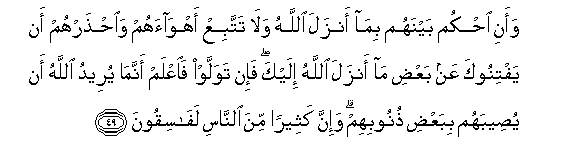

#وَأَنِ احْكُمْ بَيْنَهُمْ بِمَا أَنْزَلَ اللَّهُ وَلَا تَتَّبِعْ أَهْوَاءَهُمْ وَاحْذَرْهُمْ أَنْ يَفْتِنُوكَ عَنْ بَعْضِ مَا أَنْزَلَ اللَّهُ إِلَيْكَ ۖ فَإِنْ تَوَلَّوْا فَاعْلَمْ أَنَّمَا يُرِيدُ اللَّهُ أَنْ يُصِيبَهُمْ بِبَعْضِ ذُنُوبِهِمْ ۗ وَإِنَّ كَثِيرًا مِنَ النَّاسِ لَفَاسِقُونَ 

##Waani ohkum baynahum bima anzala Allahu wala tattabiAA ahwaahum waihtharhum an yaftinooka AAan baAAdi ma anzala Allahu ilayka fain tawallaw faiAAlam annama yureedu Allahu an yuseebahum bibaAAdi thunoobihim wainna katheeran mina alnnasi lafasiqoona 

## 翻译(Translation)：

| Translator | 译文(Translation)                                            |
| :--------: | ------------------------------------------------------------ |
|    马坚    | 你当依真主所降示的经典而替他们判决，你不要顺从他们的私欲，你当谨防他们引诱你违背真主所降示你的一部分经典。如果他们违背正道，那末，你须知真主欲因他们的一部分罪过，而惩罚他们。有许多人，确是犯罪的。 |
|  YUSUFALI  | And this (He commands): Judge thou between them by what Allah hath revealed and follow not their vain desires but beware of them lest they beguile thee from any of that (teaching) which Allah hath sent down to thee. And if they turn away be assured that for some of their crimes it is Allah's purpose to punish them. And truly most men are rebellious. |
| PICKTHALL  | So judge between them by that which Allah hath revealed, and follow not their desires, but beware of them lest they seduce thee from some part of that which Allah hath revealed unto thee. And if they turn away, then know that Allah's Will is to smite them for some sin of theirs. Lo! many of mankind are evil-livers. |
|   SHAKIR   | And that you should judge between them by what Allah has revealed, and do not follow their low desires, and be cautious of them, lest they seduce you from part of what Allah has revealed to you; but if they turn back, then know that Allah desires to afflict them on account of some of their faults; and most surely many of the people are transgressors. |

---

## 对位释义(Words Interpretation)：

| No   | العربية | 中文    | English | 曾用词 |
| ---- | ------: | ------- | ------- | ------ |
| 序号 |    阿文 | Chinese | 英文    | Used   |
| 5:49.1  | وَأَنِ     | 和那个                 | and that                 |            |
| 5:49.2  | احْكُمْ    | 你判决                 | you judge                | 参5:42.7   |
| 5:49.3  | بَيْنَهُمْ   | 他们之间               | between them             | 见2:113.25 |
| 5:49.4  | بِمَا     | 在什么                 | in what                  | 见2:4.3    |
| 5:49.5  | أَنْزَلَ    | 下降，颁降，降示，揭秘 | get down                 | 见2:4.4    |
| 5:49.6  | اللَّهُ    | 安拉，真主             | Allah                    | 见2:7.2    |
| 5:49.7  | وَلَا     | 也不                   | and not                  | 见1:7.8    |
| 5:49.8  | تَتَّبِعْ    | 你顺从                 | you follow               | 见5:48.19  |
| 5:49.9  | أَهْوَاءَهُمْ | 他们的私欲             | their desires            | 见2:120.18 |
| 5:49.10 | وَاحْذَرْهُمْ | 和你应谨防他们         | and be cautious of them  |            |
| 5:49.11 | أَنْ      | 该                     | that                     | 见2:26.5   |
| 5:49.12 | يَفْتِنُوكَ  | 他们引诱你             | they seduce you          |            |
| 5:49.13 | عَنْ      | 从                     | on                       | 见2:48.6   |
| 5:49.14 | بَعْضِ     | 一部分                 | part                     | 参2:85.24  |
| 5:49.15 | مَا      | 什么                   | what/ that which         | 见2:17.8   |
| 5:49.16 | أَنْزَلَ    | 下降，颁降，降示，揭秘 | get down                 | 见2:4.4    |
| 5:49.17 | اللَّهُ    | 安拉，真主             | Allah                    | 见2:7.2    |
| 5:49.18 | إِلَيْكَ    | 至你                   | to you                   | 见2:4.5    |
| 5:49.19 | فَإِنْ     | 因此如果               | then if                  | 见2:24.1   |
| 5:49.20 | تَوَلَّوْا   | 你们转向               | you turn                 | 见2:115.5  |
| 5:49.21 | فَاعْلَمْ   | 因此你应知道           | then know                |            |
| 5:49.22 | أَنَّمَا    | 那个什么               | that what                | 见3:178.5  |
| 5:49.23 | يُرِيدُ    | 希望                   | desire                   | 见2:185.29 |
| 5:49.24 | اللَّهُ    | 安拉，真主             | Allah                    | 见2:7.2    |
| 5:49.25 | أَنْ      | 该                     | that                     | 见2:26.5   |
| 5:49.26 | يُصِيبَهُمْ  | 他惩罚他们             | he punish them           |            |
| 5:49.27 | بِبَعْضِ    | 在一部分               | in a part                | 见2:85.24  |
| 5:49.28 | ذُنُوبِهِمْ  | 他们的众罪的           | of their crimes          |            |
| 5:49.29 | وَإِنَّ     | 和确实                 | and is                   | 见2:143.28 |
| 5:49.30 | كَثِيرًا   | 多                     | Much                     | 见2:26.31  |
| 5:49.31 | مِنَ      | 从                     | from                     | 见2:19.3 |
| 5:49.32 | النَّاسِ   | 人                     | People                   | 见2:8.2    |
| 5:49.33 | لَفَاسِقُونَ | 必定众犯罪者           | surely are transgressors |            |

---
