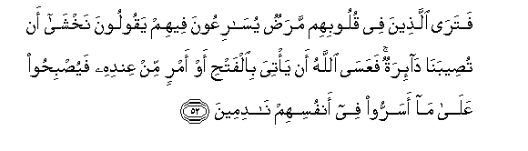

#فَتَرَى الَّذِينَ فِي قُلُوبِهِمْ مَرَضٌ يُسَارِعُونَ فِيهِمْ يَقُولُونَ نَخْشَىٰ أَنْ تُصِيبَنَا دَائِرَةٌ ۚ فَعَسَى اللَّهُ أَنْ يَأْتِيَ بِالْفَتْحِ أَوْ أَمْرٍ مِنْ عِنْدِهِ فَيُصْبِحُوا عَلَىٰ مَا أَسَرُّوا فِي أَنْفُسِهِمْ نَادِمِينَ 

##Fatara allatheena fee quloobihim maradun yusariAAoona feehim yaqooloona nakhsha an tuseebana dairatun faAAasa Allahu an yatiya bialfathi aw amrin min AAindihi fayusbihoo AAala ma asarroo fee anfusihim nadimeena 

## 翻译(Translation)：

| Translator | 译文(Translation)                                            |
| :--------: | ------------------------------------------------------------ |
|    马坚    | 你将看见有心病的人，将争先地去与他们亲善，还要托辞说：我们恐怕遭遇厄运。真主也许降下胜利，或发出命令，而他们因为自己心中隐藏的阴谋，而变成悔恨的人。 |
|  YUSUFALI  | Those in whose heart is a disease thou seest how eagerly they run about amongst them saying: "We do fear lest a change of fortune bring us disaster." Ah! perhaps Allah will give (thee) victory or a decision according to His Will. Then will they repent of the thoughts which they secretly harbored in their hearts. |
| PICKTHALL  | And thou seest those in whose heart is a disease race toward them, saying: We fear lest a change of fortune befall us. And it may happen that Allah will vouchsafe (unto thee) the victory, or a commandment from His presence. Then will they repent them of their secret thoughts. |
|   SHAKIR   | But you will see those in whose hearts is a disease hastening towards them, saying: We fear lest a calamity should befall us; but it may be that Allah will bring the victory or a punish ment from Himself, so that they shall be regretting on account of what they hid in their souls. |

---

## 对位释义(Words Interpretation)：

| No   | العربية | 中文    | English | 曾用词 |
| ---- | ------: | ------- | ------- | ------ |
| 序号 |    阿文 | Chinese | 英文    | Used   |
| 5:52.1  | فَتَرَى    | 然后你看见   | then you will see |            |
| 5:52.2  | الَّذِينَ   | 谁，那些     | those who         | 见2:6.2    |
| 5:52.3  | فِي      | 在           | in                | 见2:10.1   |
| 5:52.4  | قُلُوبِهِمْ  | 他们的心     | Their hearts      | 见2:7.4    |
| 5:52.5  | مَرَضٌ     | 病，病症     | illness           | 见2:10.3   |
| 5:52.6  | يُسَارِعُونَ | 他们投入     | they fall         | 见3:176.4  |
| 5:52.7  | فِيهِمْ    | 在他们       | in them           | 见2:129.3  |
| 5:52.8  | يَقُولُونَ  | 他们说       | They say          | 见2:79.7   |
| 5:52.9  | نَخْشَىٰ    | 我们恐怕     | We fear           |            |
| 5:52.10 | أَنْ      | 该           | that              | 见2:26.5   |
| 5:52.11 | تُصِيبَنَا  | 它降临我们   | befall us         |            |
| 5:52.12 | دَائِرَةٌ   | 一个厄运     | a calamity        |            |
| 5:52.13 | فَعَسَى    | 因此它也许   | so It may be      | 参4:84.11  |
| 5:52.14 | اللَّهُ    | 安拉，真主   | Allah             | 见2:7.2    |
| 5:52.15 | أَنْ      | 该           | that              | 见2:26.5   |
| 5:52.16 | يَأْتِيَ    | 带来         | bring             | 见2:109.25 |
| 5:52.17 | بِالْفَتْحِ  | 在胜利       | in the victory    |            |
| 5:52.18 | أَوْ      | 或           | or                | 见2:19.1   |
| 5:52.19 | أَمْرٍ     | 一个命令     | a commandment     |            |
| 5:52.20 | مِنْ      | 从           | from              | 见2:4.8    |
| 5:52.21 | عِنْدِهِ    | 他的那里     | His presence      |            |
| 5:52.22 | فَيُصْبِحُوا | 然后他们成为 | Then will they    |            |
| 5:52.23 | عَلَىٰ     | 至           | On                | 见2:5.2    |
| 5:52.24 | مَا      | 什么         | what/ that which  | 见2:17.8   |
| 5:52.25 | أَسَرُّوا   | 他们隐藏     | they hid          |            |
| 5:52.26 | فِي      | 在           | in                | 见2:10.1   |
| 5:52.27 | أَنْفُسِهِمْ  | 他们自己     | themselves        | 见2:9.8    |
| 5:52.28 | نَادِمِينَ  | 悔恨         | repent            |            |

---
