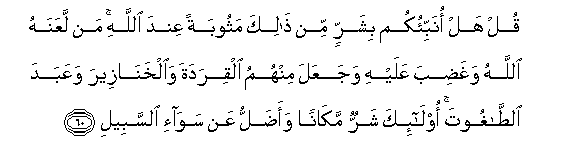

#قُلْ هَلْ أُنَبِّئُكُمْ بِشَرٍّ مِنْ ذَٰلِكَ مَثُوبَةً عِنْدَ اللَّهِ ۚ مَنْ لَعَنَهُ اللَّهُ وَغَضِبَ عَلَيْهِ وَجَعَلَ مِنْهُمُ الْقِرَدَةَ وَالْخَنَازِيرَ وَعَبَدَ الطَّاغُوتَ ۚ أُولَٰئِكَ شَرٌّ مَكَانًا وَأَضَلُّ عَنْ سَوَاءِ السَّبِيلِ 

##Qul hal onabbiokum bisharrin min thalika mathoobatan AAinda Allahi man laAAanahu Allahu waghadiba AAalayhi wajaAAala minhumu alqiradata waalkhanazeera waAAabada alttaghooti olaika sharrun makanan waadallu AAan sawai alssabeeli 

## 翻译(Translation)：

| Translator | 译文(Translation)                                            |
| :--------: | ------------------------------------------------------------ |
|    马坚    | 你说：我告诉你们在真主那里所受的报酬有比这更恶劣的，好吗？有等人曾受主的弃绝和谴怒，他使他们一部分变成猴子和猪，一部分崇拜恶魔，这等人，他们的地位是更恶劣的，他们离开正道是更远的。 |
|  YUSUFALI  | Say: "Shall I point out to you something much worse than this (as judged) by the treatment it received from Allah? Those who incurred the curse of Allah and His wrath those of whom some He transformed into apes and swine those who worshipped Evil; these are (many times) worse in rank and far more astray from the even Path! |
| PICKTHALL  | Shall I tell thee of a worse (case) than theirs for retribution with Allah ? (Worse is the case of him) whom Allah hath cursed, him on whom His wrath hath fallen and of whose sort Allah hath turned some to apes and swine, and who serveth idols. Such are in worse plight and further astray from the plain road. |
|   SHAKIR   | Say: Shall I inform you of (him who is) worse than this in retribution from Allah? (Worse is he) whom Allah has cursed and brought His wrath upon, and of whom He made apes and swine, and he who served the Shaitan; these are worse in place and more erring from the straight path. |

---

## 对位释义(Words Interpretation)：

| No   | العربية | 中文    | English | 曾用词 |
| ---- | ------: | ------- | ------- | ------ |
| 序号 |    阿文 | Chinese | 英文    | Used   |
| 5:60.1  | قُلْ        | 你说       | Say                | 见2:80.8   |
| 5:60.2  | هَلْ        | 是吗？     | will ?             | 见2:210.1  |
| 5:60.3  | أُنَبِّئُكُمْ    | 我告诉你们 | I tell you         |            |
| 5:60.4  | بِشَرٍّ       | 在更恶劣   | in worse           |            |
| 5:60.5  | مِنْ        | 比         | than               | 见2:219.25 |
| 5:60.6  | ذَٰلِكَ       | 这个       | this               | 见2:2.1    |
| 5:60.7  | مَثُوبَةً     | 报酬       | retribution        |            |
| 5:60.8  | عِنْدَ       | 以         | with               | 见2:54.20  |
| 5:60.9  | اللَّهِ      | 真主的     | of Allah           | 见2:23.17  |
| 5:60.10 | مَنْ        | 谁         | who                | 见2:97.2   |
| 5:60.11 | لَعَنَهُ      | 弃绝他     | cursed him         | 见4:118.1  |
| 5:60.12 | اللَّهُ      | 安拉，真主 | Allah              | 见2:7.2    |
| 5:60.13 | وَغَضِبَ      | 和他谴怒   | and the wrath      | 见4:93.9   |
| 5:60.14 | عَلَيْهِ      | 在他       | on him             | 见2:37.7   |
| 5:60.15 | وَجَعَلَ      | 和他使     | and he make        | 参2:22.2   |
| 5:60.16 | مِنْهُمُ      | 从他们     | from them          | 见2:75.8   |
| 5:60.17 | الْقِرَدَةَ    | 众猴子     | apes               |            |
| 5:60.18 | وَالْخَنَازِيرَ | 和众猪     | and swine          |            |
| 5:60.19 | وَعَبَدَ      | 和他崇拜   | and he worshipped  |            |
| 5:60.20 | الطَّاغُوتَ   | 恶魔       | the Shaitan        |            |
| 5:60.21 | أُولَٰئِكَ     | 这等人     | These are          | 见2:5.1    |
| 5:60.22 | شَرٌّ        | 不好       | bad                | 见2:216.19 |
| 5:60.23 | مَكَانًا     | 地位       | place              |            |
| 5:60.24 | وَأَضَلُّ      | 和更迷误   | and further astray |            |
| 5:60.25 | عَنْ        | 从         | on                 | 见2:48.6   |
| 5:60.26 | سَوَاءِ      | 正确的     | right              | 参2:108.17 |
| 5:60.27 | السَّبِيلِ    | 道路       | The way            | 见2:108.18 |

---
