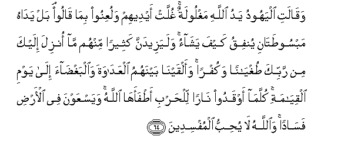

#وَقَالَتِ الْيَهُودُ يَدُ اللَّهِ مَغْلُولَةٌ ۚ غُلَّتْ أَيْدِيهِمْ وَلُعِنُوا بِمَا قَالُوا ۘ بَلْ يَدَاهُ مَبْسُوطَتَانِ يُنْفِقُ كَيْفَ يَشَاءُ ۚ وَلَيَزِيدَنَّ كَثِيرًا مِنْهُمْ مَا أُنْزِلَ إِلَيْكَ مِنْ رَبِّكَ طُغْيَانًا وَكُفْرًا ۚ وَأَلْقَيْنَا بَيْنَهُمُ الْعَدَاوَةَ وَالْبَغْضَاءَ إِلَىٰ يَوْمِ الْقِيَامَةِ ۚ كُلَّمَا أَوْقَدُوا نَارًا لِلْحَرْبِ أَطْفَأَهَا اللَّهُ ۚ وَيَسْعَوْنَ فِي الْأَرْضِ فَسَادًا ۚ وَاللَّهُ لَا يُحِبُّ الْمُفْسِدِينَ 

##Waqalati alyahoodu yadu Allahi maghloolatun ghullat aydeehim waluAAinoo bima qaloo bal yadahu mabsootatani yunfiqu kayfa yashao walayazeedanna katheeran minhum ma onzila ilayka min rabbika tughyanan wakufran waalqayna baynahumu alAAadawata waalbaghdaa ila yawmi alqiyamati kullama awqadoo naran lilharbi atfaaha Allahu wayasAAawna fee alardi fasadan waAllahu la yuhibbu almufsideena 

## 翻译(Translation)：

| Translator | 译文(Translation)                                            |
| :--------: | ------------------------------------------------------------ |
|    马坚    | 犹太教徒说：真主的手是被拘束的。但愿他们的手被拘束，但愿他们因为自己所说的恶言而被弃绝! 其实，他的两只手是展开的；他要怎样费用，就怎样费用。从你的主降示你的经典，必定要使他们多数的人更加横暴，更加不信道。我将仇视和怨恨，投在他们之间，直到复活日。每逢他们点燃战火的时候，真主就扑灭它。他们在地方上肆意作恶。真主不喜爱作恶的人。 |
|  YUSUFALI  | The Jews say: "Allah's hand is tied up." Be their hands tied up and be they accursed for the (blasphemy) they utter. Nay both His hands are widely outstretched: He giveth and spendeth (of His bounty) as He pleaseth. But the revelation that cometh to thee from Allah increaseth in most of them their obstinate rebellion and blasphemy. Amongst them We have placed enmity and hatred till the Day of Judgment. Every time they kindle the fire of war Allah doth extinguish it; but they (ever) strive to do mischief on earth. And Allah loveth not those who do mischief. |
| PICKTHALL  | The Jews say: Allah's hand is fettered. Their hands are fettered and they are accursed for saying so. Nay, but both His hands are spread out wide in bounty. He bestoweth as He will. That which hath been revealed unto thee from thy Lord is certain to increase the contumacy and disbelief of many of them, and We have cast among them enmity and hatred till the Day of Resurrection. As often as they light a fire for war, Allah extinguisheth it. Their effort is for corruption in the land, and Allah loveth not corrupters. |
|   SHAKIR   | And the Jews say: The hand of Allah is tied up! Their hands shall be shackled and they shall be cursed for what they say. Nay, both His hands are spread out, He expends as He pleases; and what has been revealed to you from your Lord will certainly make many of them increase in inordinacy and unbelief; and We have put enmity and hatred among them till the day of resurrection; whenever they kindle a fire for war Allah puts it out, and they strive to make mischief in the land; and Allah does not love the mischief-makers. |

---

## 对位释义(Words Interpretation)：

| No   | العربية | 中文    | English | 曾用词 |
| ---- | ------: | ------- | ------- | ------ |
| 序号 |    阿文 | Chinese | 英文    | Used   |
| 5:64.1  | وَقَالَتِ    | 和她说                 | and she said            | 见2:113.1  |
| 5:64.2  | الْيَهُودُ   | 犹太教徒               | The Jews                | 见2:113.2  |
| 5:64.3  | يَدُ       | 手                     | hand                    |            |
| 5:64.4  | اللَّهِ     | 真主的                 | of Allah                | 见2:23.17  |
| 5:64.5  | مَغْلُولَةٌ   | 被拘束                 | is fettered             |            |
| 5:64.6  | غُلَّتْ      | 它被拘束               | tied up                 |            |
| 5:64.7  | أَيْدِيهِمْ   | 他们的手               | Their hands             | 见2:79.20  |
| 5:64.8  | وَلُعِنُوا   | 和他们被弃绝           | and they are accursed   |            |
| 5:64.9  | بِمَا      | 在什么                 | in what                 | 见2:4.3    |
| 5:64.10 | قَالُوا    | 他们说，               | They said               | 见2:11.8   |
| 5:64.11 | بَلْ       | 不然                   | Nay, but                | 见2:88.4   |
| 5:64.12 | يَدَاهُ     | 他的双手               | His hands               | 参5:64.3   |
| 5:64.13 | مَبْسُوطَتَانِ | 展开的                 | widely outstretched     |            |
| 5:64.14 | يُنْفِقُ     | 花费                   | spend                   | 见2:264.11 |
| 5:64.15 | كَيْفَ      | 如何                   | How                     | 见2:28.1   |
| 5:64.16 | يَشَاءُ     | 他意欲                 | He pleases              | 见2:90.18  |
| 5:64.17 | وَلَيَزِيدَنَّ  | 和必定他增加           | and certain to increase |            |
| 5:64.18 | كَثِيرًا    | 多                     | Much                    | 见2:26.31  |
| 5:64.19 | مِنْهُمْ     | 从他们                 | from them               | 见2:75.8   |
| 5:64.20 | مَا       | 什么                   | what/ that which        | 见2:17.8   |
| 5:64.21 | أُنْزِلَ     | 下降，颁降，降示，揭秘 | get down                | 见2:4.4    |
| 5:64.22 | إِلَيْكَ     | 至你                   | to you                  | 见2:4.5    |
| 5:64.23 | مِنْ       | 从                     | from                    | 见2:4.8    |
| 5:64.24 | رَبِّكَ      | 您的主                 | Your Lord               | 见2:30.3   |
| 5:64.25 | طُغْيَانًا   | 横暴                   | the contumacy           |            |
| 5:64.26 | وَكُفْرًا    | 和不信                 | and unbelief            | 参3:90.8   |
| 5:64.27 | وَأَلْقَيْنَا  | 和我们投               | and We have cast        |            |
| 5:64.28 | بَيْنَهُمُ    | 他们的之间             | among them              | 见5:14.14  |
| 5:64.29 | الْعَدَاوَةَ  | 仇恨                   | enmity                  | 见5:14.15  |
| 5:64.30 | وَالْبَغْضَاءَ | 和怨恨                 | and hatred              | 见5:14.16  |
| 5:64.31 | إِلَىٰ      | 至                     | to                      | 见2:14.9   |
| 5:64.32 | يَوْمِ      | 日，日子，时候的       | day                     | 见1:4.2    |
| 5:64.33 | الْقِيَامَةِ  | 复活的                 | Resurrection            | 见2:85.40  |
| 5:64.34 | كُلَّمَا     | 每当                   | whenever                | 见2:20.5   |
| 5:64.35 | أَوْقَدُوا   | 他们点燃               | they kindle             |            |
| 5:64.36 | نَارًا     | 火                     | fire                    | 见2:17.5   |
| 5:64.37 | لِلْحَرْبِ    | 为战争                 | for war                 |            |
| 5:64.38 | أَطْفَأَهَا   | 他扑灭它               | extinguish it           |            |
| 5:64.39 | اللَّهُ     | 安拉，真主             | Allah                   | 见2:7.2    |
| 5:64.40 | وَيَسْعَوْنَ   | 和他们传播             | and they strive         | 见5:33.7   |
| 5:64.41 | فِي       | 在                     | in                      | 见2:10.1   |
| 5:64.42 | الْأَرْضِ    | 大地                   | Earth                   | 见2:22.4   |
| 5:64.43 | فَسَادًا    | 纷乱                   | make mischief           | 见5:33.10  |
| 5:64.44 | وَاللَّهُ    | 和安拉，真主           | and Allah               | 见2:19.17  |
| 5:64.45 | لَا       | 不，不是，没有         | no                      | 见2:2.3    |
| 5:64.46 | يُحِبُّ      | 喜欢                   | love                    | 见2:190.12 |
| 5:64.47 | الْمُفْسِدِينَ | 众作恶者               | the mischief-makers     |            |

---
