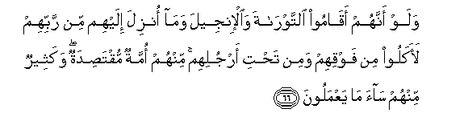

#وَلَوْ أَنَّهُمْ أَقَامُوا التَّوْرَاةَ وَالْإِنْجِيلَ وَمَا أُنْزِلَ إِلَيْهِمْ مِنْ رَبِّهِمْ لَأَكَلُوا مِنْ فَوْقِهِمْ وَمِنْ تَحْتِ أَرْجُلِهِمْ ۚ مِنْهُمْ أُمَّةٌ مُقْتَصِدَةٌ ۖ وَكَثِيرٌ مِنْهُمْ سَاءَ مَا يَعْمَلُونَ 

##Walaw annahum aqamoo alttawrata waalinjeela wama onzila ilayhim min rabbihim laakaloo min fawqihim wamin tahti arjulihim minhum ommatun muqtasidatun wakatheerun minhum saa ma yaAAmaloona 

## 翻译(Translation)：

| Translator | 译文(Translation)                                            |
| :--------: | ------------------------------------------------------------ |
|    马坚    | 假若他们遵守《讨拉特》和《引支勒》和他们的主所降示他们的其他经典，那末，他们必得仰食头上的，俯食脚下的。他们中有一伙中和的人；他们中有许多行为恶劣的人。 |
|  YUSUFALI  | If only they had stood fast by the Law the Gospel and all the revelation that was sent to them from their Lord they would have enjoyed happiness from every side. There is from among them a party on the right course; but many of them follow a course that is evil. |
| PICKTHALL  | If they had observed the Torah and the Gospel and that which was revealed unto them from their Lord, they would surely have been nourished from above them and from beneath their feet. Among them there are people who are moderate, but many of them are of evil conduct. |
|   SHAKIR   | And if they had kept up the Taurat and the Injeel and that which was revealed to them from their Lord, they would certainly have eaten from above them and from beneath their feet there is a party of them keeping to the moderate course, and (as for) most of them, evil is that which they do |

---

## 对位释义(Words Interpretation)：

| No   | العربية | 中文    | English | 曾用词 |
| ---- | ------: | ------- | ------- | ------ |
| 序号 |    阿文 | Chinese | 英文    | Used   |
| 5:66.1  | وَلَوْ      | 和如果                 | and if                          | 见2:20.14 |
| 5:66.2  | أَنَّهُمْ     | 确实他们               | that they                       | 见2:46.3  |
| 5:66.3  | أَقَامُوا   | 他们遵守               | they had kept up                |           |
| 5:66.4  | التَّوْرَاةَ  | 讨拉特                 | the Torah                       | 见3:3.10  |
| 5:66.5  | وَالْإِنْجِيلَ | 和引支勒               | and the Injeel                  | 见3:3.11  |
| 5:66.6  | وَمَا      | 和什么                 | and that                        | 见2:4.6   |
| 5:66.7  | أُنْزِلَ     | 下降，颁降，降示，揭秘 | get down                        | 见2:4.4   |
| 5:66.8  | إِلَيْهِمْ    | 至他们                 | at them                         | 见3:77.20 |
| 5:66.9  | مِنْ       | 从                     | from                            | 见2:4.8   |
| 5:66.10 | رَبِّهِمْ     | 他们的主               | their Lord                      | 见2:5.5   |
| 5:66.11 | لَأَكَلُوا   | 他们必定吃             | they would certainly have eaten |           |
| 5:66.12 | مِنْ       | 从                     | from                            | 见2:4.8   |
| 5:66.13 | فَوْقِهِمْ    | 他们的上面             | above them                      |           |
| 5:66.14 | وَمِنْ      | 和从                   | And from                        | 见2:8.1   |
| 5:66.15 | تَحْتِ      | 下面                   | beneath                         |           |
| 5:66.16 | أَرْجُلِهِمْ   | 他们的众脚             | their feet                      |           |
| 5:66.17 | مِنْهُمْ     | 从他们                 | from them                       | 见2:75.8  |
| 5:66.18 | أُمَّةٌ      | 一个民族               | a nation                        | 见2:128.7 |
| 5:66.19 | مُقْتَصِدَةٌ   | 中和的                 | the moderate course             |           |
| 5:66.20 | وَكَثِيرٌ    | 和很多                 | and many                        | 参2:109.2 |
| 5:66.21 | مِنْهُمْ     | 从他们                 | from them                       | 见2:75.8  |
| 5:66.22 | سَاءَ      | 它恶劣                 | evil is that                    |           |
| 5:66.23 | مَا       | 什么                   | what/ that which                | 见2:17.8  |
| 5:66.24 | يَعْمَلُونَ   | 他们的行为             | they do                         | 见2:96.25 |

---
