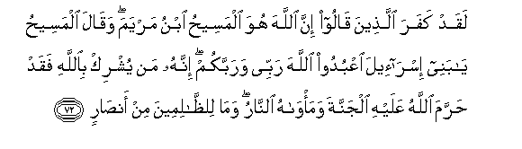

#لَقَدْ كَفَرَ الَّذِينَ قَالُوا إِنَّ اللَّهَ هُوَ الْمَسِيحُ ابْنُ مَرْيَمَ ۖ وَقَالَ الْمَسِيحُ يَا بَنِي إِسْرَائِيلَ اعْبُدُوا اللَّهَ رَبِّي وَرَبَّكُمْ ۖ إِنَّهُ مَنْ يُشْرِكْ بِاللَّهِ فَقَدْ حَرَّمَ اللَّهُ عَلَيْهِ الْجَنَّةَ وَمَأْوَاهُ النَّارُ ۖ وَمَا لِلظَّالِمِينَ مِنْ أَنْصَارٍ 

##Laqad kafara allatheena qaloo inna Allaha huwa almaseehu ibnu maryama waqala almaseehu ya banee israeela oAAbudoo Allaha rabbee warabbakum innahu man yushrik biAllahi faqad harrama Allahu AAalayhi aljannata wamawahu alnnaru wama lilththalimeena min ansarin 

## 翻译(Translation)：

| Translator | 译文(Translation)                                            |
| :--------: | ------------------------------------------------------------ |
|    马坚    | 妄言真主就是麦尔彦之子麦西哈的人，确已不信道了。麦西哈曾说：以色列的后裔啊! 你们当崇拜真主--我的主，和你们的主。谁以物配主，真主必禁止谁入乐园，他的归宿是火狱。不义的人，绝没有任何援助者。 |
|  YUSUFALI  | They do blaspheme who say: "Allah is Christ the son of Mary." But said Christ: "O children of Israel! worship Allah my Lord and your Lord." Whoever joins other gods with Allah Allah will forbid him the garden and the Fire will be his abode. There will for the wrong-doers be no one to help. |
| PICKTHALL  | They surely disbelieve who say: Lo! Allah is the Messiah, son of Mary. The Messiah (himself) said: O Children of Israel, worship Allah, my Lord and your Lord. Lo! whoso ascribeth partners unto Allah, for him Allah hath forbidden paradise. His abode is the Fire. For evil-doers there will be no helpers. |
|   SHAKIR   | Certainly they disbelieve who say: Surely Allah, He is the Messiah, son of Marium; and the Messiah said: O Children of Israel! serve Allah, my Lord and your Lord. Surely whoever associates (others) with Allah, then Allah has forbidden to him the garden, and his abode is the fire; and there shall be no helpers for the unjust. |

---

## 对位释义(Words Interpretation)：

| No   | العربية | 中文    | English | 曾用词 |
| ---- | ------: | ------- | ------- | ------ |
| 序号 |    阿文 | Chinese | 英文    | Used   |
| 5:72.1  | لَقَدْ      | 必定         | Certainly          | 见3:164.1  |
| 5:72.2  | كَفَرَ      | 不信         | disbelieve         | 见2:102.9  |
| 5:72.3  | الَّذِينَ    | 谁，那些     | those who          | 见2:6.2    |
| 5:72.4  | قَالُوا    | 他们说，     | They said          | 见2:11.8   |
| 5:72.5  | إِنَّ       | 的确         | surely             | 见2:6.1    |
| 5:72.6  | اللَّهَ     | 安拉，真主   | Allah              | 见2:9.2    |
| 5:72.7  | هُوَ       | 他是         | He is              | 见2:29.1   |
| 5:72.8  | الْمَسِيحُ   | 麦西哈       | the Messiah        | 见3:45.12  |
| 5:72.9  | ابْنُ      | 儿子         | son                | 见3:45.14  |
| 5:72.10 | مَرْيَمَ     | 麦尔彦       | Marium             | 见2:87.12  |
| 5:72.11 | وَقَالَ     | 和他说，     | and he said        | 见2:118.1  |
| 5:72.12 | الْمَسِيحُ   | 麦西哈       | the Messiah        | 见3:45.12  |
| 5:72.13 | يَا       | 啊           | Oh                 | 见2:21.1   |
| 5:72.14 | بَنِي      | 后裔         | Children           | 见2:40.2   |
| 5:72.15 | إِسْرَائِيلَ  | 以色列       | Israel             | 见2:40.3   |
| 5:72.16 | اعْبُدُوا   | 崇拜         | Worship            | 见2:21.4   |
| 5:72.17 | اللَّهَ     | 安拉，真主   | Allah              | 见2:9.2    |
| 5:72.18 | رَبِّي      | 我的主       | my Lord            | 见3:51.3   |
| 5:72.19 | وَرَبَّكُمْ    | 和你们的主   | and your Lord      |            |
| 5:72.20 | إِنَّهُ      | 确实他       | he is              | 见2:37.8   |
| 5:72.21 | مَنْ       | 谁           | who                | 见2:97.2   |
| 5:72.22 | يُشْرِكْ     | 他采配       | ascribe partners   | 见4:48.15  |
| 5:72.23 | بِاللَّهِ    | 在真主       | in Allah           | 见2:8.6    |
| 5:72.24 | فَقَدْ      | 然后当然     | then may           | 见2:108.15 |
| 5:72.25 | حَرَّمَ      | 禁止         | forbidden          | 见2:173.2  |
| 5:72.26 | اللَّهُ     | 安拉，真主   | Allah              | 见2:7.2    |
| 5:72.27 | عَلَيْهِ     | 在他         | on him             | 见2:37.7   |
| 5:72.28 | الْجَنَّةَ    | 天园         | Paradise           | 见2:35.7   |
| 5:72.29 | وَمَأْوَاهُ   | 和他的住所   | and his abode      | 见3:162.10 |
| 5:72.30 | النَّارُ    | 火           | fire               | 见2:24.7   |
| 5:72.31 | وَمَا      | 和不         | And not            | 见2:9.9    |
| 5:72.32 | لِلظَّالِمِينَ | 为不义的人们 | to the wrong-doers | 见2:270.13 |
| 5:72.33 | مِنْ       | 从           | from               | 见2:4.8    |
| 5:72.34 | أَنْصَارٍ    | 援助者       | helpers            | 见2:270.15 |

---
