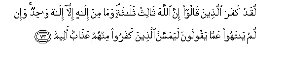

#لَقَدْ كَفَرَ الَّذِينَ قَالُوا إِنَّ اللَّهَ ثَالِثُ ثَلَاثَةٍ ۘ وَمَا مِنْ إِلَٰهٍ إِلَّا إِلَٰهٌ وَاحِدٌ ۚ وَإِنْ لَمْ يَنْتَهُوا عَمَّا يَقُولُونَ لَيَمَسَّنَّ الَّذِينَ كَفَرُوا مِنْهُمْ عَذَابٌ أَلِيمٌ 

##Laqad kafara allatheena qaloo inna Allaha thalithu thalathatin wama min ilahin illa ilahun wahidun wain lam yantahoo AAamma yaqooloona layamassanna allatheena kafaroo minhum AAathabun aleemun 

## 翻译(Translation)：

| Translator | 译文(Translation)                                            |
| :--------: | ------------------------------------------------------------ |
|    马坚    | 妄言真主确是三位中的一位的人，确已不信道了。除独一的主宰外，绝无应受崇拜的。如果他们不停止妄言，那末，他们中不信道的人，必遭痛苦的刑罚。 |
|  YUSUFALI  | They do blaspheme who say: Allah is one of three in a Trinity: for there is no god except One Allah. If they desist not from their word (of blasphemy) verily a grievous penalty will befall the blasphemers among them. |
| PICKTHALL  | They surely disbelieve who say: Lo! Allah is the third of three; when there is no God save the One God. If they desist not from so saying a painful doom will fall on those of them who disbelieve. |
|   SHAKIR   | Certainly they disbelieve who say: Surely Allah is the third (person) of the three; and there is no god but the one God, and if they desist not from what they say, a painful chastisement shall befall those among them who disbelieve. |

---

## 对位释义(Words Interpretation)：

| No   | العربية | 中文    | English | 曾用词 |
| ---- | ------: | ------- | ------- | ------ |
| 序号 |    阿文 | Chinese | 英文    | Used   |
| 5:73.1  | لَقَدْ    | 必定       | Certainly             | 见3:164.1 |
| 5:73.2  | كَفَرَ    | 不信       | disbelieve            | 见2:102.9 |
| 5:73.3  | الَّذِينَ  | 谁，那些   | those who             | 见2:6.2   |
| 5:73.4  | قَالُوا  | 他们说，   | They said             | 见2:11.8  |
| 5:73.5  | إِنَّ     | 的确       | surely                | 见2:6.1   |
| 5:73.6  | اللَّهَ   | 安拉，真主 | Allah                 | 见2:9.2   |
| 5:73.7  | ثَالِثُ   | 第三       | the third             |           |
| 5:73.8  | ثَلَاثَةٍ  | 三的       | of three              |           |
| 5:73.9  | وَمَا    | 和不       | And not               | 见2:9.9   |
| 5:73.10 | مِنْ     | 从         | from                  | 见2:4.8   |
| 5:73.11 | إِلَٰهٍ    | 主宰       | Allah                 | 见3:62.8  |
| 5:73.12 | إِلَّا    | 除了       | Except                | 见2:9.7   |
| 5:73.13 | إِلَٰهٌ    | 主宰       | Allah                 | 见2:163.2 |
| 5:73.14 | وَاحِدٌ   | 独一的     | One                   | 见2:163.3 |
| 5:73.15 | وَإِنْ    | 和如果     | and if                | 见2:23.1 |
| 5:73.16 | لَمْ     | 不，没有   | did not               | 见2:6.8   |
| 5:73.17 | يَنْتَهُوا | 他们停止   | they desist           |           |
| 5:73.18 | عَمَّا    | 在什么     | of what               | 见2:74.36 |
| 5:73.19 | يَقُولُونَ | 他们说     | They say              | 见2:79.7  |
| 5:73.20 | لَيَمَسَّنَّ  | 必定它遭受 | verily it will befall |           |
| 5:73.21 | الَّذِينَ  | 谁，那些   | those who             | 见2:6.2   |
| 5:73.22 | كَفَرُوا  | 不信       | disbelieve            | 见2:6.3   |
| 5:73.23 | مِنْهُمْ   | 从他们     | from them             | 见2:75.8  |
| 5:73.24 | عَذَابٌ   | 煎熬，刑罚 | torment, punishment   | 见2:7.11  |
| 5:73.25 | أَلِيمٌ   | 痛苦，疼痛 | A painful             | 见2:10.9  |

---
