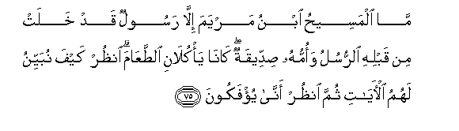

#مَا الْمَسِيحُ ابْنُ مَرْيَمَ إِلَّا رَسُولٌ قَدْ خَلَتْ مِنْ قَبْلِهِ الرُّسُلُ وَأُمُّهُ صِدِّيقَةٌ ۖ كَانَا يَأْكُلَانِ الطَّعَامَ ۗ انْظُرْ كَيْفَ نُبَيِّنُ لَهُمُ الْآيَاتِ ثُمَّ انْظُرْ أَنَّىٰ يُؤْفَكُونَ 

##Ma almaseehu ibnu maryama illa rasoolun qad khalat min qablihi alrrusulu waommuhu siddeeqatun kana yakulani alttaAAama onthur kayfa nubayyinu lahumu alayati thumma onthur anna yufakoona 

## 翻译(Translation)：

| Translator | 译文(Translation)                                            |
| :--------: | ------------------------------------------------------------ |
|    马坚    | 麦尔彦之子麦西哈，只是一个使者，在他之前，有许多使者确已逝去了。他母亲是一个诚实的人。他们俩也是吃饭的。你看我怎样为他们阐明一切迹象，然后，你看他们是如何悖谬的。 |
|  YUSUFALI  | Christ the son of Mary was no more than an Apostle; many were the Apostles that passed away before him. His mother was a woman of truth. They had both to eat their (daily) food. See how Allah doth makes His Signs clear to them; yet see in what ways they are deluded away from the truth! |
| PICKTHALL  | The Messiah, son of Mary, was no other than a messenger, messengers (the like of whom) had passed away before him. And his mother was a saintly woman. And they both used to eat (earthly) food. See how We make the revelations clear for them, and see how they are turned away! |
|   SHAKIR   | The Messiah, son of Marium is but an apostle; apostles before him have indeed passed away; and his mother was a truthful woman; they both used to eat food. See how We make the communications clear to them, then behold, how they are turned away. |

---

## 对位释义(Words Interpretation)：

| No   | العربية | 中文    | English | 曾用词 |
| ---- | ------: | ------- | ------- | ------ |
| 序号 |    阿文 | Chinese | 英文    | Used   |
| 5:75.1  | مَا     | 不             | not                  | 见2:120.24 |
| 5:75.2  | الْمَسِيحُ | 麦西哈         | the Messiah          | 见3:45.12  |
| 5:75.3  | ابْنُ    | 儿子           | son                  | 见3:45.14  |
| 5:75.4  | مَرْيَمَ   | 麦尔彦         | Marium               | 见2:87.12  |
| 5:75.5  | إِلَّا    | 除了           | Except               | 见2:9.7    |
| 5:75.6  | رَسُولٌ   | 一个使者       | a messenger          | 见2:87.19  |
| 5:75.7  | قَدْ     | 当然           | may                  | 见2:60.14  |
| 5:75.8  | خَلَتْ    | 逝去           | passed away          | 见2:134.4  |
| 5:75.9  | مِنْ     | 从             | from                 | 见2:4.8    |
| 5:75.10 | قَبْلِهِ   | 之前           | before this          | 见2:198.24 |
| 5:75.11 | الرُّسُلُ  | 使者           | the messengers       | 见2:253.2  |
| 5:75.12 | وَأُمُّهُ   | 和他的母亲     | and his mother       |            |
| 5:75.13 | صِدِّيقَةٌ  | 一个诚实的女人 | a truthful woman     |            |
| 5:75.14 | كَانَا   | 他俩是         | They were            | 见2:36.6   |
| 5:75.15 | يَأْكُلَانِ | 他俩吃         | they eat             |            |
| 5:75.16 | الطَّعَامَ | 食物           | food                 |            |
| 5:75.17 | انْظُرْ   | 你看           | See                  | 见4:50.1   |
| 5:75.18 | كَيْفَ    | 如何           | How                  | 见2:28.1   |
| 5:75.19 | نُبَيِّنُ   | 我们阐明       | we make clear        |            |
| 5:75.20 | لَهُمُ    | 对他们         | for them             | 见2:11.3   |
| 5:75.21 | الْآيَاتِ | 众迹象         | the signs            | 见2:118.22 |
| 5:75.22 | ثُمَّ     | 然后           | Then                 | 见2:28.7   |
| 5:75.23 | انْظُرْ   | 你看           | See                  | 见4:50.1   |
| 5:75.24 | أَنَّىٰ    | 如何           | how                  | 见2:223.6  |
| 5:75.25 | يُؤْفَكُونَ | 他们悖谬       | they are turned away |            |

---
