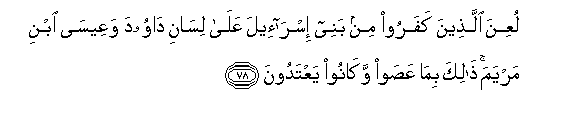

#لُعِنَ الَّذِينَ كَفَرُوا مِنْ بَنِي إِسْرَائِيلَ عَلَىٰ لِسَانِ دَاوُودَ وَعِيسَى ابْنِ مَرْيَمَ ۚ ذَٰلِكَ بِمَا عَصَوْا وَكَانُوا يَعْتَدُونَ 

##LuAAina allatheena kafaroo min banee israeela AAala lisani dawooda waAAeesa ibni maryama thalika bima AAasaw wakanoo yaAAtadoona 

## 翻译(Translation)：

| Translator | 译文(Translation)                                            |
| :--------: | ------------------------------------------------------------ |
|    马坚    | 以色列的后裔中不信道的人，曾被达五德和麦尔彦之子尔撒的舌所诅咒，这是由于他们的违抗和过分。 |
|  YUSUFALI  | Curses were pronounced on those among the Children of Israel who rejected faith by the tongue of David and of Jesus the son of Mary: because they disobeyed and persisted in excesses. |
| PICKTHALL  | Those of the Children of Israel who went astray were cursed by the tongue of David, and of Jesus, son of Mary. That was because they rebelled and used to transgress. |
|   SHAKIR   | Those who disbelieved from among the children of Israel were cursed by the tongue of Dawood and Isa, son of Marium; this was because they disobeyed and used to exceed the limit. |

---

## 对位释义(Words Interpretation)：

| No   | العربية | 中文    | English | 曾用词 |
| ---- | ------: | ------- | ------- | ------ |
| 序号 |    阿文 | Chinese | 英文    | Used   |
| 5:78.1  | لُعِنَ     | 被诅咒   | were cursed   |            |
| 5:78.2  | الَّذِينَ   | 谁，那些 | those who     | 见2:6.2    |
| 5:78.3  | كَفَرُوا   | 不信     | disbelieve    | 见2:6.3    |
| 5:78.4  | مِنْ      | 从       | from          | 见2:4.8    |
| 5:78.5  | بَنِي     | 后裔     | Children      | 见2:40.2   |
| 5:78.6  | إِسْرَائِيلَ | 以色列   | Israel        | 见2:40.3   |
| 5:78.7  | عَلَىٰ     | 至       | On            | 见2:5.2    |
| 5:78.8  | لِسَانِ    | 舌       | the tongue    |            |
| 5:78.9  | دَاوُودَ   | 达五德   | David         | 见4:163.24 |
| 5:78.10 | وَعِيسَى   | 和尔撒   | and Isa       | 参2:87.10  |
| 5:78.11 | ابْنِ     | 儿子     | son           | 见5:46.5   |
| 5:78.12 | مَرْيَمَ    | 麦尔彦   | Marium        | 见2:87.12  |
| 5:78.13 | ذَٰلِكَ     | 这个     | this          | 见2:2.1    |
| 5:78.14 | بِمَا     | 在什么   | in what       | 见2:4.3    |
| 5:78.15 | عَصَوْا    | 违抗     | Disobeyed     | 见2:61.58  |
| 5:78.16 | وَكَانُوا  | 他们是   | and they were | 见2:61.59  |
| 5:78.17 | يَعْتَدُونَ  | 超越法度 | transgression | 见2:61.60  |

---
