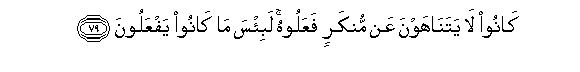

#كَانُوا لَا يَتَنَاهَوْنَ عَنْ مُنْكَرٍ فَعَلُوهُ ۚ لَبِئْسَ مَا كَانُوا يَفْعَلُونَ 

##Kanoo la yatanahawna AAan munkarin faAAaloohu labisa ma kanoo yafAAaloona 

## 翻译(Translation)：

| Translator | 译文(Translation)                                            |
| :--------: | ------------------------------------------------------------ |
|    马坚    | 他们对于自己所作的恶事，不互相劝戒；他们的行为，真恶劣。     |
|  YUSUFALI  | Nor did they (usually) forbid one another the iniquities which they committed: evil indeed were the deeds which they did. |
| PICKTHALL  | They restrained not one another from the wickedness they did. Verily evil was that they used to do! |
|   SHAKIR   | They used not to forbid each other the hateful things (which) they did; certainly evil was that which they did. |

---

## 对位释义(Words Interpretation)：

| No   | العربية | 中文    | English | 曾用词 |
| ---- | ------: | ------- | ------- | ------ |
| 序号 |    阿文 | Chinese | 英文    | Used   |
| 5:79.1  | كَانُوا   | 他们是         | they were               | 见2:10:11 |
| 5:79.2  | لَا      | 不，不是，没有 | no                      | 见2:2.3   |
| 5:79.3  | يَتَنَاهَوْنَ | 他们彼此劝诫   | they forbid one another |           |
| 5:79.4  | عَنْ      | 从             | on                      | 见2:48.6  |
| 5:79.5  | مُنْكَرٍ    | 众恶事         | the iniquities          |           |
| 5:79.6  | فَعَلُوهُ   | 他们做它       | they would have done it | 见4:66.13 |
| 5:79.7  | لَبِئْسَ    | 必定它真恶劣   | certainly evil          | 见5:62.10 |
| 5:79.8  | مَا      | 什么           | what/ that which        | 见2:17.8  |
| 5:79.9  | كَانُوا   | 他们是         | they were               | 见2:10:11 |
| 5:79.10 | يَفْعَلُونَ  | 他们做         | They do                 | 见2:71.24 |

---
