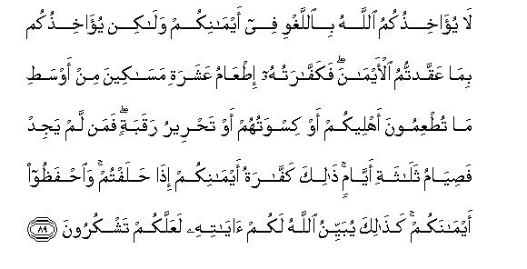

#لَا يُؤَاخِذُكُمُ اللَّهُ بِاللَّغْوِ فِي أَيْمَانِكُمْ وَلَٰكِنْ يُؤَاخِذُكُمْ بِمَا عَقَّدْتُمُ الْأَيْمَانَ ۖ فَكَفَّارَتُهُ إِطْعَامُ عَشَرَةِ مَسَاكِينَ مِنْ أَوْسَطِ مَا تُطْعِمُونَ أَهْلِيكُمْ أَوْ كِسْوَتُهُمْ أَوْ تَحْرِيرُ رَقَبَةٍ ۖ فَمَنْ لَمْ يَجِدْ فَصِيَامُ ثَلَاثَةِ أَيَّامٍ ۚ ذَٰلِكَ كَفَّارَةُ أَيْمَانِكُمْ إِذَا حَلَفْتُمْ ۚ وَاحْفَظُوا أَيْمَانَكُمْ ۚ كَذَٰلِكَ يُبَيِّنُ اللَّهُ لَكُمْ آيَاتِهِ لَعَلَّكُمْ تَشْكُرُونَ 

##La yuakhithukumu Allahu biallaghwi fee aymanikum walakin yuakhithukum bima AAaqqadtumu alaymana fakaffaratuhu itAAamu AAasharati masakeena min awsati ma tutAAimoona ahleekum aw kiswatuhum aw tahreeru raqabatin faman lam yajid fasiyamu thalathati ayyamin thalika kaffaratu aymanikum itha halaftum waihfathoo aymanakum kathalika yubayyinu Allahu lakum ayatihi laAAallakum tashkuroona 

## 翻译(Translation)：

| Translator | 译文(Translation)                                            |
| :--------: | ------------------------------------------------------------ |
|    马坚    | 真主不为无意的誓言而责备你们，却为有意的誓言而责备你们。破坏誓言的罚金，是按自己家属的中等食量，供给十个贫民一餐的口粮，或以衣服赠送他们，或释放一个奴隶。无力济贫或释奴的人，当斋戒三日。这是你们发誓后破坏誓言时的罚金。你们应当信守自己的誓言。真主为你们如此阐明他的迹象，以便你们感谢他。 |
|  YUSUFALI  | Allah will not call you to account for what is futile in your oaths but He will call you to account for your deliberate oaths: for expiation feed then indigent persons on a scale of the average for the food of your families; or clothe them; or give a slave his freedom. If that is beyond your means fast for three days. That is the expiation for the oaths ye have sworn. But keep to your oaths. Thus doth Allah make clear to you His Signs that ye may be grateful. |
| PICKTHALL  | Allah will not take you to task for that which is unintentional in your oaths, but He will take you to task for the oaths which ye swear in earnest. The expiation thereof is the feeding of ten of the needy with the average of that wherewith ye feed your own folk, or the clothing of them, or the liberation of a slave, and for him who findeth not (the wherewithal to do so) then a three days' fast. This is the expiation of your oaths when ye have sworn; and keep your oaths. Thus Allah expoundeth unto you His revelations in order that ye may give thanks. |
|   SHAKIR   | Allah does not call you to account for what is vain in your oaths, but He calls you to account for the making of deliberate oaths; so its expiation is the feeding of ten poor men out of the middling (food) you feed your families with, or their clothing, or the freeing of a neck; but whosoever cannot find (means) then fasting for three days; this is the expiation of your oaths when you swear; and guard your oaths. Thus does Allah make clear to you His communications, that you may be Fateful. |

---

## 对位释义(Words Interpretation)：

| No   | العربية | 中文    | English | 曾用词 |
| ---- | ------: | ------- | ------- | ------ |
| 序号 |    阿文 | Chinese | 英文    | Used   |
| 5:89.1  | لَا      | 不，不是，没有 | no                  | 见2:2.3    |
| 5:89.2  | يُؤَاخِذُكُمُ | 责备你们       | call you to account | 见2:225.2  |
| 5:89.3  | اللَّهُ    | 安拉，真主     | Allah               | 见2:7.2    |
| 5:89.4  | بِاللَّغْوِ  | 以无意的       | for thoughtlessness | 见2:225.4  |
| 5:89.5  | فِي      | 在             | in                  | 见2:10.1   |
| 5:89.6  | أَيْمَانِكُمْ | 你们的誓言     | your oaths          | 见2:225.6  |
| 5:89.7  | وَلَٰكِنْ    | 并且但是       | and but             | 见2:12.5   |
| 5:89.8  | يُؤَاخِذُكُمْ | 责备你们       | call you to account | 见2:225.2  |
| 5:89.9  | بِمَا     | 在什么         | in what             | 见2:4.3    |
| 5:89.10 | عَقَّدْتُمُ   | 你们有意       | your deliberate     |            |
| 5:89.11 | الْأَيْمَانَ | 众誓言         | oaths               |            |
| 5:89.12 | فَكَفَّارَتُهُ | 因此它的罚金   | so its expiation    |            |
| 5:89.13 | إِطْعَامُ   | 饮食           | the feeding         |            |
| 5:89.14 | عَشَرَةِ    | 10的           | of ten              |            |
| 5:89.15 | مَسَاكِينَ  | 贫民的         | of the needy        |            |
| 5:89.16 | مِنْ      | 从             | from                | 见2:4.8    |
| 5:89.17 | أَوْسَطِ    | 平均           | the average         |            |
| 5:89.18 | مَا      | 什么           | what/ that which    | 见2:17.8   |
| 5:89.19 | تُطْعِمُونَ  | 你们饮食       | you feed            |            |
| 5:89.20 | أَهْلِيكُمْ  | 你们的家属     | your families       |            |
| 5:89.21 | أَوْ      | 或             | or                  | 见2:19.1   |
| 5:89.22 | كِسْوَتُهُمْ  | 他们的衣服     | their clothing      |            |
| 5:89.23 | أَوْ      | 或             | or                  | 见2:19.1   |
| 5:89.24 | تَحْرِيرُ   | 释放           | the freeing         |            |
| 5:89.25 | رَقَبَةٍ    | 奴隶           | slave               | 见4:92.14  |
| 5:89.26 | فَمَنْ     | 无论谁         | whosoever           | 见2:38.9   |
| 5:89.27 | لَمْ      | 不，没有       | did not             | 见2:6.8    |
| 5:89.28 | يَجِدْ     | 发现           | find                | 见2:196.47 |
| 5:89.29 | فَصِيَامُ   | 然后斋戒       | then a fast         | 见2:196.48 |
| 5:89.30 | ثَلَاثَةِ   | 三             | three               | 见2:196.49 |
| 5:89.31 | أَيَّامٍ    | 日子           | days                | 见2:184.12 |
| 5:89.32 | ذَٰلِكَ     | 这个           | this                | 见2:2.1    |
| 5:89.33 | كَفَّارَةُ   | 罚金           | the expiation       | 参5:89.12  |
| 5:89.34 | أَيْمَانِكُمْ | 你们的誓言     | your oaths          | 见2:225.6  |
| 5:89.35 | إِذَا     | 当时           | when                | 见2:156.2  |
| 5:89.36 | حَلَفْتُمْ   | 你们发誓       | you swear           |            |
| 5:89.37 | وَاحْفَظُوا | 和你们应守     | and guard           |            |
| 5:89.38 | أَيْمَانَكُمْ | 你们的众誓言   | your oaths          | 参5:89.11  |
| 5:89.39 | كَذَٰلِكَ    | 像如此         | Thus                | 见2:73.4   |
| 5:89.40 | يُبَيِّنُ    | 他阐明         | he make clear       | 见2:187.60 |
| 5:89.41 | اللَّهُ    | 安拉，真主     | Allah               | 见2:7.2    |
| 5:89.42 | لَكُمْ     | 为你们         | For you             | 见2:22.3   |
| 5:89.43 | آيَاتِهِ   | 他的迹象       | His Signs           | 见2:73.9   |
| 5:89.44 | لَعَلَّكُمْ   | 以便你们       | you may             | 见2:21.11  |
| 5:89.45 | تَشْكُرُونَ  | 感谢           | give thanks         | 见2:52.7   |

---
