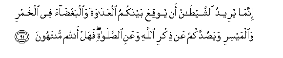

#إِنَّمَا يُرِيدُ الشَّيْطَانُ أَنْ يُوقِعَ بَيْنَكُمُ الْعَدَاوَةَ وَالْبَغْضَاءَ فِي الْخَمْرِ وَالْمَيْسِرِ وَيَصُدَّكُمْ عَنْ ذِكْرِ اللَّهِ وَعَنِ الصَّلَاةِ ۖ فَهَلْ أَنْتُمْ مُنْتَهُونَ 

##Innama yureedu alshshaytanu an yooqiAAa baynakumu alAAadawata waalbaghdaa fee alkhamri waalmaysiri wayasuddakum AAan thikri Allahi waAAani alssalati fahal antum muntahoona 

## 翻译(Translation)：

| Translator | 译文(Translation)                                            |
| :--------: | ------------------------------------------------------------ |
|    马坚    | 恶魔惟愿你们因饮酒和赌博而互相仇恨，并且阻止你们记念真主，和谨守拜功。你们将戒除（饮酒和赌博）吗﹖ |
|  YUSUFALI  | Satan's plan is (but) to excite enmity and hatred between you with intoxicants and gambling and hinder you from the remembrance of Allah and from prayer: will ye not then abstain? |
| PICKTHALL  | Satan seeketh only to cast among you enmity and hatred by means of strong drink and games of chance, and to turn you from remembrance of Allah and from (His) worship. Will ye then have done ? |
|   SHAKIR   | The Shaitan only desires to cause enmity and hatred to spring in your midst by means of intoxicants and games of chance, and to keep you off from the remembrance of Allah and from prayer. Will you then desist? |

---

## 对位释义(Words Interpretation)：

| No   | العربية | 中文    | English | 曾用词 |
| ---- | ------: | ------- | ------- | ------ |
| 序号 |    阿文 | Chinese | 英文    | Used   |
| 5:91.1  | إِنَّمَا     | 仅仅         | only            | 见2:11.9   |
| 5:91.2  | يُرِيدُ     | 希望         | desire          | 见2:185.29 |
| 5:91.3  | الشَّيْطَانُ  | 恶魔         | Satan           | 见2:36.2   |
| 5:91.4  | أَنْ       | 该           | that            | 见2:26.5   |
| 5:91.5  | يُوقِعَ     | 他招致       | cause           |            |
| 5:91.6  | بَيْنَكُمُ    | 你们之间     | between you     | 参5:14.14  |
| 5:91.7  | الْعَدَاوَةَ  | 仇恨         | enmity          | 见5:14.15  |
| 5:91.8  | وَالْبَغْضَاءَ | 和怨恨       | and hatred      | 见5:14.16  |
| 5:91.9  | فِي       | 在           | in              | 见2:10.1   |
| 5:91.10 | الْخَمْرِ    | 饮酒         | wine            | 见2:219.3  |
| 5:91.11 | وَالْمَيْسِرِ  | 和赌博       | and gambling    | 见2:219.4  |
| 5:91.12 | وَيَصُدَّكُمْ   | 和他阻止你们 | and hinder you  |            |
| 5:91.13 | عَنْ       | 从           | on              | 见2:48.6   |
| 5:91.14 | ذِكْرِ      | 记念         | the remembrance |            |
| 5:91.15 | اللَّهِ     | 真主的       | of Allah        | 见2:23.17  |
| 5:91.16 | وَعَنِ      | 和从         | and from        | 参2:48.6   |
| 5:91.17 | الصَّلَاةِ   | 拜功         | the prayer      | 见4:101.11 |
| 5:91.18 | فَهَلْ      | 因此         | then            |            |
| 5:91.19 | أَنْتُمْ     | 你们         | you             | 见2:85.2   |
| 5:91.20 | مُنْتَهُونَ   | 戒除         | abstain         |            |

---
