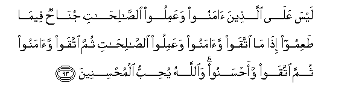

#لَيْسَ عَلَى الَّذِينَ آمَنُوا وَعَمِلُوا الصَّالِحَاتِ جُنَاحٌ فِيمَا طَعِمُوا إِذَا مَا اتَّقَوْا وَآمَنُوا وَعَمِلُوا الصَّالِحَاتِ ثُمَّ اتَّقَوْا وَآمَنُوا ثُمَّ اتَّقَوْا وَأَحْسَنُوا ۗ وَاللَّهُ يُحِبُّ الْمُحْسِنِينَ 

##Laysa AAala allatheena amanoo waAAamiloo alssalihati junahun feema taAAimoo itha ma ittaqaw waamanoo waAAamiloo alssalihati thumma ittaqaw waamanoo thumma ittaqaw waahsanoo waAllahu yuhibbu almuhsineena 

## 翻译(Translation)：

| Translator | 译文(Translation)                                            |
| :--------: | ------------------------------------------------------------ |
|    马坚    | 信道而且行善的人，对于所用的饮食，是毫无罪过的，如果他们敬畏而且信道，并努力为善；然后，敬畏而且信道；然后，敬畏而且行善。真主是喜爱行善者的。 |
|  YUSUFALI  | On those who believe and do deeds of righteousness there is no blame for what they ate (in the past) when they guard themselves from evil and believe and do deeds of righteousness (or) again guard themselves from evil and do good. For Allah loveth those who do good. |
| PICKTHALL  | There shall be no sin (imputed) unto those who believe and do good works for what they may have eaten (in the past). So be mindful of your duty (to Allah), and believe, and do good works; and again: be mindful of your duty, and believe; and once again: be mindful of your duty, and do right. Allah loveth the good. |
|   SHAKIR   | On those who believe and do good there is no blame for what they eat, when they are careful (of their duty) and believe and do good deeds, then they are careful (of their duty) and believe, then they are careful (of their duty) and do good (to others), and Allah loves those who do good (to others). |

---

## 对位释义(Words Interpretation)：

| No   | العربية | 中文    | English | 曾用词 |
| ---- | ------: | ------- | ------- | ------ |
| 序号 |    阿文 | Chinese | 英文    | Used   |
| 5:93.1  | لَيْسَ      | 它不是       | It is not        | 见2:177.1  |
| 5:93.2  | عَلَى      | 至           | On               | 见2:5.2    |
| 5:93.3  | الَّذِينَ    | 谁，那些     | those who        | 见2:6.2    |
| 5:93.4  | آمَنُوا    | 诚信         | believe          | 见2:9.4    |
| 5:93.5  | وَعَمِلُوا   | 工作         | and worked       | 见2:25.4   |
| 5:93.6  | الصَّالِحَاتِ | 善行         | Good deeds       | 见2:25.5   |
| 5:93.7  | جُنَاحٌ     | 罪行         | crime            | 见2:198.3  |
| 5:93.8  | فِيمَا     | 在什么       | in that          | 见2:113.28 |
| 5:93.9  | طَعِمُوا    | 他们吃       | they eat         |            |
| 5:93.10 | إِذَا      | 当时         | when             | 见2:156.2  |
| 5:93.11 | مَا       | 什么         | what/ that which | 见2:17.8   |
| 5:93.12 | اتَّقَوْا    | 虔诚         | keep their duty  | 见2:212.11 |
| 5:93.13 | وَآمَنُوا   | 和诚信       | and believe      | 参2:9.4    |
| 5:93.14 | وَعَمِلُوا   | 工作         | and worked       | 见2:25.4   |
| 5:93.15 | الصَّالِحَاتِ | 善行         | Good deeds       | 见2:25.5   |
| 5:93.16 | ثُمَّ       | 然后         | Then             | 见2:28.7   |
| 5:93.17 | اتَّقَوْا    | 虔诚         | keep their duty  | 见2:212.11 |
| 5:93.18 | وَآمَنُوا   | 和诚信       | and believe      | 见5:93.13 |
| 5:93.19 | ثُمَّ       | 然后         | Then             | 见2:28.7   |
| 5:93.20 | اتَّقَوْا    | 虔诚         | keep their duty  | 见2:212.11 |
| 5:93.21 | وَأَحْسَنُوا  | 和行善       | and do right     | 参3:172.11 |
| 5:93.22 | وَاللَّهُ    | 和安拉，真主 | and Allah        | 见2:19.17  |
| 5:93.23 | يُحِبُّ      | 喜欢         | love             | 见2:190.12 |
| 5:93.24 | الْمُحْسِنِينَ | 行善者       | The right-doers  | 见2:58.20  |

---
