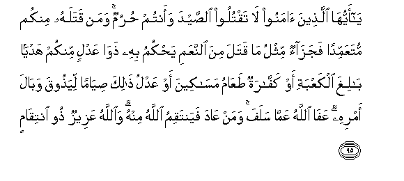

#يَا أَيُّهَا الَّذِينَ آمَنُوا لَا تَقْتُلُوا الصَّيْدَ وَأَنْتُمْ حُرُمٌ ۚ وَمَنْ قَتَلَهُ مِنْكُمْ مُتَعَمِّدًا فَجَزَاءٌ مِثْلُ مَا قَتَلَ مِنَ النَّعَمِ يَحْكُمُ بِهِ ذَوَا عَدْلٍ مِنْكُمْ هَدْيًا بَالِغَ الْكَعْبَةِ أَوْ كَفَّارَةٌ طَعَامُ مَسَاكِينَ أَوْ عَدْلُ ذَٰلِكَ صِيَامًا لِيَذُوقَ وَبَالَ أَمْرِهِ ۗ عَفَا اللَّهُ عَمَّا سَلَفَ ۚ وَمَنْ عَادَ فَيَنْتَقِمُ اللَّهُ مِنْهُ ۗ وَاللَّهُ عَزِيزٌ ذُو انْتِقَامٍ 

##Ya ayyuha allatheena amanoo la taqtuloo alssayda waantum hurumun waman qatalahu minkum mutaAAammidan fajazaon mithlu ma qatala mina alnnaAAami yahkumu bihi thawa AAadlin minkum hadyan baligha alkaAAbati aw kaffaratun taAAamu masakeena aw AAadlu thalika siyaman liyathooqa wabala amrihi AAafa Allahu AAamma salafa waman AAada fayantaqimu Allahu minhu waAllahu AAazeezun thoo intiqamin 

## 翻译(Translation)：

| Translator | 译文(Translation)                                            |
| :--------: | ------------------------------------------------------------ |
|    马坚    | 信道的人们啊! 你们在受戒期间，或在禁地境内，不要宰杀所获的飞禽走兽。你们中谁故意宰杀，谁应以相当的牲畜赎罪，那只牲畜，须经你们中的两个公正人加以审定后，送到克尔白去作供物，或纳罚金，即施舍（几个）贫民一日的口粮；或代以相当的斋戒，以便他尝试犯戒的恶果。真主已恕饶以往的罪过。再犯的人，真主将惩罚他。真主是万能的，是惩恶的。 |
|  YUSUFALI  | O ye who believe! kill not game while in the Sacred Precincts or in pilgrim garb. If any of you doth so intentionally the compensation is an offering brought to the Ka'ba of a domestic animal equivalent to the one he killed as adjudged by two just men among you; or by way of atonement the feeding of the indigent; or its equivalent in fasts: that he may taste of the penalty of his deed. Allah forgives what is past: for repetition Allah will exact from him the penalty: for Allah is Exalted and Lord of Retribution. |
| PICKTHALL  | O ye who believe! Kill no wild game while ye are on the pilgrimage. Whoso of you killeth it of set purpose he shall pay its forfeit in the equivalent of that which he hath killed, of domestic animals, the judge to be two men among you known for justice, (the forfeit) to be brought as an offering to the Ka'bah; or, for expiation, he shall feed poor persons, or the equivalent thereof in fasting, that he may taste the evil consequences of his deed. Allah forgiveth whatever (of this kind) may have happened in the past, but whoso relapseth, Allah will take retribution from him. Allah is Mighty, Able to Requite (the wrong). |
|   SHAKIR   | O you who believe! do not kill game while you are on pilgrimage, and whoever among you shall kill it intentionally, the compensation (of it) is the like of what he killed, from the cattle, as two just persons among you shall judge, as an offering to be brought to the Kaaba or the expiation (of it) is the feeding of the poor or the equivalent of it in fasting, that he may taste the unwholesome result of his deed; Allah has pardoned what is gone by; and whoever returns (to it), Allah will inflict retribution on him; and Allah is Mighty, Lord of Retribution. |

---

## 对位释义(Words Interpretation)：

| No   | العربية | 中文    | English | 曾用词 |
| ---- | ------: | ------- | ------- | ------ |
| 序号 |    阿文 | Chinese | 英文    | Used   |
| 5:95.1  | يَا     | 啊             | Oh                             | 见2:21.1   |
| 5:95.2  | أَيُّهَا   | 语气词         | O                              | 见2:21.2   |
| 5:95.3  | الَّذِينَ  | 谁，那些       | those who                      | 见2:6.2    |
| 5:95.4  | آمَنُوا  | 诚信           | believe                        | 见2:9.4    |
| 5:95.5  | لَا     | 不，不是，没有 | no                             | 见2:2.3    |
| 5:95.6  | تَقْتُلُوا | 你们杀         | you kill                       | 见4:29.18  |
| 5:95.7  | الصَّيْدَ  | 猎物           | game                           | 参5:1.17   |
| 5:95.8  | وَأَنْتُمْ  | 和你们         | and you                        | 见2:22.22  |
| 5:95.9  | حُرُمٌ    | 受戒           | the pilgrimage                 | 见5:1.19   |
| 5:95.10 | وَمَنْ    | 和谁           | and who                        | 见2:108.11 |
| 5:95.11 | قَتَلَهُ   | 他杀它         | he kills it                    |            |
| 5:95.12 | مِنْكُمْ   | 从你们         | Of you                         | 见2:65.5   |
| 5:95.13 | مُتَعَمِّدًا | 故意           | intentionally                  | 见4:93.4   |
| 5:95.14 | فَجَزَاءٌ  | 然后赎罪       | then the compensation          |            |
| 5:95.15 | مِثْلُ    | 相似的         | similar                        | 见2:228.31 |
| 5:95.16 | مَا     | 什么           | what/ that which               | 见2:17.8   |
| 5:95.17 | قَتَلَ    | 杀             | kills                          | 见4:92.10  |
| 5:95.18 | مِنَ     | 从             | from                           | 见2:19.3 |
| 5:95.19 | النَّعَمِ  | 牲畜           | a domestic animal              |            |
| 5:95.20 | يَحْكُمُ   | 他判决         | he judge                       | 见2:113.24 |
| 5:95.21 | بِهِ     | 以它           | with it                        | 见2:22.13  |
| 5:95.22 | ذَوَا    | 拥有者（双数） | as two                         | 参2:105.23 |
| 5:95.23 | عَدْلٍ    | 公正的         | for justice                    |            |
| 5:95.24 | مِنْكُمْ   | 从你们         | Of you                         | 见2:65.5   |
| 5:95.25 | هَدْيًا   | 一个供物       | an offering                    |            |
| 5:95.26 | بَالِغَ   | 被供至         | be brought to                  |            |
| 5:95.27 | الْكَعْبَةِ | 克尔白         | the Kaaba                      |            |
| 5:95.28 | أَوْ     | 或             | or                             | 见2:19.1   |
| 5:95.29 | كَفَّارَةٌ  | 一个补偿       | an expiation                   | 见5:45.21  |
| 5:95.30 | طَعَامُ   | 喂养           | feeding                        | 见2:184.18 |
| 5:95.31 | مَسَاكِينَ | 贫民的         | of the needy                   | 见5:89.15  |
| 5:95.32 | أَوْ     | 或             | or                             | 见2:19.1   |
| 5:95.33 | عَدْلُ    | 代替           | the equivalent                 |            |
| 5:95.34 | ذَٰلِكَ    | 这个           | this                           | 见2:2.1    |
| 5:95.35 | صِيَامًا  | 斋戒           | fasting                        |            |
| 5:95.36 | لِيَذُوقَ  | 以便他尝       | that he may taste              |            |
| 5:95.37 | وَبَالَ   | 恶果           | the evil consequences          |            |
| 5:95.38 | أَمْرِهِ   | 他的行为的     | of his deed                    |            |
| 5:95.39 | عَفَا    | 他饶恕         | he pardoned                    | 见3:152.34 |
| 5:95.40 | اللَّهُ   | 安拉，真主     | Allah                          | 见2:7.2    |
| 5:95.41 | عَمَّا    | 在什么         | of what                        | 见2:74.36  |
| 5:95.42 | سَلَفَ    | 过去           | passed                         | 见2:275.34 |
| 5:95.43 | وَمَنْ    | 和谁           | and who                        | 见2:108.11 |
| 5:95.44 | عَادَ    | 再犯           | returns                        | 见2:275.39 |
| 5:95.45 | فَيَنْتَقِمُ | 因此他惩罚     | so he will inflict retribution |            |
| 5:95.46 | اللَّهُ   | 安拉，真主     | Allah                          | 见2:7.2    |
| 5:95.47 | مِنْهُ    | 从它           | from it                        | 见2:60.10  |
| 5:95.48 | وَاللَّهُ  | 和安拉，真主   | and Allah                      | 见2:19.17  |
| 5:95.49 | عَزِيزٌ   | 万能的         | Mighty                         | 见2:209.11 |
| 5:95.50 | ذُو     | 拥有           | is of                          | 见2:105.23 |
| 5:95.51 | انْتِقَامٍ | 惩恶的         | Retribution                    | 见3:4.18   |

---
