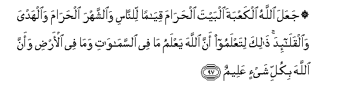

#۞ جَعَلَ اللَّهُ الْكَعْبَةَ الْبَيْتَ الْحَرَامَ قِيَامًا لِلنَّاسِ وَالشَّهْرَ الْحَرَامَ وَالْهَدْيَ وَالْقَلَائِدَ ۚ ذَٰلِكَ لِتَعْلَمُوا أَنَّ اللَّهَ يَعْلَمُ مَا فِي السَّمَاوَاتِ وَمَا فِي الْأَرْضِ وَأَنَّ اللَّهَ بِكُلِّ شَيْءٍ عَلِيمٌ 

##JaAAala Allahu alkaAAbata albayta alharama qiyaman lilnnasi waalshshahra alharama waalhadya waalqalaida thalika litaAAlamoo anna Allaha yaAAlamu ma fee alssamawati wama fee alardi waanna Allaha bikulli shayin AAaleemun 

## 翻译(Translation)：

| Translator | 译文(Translation)                                            |
| :--------: | ------------------------------------------------------------ |
|    马坚    | 真主以克尔白--禁寺--为众人的纲维，又以禁月、供物、项圈，为众人的纲维，这是因为要使你们知道真主全知天上的一切和地上的一切。真主是全知万物的。 |
|  YUSUFALI  | Allah made the Ka'ba the Sacred House an asylum of security for men as also the Sacred Months the animals for offerings and the garlands that mark them: that ye may know that Allah hath knowledge of what is in the heavens and on earth and that Allah is well acquainted with all things. |
| PICKTHALL  | Allah hath appointed the Ka'bah, the Sacred House, a standard for mankind, and the Sacred Month and the offerings and the garlands. That is so that ye may know that Allah knoweth whatsoever is in the heavens and whatsoever is in the earth, and that Allah is Knower of all things. |
|   SHAKIR   | Allah has made the Kaaba, the sacred house, a maintenance for the people, and the sacred month and the offerings and the sacrificial animals with garlands; this is that you may know that Allah knows whatever is in the heavens and whatever is in the earth, and that Allah is the Knower of all things. |

---

## 对位释义(Words Interpretation)：

| No   | العربية | 中文    | English | 曾用词 |
| ---- | ------: | ------- | ------- | ------ |
| 序号 |    阿文 | Chinese | 英文    | Used   |
| 5:97.1  | جَعَلَ      | 使           | make              | 见2:22.2   |
| 5:97.2  | اللَّهُ     | 安拉，真主   | Allah             | 见2:7.2    |
| 5:97.3  | الْكَعْبَةَ   | 克尔白       | the Kaaba         | 参5:95.27  |
| 5:97.4  | الْبَيْتَ    | 天房         | the House         | 见2:125.3  |
| 5:97.5  | الْحَرَامَ   | 禁止的       | Sacred            | 见5:2.11   |
| 5:97.6  | قِيَامًا    | 站着         | standing          | 见3:191.4  |
| 5:97.7  | لِلنَّاسِ    | 对世人       | For people        | 见2:83.17  |
| 5:97.8  | وَالشَّهْرَ   | 和这个月     | and the month     | 参2:185.16 |
| 5:97.9  | الْحَرَامَ   | 禁止的       | Sacred            | 见5:2.11   |
| 5:97.10 | وَالْهَدْيَ   | 和牺牲用的   | and the offerings | 参5:2.13   |
| 5:97.11 | وَالْقَلَائِدَ | 和挂项饰的   | and the garlands  | 参5:2.15   |
| 5:97.12 | ذَٰلِكَ      | 这个         | this              | 见2:2.1    |
| 5:97.13 | لِتَعْلَمُوا  | 以便你们知道 | so that you know  | 参4:43.11  |
| 5:97.14 | أَنَّ       | 该           | that              | 见2:26.5   |
| 5:97.15 | اللَّهَ     | 安拉，真主   | Allah             | 见2:9.2    |
| 5:97.16 | يَعْلَمُ     | 知道         | knows             | 见2:77.5   |
| 5:97.17 | مَا       | 什么         | what/ that which  | 见2:17.8   |
| 5:97.18 | فِي       | 在           | in                | 见2:10.1   |
| 5:97.19 | السَّمَاوَاتِ | 诸天的       | of the heavens    | 见2:33.16  |
| 5:97.20 | وَمَا      | 和什么       | and that          | 见2:4.6    |
| 5:97.21 | فِي       | 在           | in                | 见2:10.1   |
| 5:97.22 | الْأَرْضِ    | 大地         | Earth             | 见2:22.4   |
| 5:97.23 | وَأَنَّ      | 和那个       | and that          | 见2:165.28 |
| 5:97.24 | اللَّهَ     | 安拉，真主   | Allah             | 见2:9.2    |
| 5:97.25 | بِكُلِّ      | 所有         | All               | 见2:29.17  |
| 5:97.26 | شَيْءٍ      | 事物         | Thing             | 见2:20.24  |
| 5:97.27 | عَلِيمٌ     | 全知的       | Knowing           | 见2:29.19  |

---
