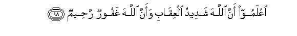

#اعْلَمُوا أَنَّ اللَّهَ شَدِيدُ الْعِقَابِ وَأَنَّ اللَّهَ غَفُورٌ رَحِيمٌ 

##IAAlamoo anna Allaha shadeedu alAAiqabi waanna Allaha ghafoorun raheemun 

## 翻译(Translation)：

| Translator | 译文(Translation)                                            |
| :--------: | ------------------------------------------------------------ |
|    马坚    | 你们应当知道真主的刑罚是严厉的，真主是至赦的，是至慈的。     |
|  YUSUFALI  | Know ye that Allah is strict in punishment and that Allah is Oft- Forgiving Most Merciful. |
| PICKTHALL  | Know that Allah is severe in punishment, but that Allah (also) is Forgiving, Merciful. |
|   SHAKIR   | Know that Allah is severe in requiting (evil) and that Allah is Forgiving, Merciful. |

---

## 对位释义(Words Interpretation)：

| No   | العربية | 中文    | English | 曾用词 |
| ---- | ------: | ------- | ------- | ------ |
| 序号 |    阿文 | Chinese | 英文    | Used   |
| 5:98.1 | اعْلَمُوا | 你们应知道 | you know   |            |
| 5:98.2 | أَنَّ     | 该         | that       | 见2:26.5   |
| 5:98.3 | اللَّهَ   | 安拉，真主 | Allah      | 见2:9.2    |
| 5:98.4 | شَدِيدُ   | 严厉       | strongly   | 见2:165.30 |
| 5:98.5 | الْعِقَابِ | 刑罚       | punishment | 见2:196.73 |
| 5:98.6 | وَأَنَّ    | 和那个     | and that   | 见2:165.28 |
| 5:98.7 | اللَّهَ   | 安拉，真主 | Allah      | 见2:9.2    |
| 5:98.8 | غَفُورٌ   | 至赦的     | Forgiving  | 见2:173.24 |
| 5:98.9 | رَحِيمٌ   | 至慈的     | Merciful   | 见2:143.45 |

---
