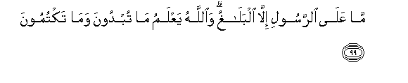

#مَا عَلَى الرَّسُولِ إِلَّا الْبَلَاغُ ۗ وَاللَّهُ يَعْلَمُ مَا تُبْدُونَ وَمَا تَكْتُمُونَ 

##Ma AAala alrrasooli illa albalaghu waAllahu yaAAlamu ma tubdoona wama taktumoona 

## 翻译(Translation)：

| Translator | 译文(Translation)                                            |
| :--------: | ------------------------------------------------------------ |
|    马坚    | 使者只负通知的责任。真主知道你们所表现的，和你们所隐讳的。   |
|  YUSUFALI  | The Apostle's duty is but to proclaim (the Message): but Allah knoweth all that ye reveal and ye conceal. |
| PICKTHALL  | The duty of the messenger is only to convey (the message). Allah knoweth what ye proclaim and what ye hide. |
|   SHAKIR   | Nothing is (incumbent) on the Apostle but to deliver (the message), and Allah knows what you do openly and what you hide. |

---

## 对位释义(Words Interpretation)：

| No   | العربية | 中文    | English | 曾用词 |
| ---- | ------: | ------- | ------- | ------ |
| 序号 |    阿文 | Chinese | 英文    | Used   |
| 5:99.1  | مَا     | 不           | not              | 见2:120.24 |
| 5:99.2  | عَلَى    | 至           | On               | 见2:5.2    |
| 5:99.3  | الرَّسُولِ | 使者         | the Messenger    | 见4:61.10  |
| 5:99.4  | إِلَّا    | 除了         | Except           | 见2:9.7    |
| 5:99.5  | الْبَلَاغُ | 传达         | the delivery     | 见3:20.23  |
| 5:99.6  | وَاللَّهُ  | 和安拉，真主 | and Allah        | 见2:19.17  |
| 5:99.7  | يَعْلَمُ   | 知道         | knows            | 见2:77.5   |
| 5:99.8  | مَا     | 什么         | what/ that which | 见2:17.8   |
| 5:99.9  | تُبْدُونَ  | 你表白的     | You reveal       | 见2:33.20  |
| 5:99.10 | وَمَا    | 和什么       | and that         | 见2:4.6    |
| 5:99.11 | تَكْتُمُونَ | 你隐藏       | You hide         | 见2:33.23  |

---
