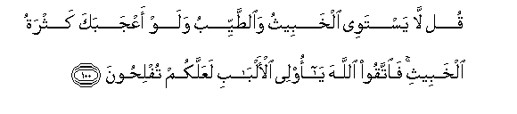

#قُلْ لَا يَسْتَوِي الْخَبِيثُ وَالطَّيِّبُ وَلَوْ أَعْجَبَكَ كَثْرَةُ الْخَبِيثِ ۚ فَاتَّقُوا اللَّهَ يَا أُولِي الْأَلْبَابِ لَعَلَّكُمْ تُفْلِحُونَ 

##Qul la yastawee alkhabeethu waalttayyibu walaw aAAjabaka kathratu alkhabeethi faittaqoo Allaha ya olee alalbabi laAAallakum tuflihoona 

## 翻译(Translation)：

| Translator | 译文(Translation)                                            |
| :--------: | ------------------------------------------------------------ |
|    马坚    | 你说：污秽的和清洁的，是不相等的，即使污秽的为数很多，使你赞叹。有理智的人啊；你们当敬畏真主，以便你们成功。 |
|  YUSUFALI  | Say: "Not equal are things that are bad and things that are good even though the abundance of the bad may dazzle thee; so fear Allah O ye that understand! that (so) ye may prosper." |
| PICKTHALL  | Say: The evil and the good are not alike even though the plenty of the evil attract thee. So be mindful of your duty to Allah, O men of understanding, that ye may succeed. |
|   SHAKIR   | Say: The bad and the good are not equal, though the abundance of the bad may please you; so be careful of (your duty to) Allah, O men of understanding, that you may be successful. |

---

## 对位释义(Words Interpretation)：

| No   | العربية | 中文    | English | 曾用词 |
| ---- | ------: | ------- | ------- | ------ |
| 序号 |    阿文 | Chinese | 英文    | Used   |
| 5:100.1  | قُلْ      | 你说           | Say              | 见2:80.8   |
| 5:100.2  | لَا      | 不，不是，没有 | no               | 见2:2.3    |
| 5:100.3  | يَسْتَوِي   | 他们相等       | equal            | 见4:95.2   |
| 5:100.4  | الْخَبِيثُ  | 污秽           | the bad          |            |
| 5:100.5  | وَالطَّيِّبُ  | 和清洁         | and the good     |            |
| 5:100.6  | وَلَوْ     | 和如果         | and if           | 见2:20.14  |
| 5:100.7  | أَعْجَبَكَ   | 他使你赞叹     | it please you    |            |
| 5:100.8  | كَثْرَةُ    | 丰富           | the plenty       |            |
| 5:100.9  | الْخَبِيثِ  | 污秽           | the bad          | 参5:100.4  |
| 5:100.10 | فَاتَّقُوا  | 敬畏           | fear             | 见2:24.6   |
| 5:100.11 | اللَّهَ    | 安拉，真主     | Allah            | 见2:9.2    |
| 5:100.12 | يَا      | 啊             | Oh               | 见2:21.1   |
| 5:100.13 | أُولِي    | 人们           | men              | 见2:179.6  |
| 5:100.14 | الْأَلْبَابِ | 理智的         | of understanding | 见2:179.7  |
| 5:100.15 | لَعَلَّكُمْ   | 以便你们       | you may          | 见2:21.11  |
| 5:100.16 | تُفْلِحُونَ  | 成功           | be successful    | 见2:189.27 |

---
