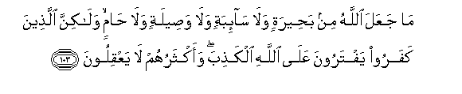

#مَا جَعَلَ اللَّهُ مِنْ بَحِيرَةٍ وَلَا سَائِبَةٍ وَلَا وَصِيلَةٍ وَلَا حَامٍ ۙ وَلَٰكِنَّ الَّذِينَ كَفَرُوا يَفْتَرُونَ عَلَى اللَّهِ الْكَذِبَ ۖ وَأَكْثَرُهُمْ لَا يَعْقِلُونَ 

##Ma jaAAala Allahu min baheeratin wala saibatin wala waseelatin wala hamin walakinna allatheena kafaroo yaftaroona AAala Allahi alkathiba waaktharuhum la yaAAqiloona 

## 翻译(Translation)：

| Translator | 译文(Translation)                                            |
| :--------: | ------------------------------------------------------------ |
|    马坚    | 真主没有规定缺耳驼、逍遥驼、孪生羊、免役驼；但不信道的人，假借真主的名义而造谣；他们大半是不了解的。 |
|  YUSUFALI  | It was not Allah Who instituted (superstitions like those of) a slit-ear she-camel or a she-camel let loose for free pasture or idol sacrifices for twin-births in animals or stallion-camels freed from work; it is blasphemers who invent a lie against Allah but most of them lack wisdom. |
| PICKTHALL  | Allah hath not appointed anything in the nature of a Bahirah or a Sa'ibah or a Wasilah or a Hami, but those who disbelieve invent a lie against Allah. Most of them have no sense. |
|   SHAKIR   | Allah has not ordained (the making of) a bahirah or a saibah or a wasilah or a hami but those who disbelieve fabricate a lie against Allah, and most of them do not understand. |

---

## 对位释义(Words Interpretation)：

| No   | العربية | 中文    | English | 曾用词 |
| ---- | ------: | ------- | ------- | ------ |
| 序号 |    阿文 | Chinese | 英文    | Used   |
| 5:103.1  | مَا      | 不             | not              | 见2:120.24 |
| 5:103.2  | جَعَلَ     | 使             | make             | 见2:22.2   |
| 5:103.3  | اللَّهُ    | 安拉，真主     | Allah            | 见2:7.2    |
| 5:103.4  | مِنْ      | 从             | from             | 见2:4.8    |
| 5:103.5  | بَحِيرَةٍ   | 缺耳驼         | a Bahirah        |            |
| 5:103.6  | وَلَا     | 也不           | and not          | 见1:7.8    |
| 5:103.7  | سَائِبَةٍ   | 逍遥驼         | a Sa'ibah        |            |
| 5:103.8  | وَلَا     | 也不           | and not          | 见1:7.8    |
| 5:103.9  | وَصِيلَةٍ   | 孪生羊         | a Wasilah        |            |
| 5:103.10 | وَلَا     | 也不           | and not          | 见1:7.8    |
| 5:103.11 | حَامٍ     | 免役驼         | a Hami           |            |
| 5:103.12 | وَلَٰكِنَّ    | 并且但是       | and but          | 见2:12.5   |
| 5:103.13 | الَّذِينَ   | 谁，那些       | those who        | 见2:6.2    |
| 5:103.14 | كَفَرُوا   | 不信           | disbelieve       | 见2:6.3    |
| 5:103.15 | يَفْتَرُونَ  | 他们虚构       | they have forged | 见3:24.15  |
| 5:103.16 | عَلَى     | 至             | On               | 见2:5.2    |
| 5:103.17 | اللَّهِ    | 真主的         | of Allah         | 见2:23.17  |
| 5:103.18 | الْكَذِبَ   | 一个谎言       | a lie            | 见3:75.34  |
| 5:103.19 | وَأَكْثَرُهُمْ | 和他们的大多数 | and most of them | 参2:100.8  |
| 5:103.20 | لَا      | 不，不是，没有 | no               | 见2:2.3    |
| 5:103.21 | يَعْقِلُونَ  | 他们了解       | They understand  | 见2:164.43 |

---
