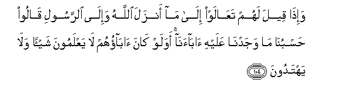

#وَإِذَا قِيلَ لَهُمْ تَعَالَوْا إِلَىٰ مَا أَنْزَلَ اللَّهُ وَإِلَى الرَّسُولِ قَالُوا حَسْبُنَا مَا وَجَدْنَا عَلَيْهِ آبَاءَنَا ۚ أَوَلَوْ كَانَ آبَاؤُهُمْ لَا يَعْلَمُونَ شَيْئًا وَلَا يَهْتَدُونَ 

##Waitha qeela lahum taAAalaw ila ma anzala Allahu waila alrrasooli qaloo hasbuna ma wajadna AAalayhi abaana awalaw kana abaohum la yaAAlamoona shayan wala yahtadoona 

## 翻译(Translation)：

| Translator | 译文(Translation)                                            |
| :--------: | ------------------------------------------------------------ |
|    马坚    | 有人对他们说：你们来遵守真主所降示的经典吧。来服从使者吧! 他们就说：能满足我们的，是我们的祖先的宗教。即使他们的祖先无知无识，不循正道，（他们仍要遵守）他们的宗教吗﹖ |
|  YUSUFALI  | When it is said to them: "Come to what Allah hath revealed; come to the Apostle": they say: "Enough for us are the ways we found our fathers following." What! even though their fathers were void of knowledge and guidance? |
| PICKTHALL  | And when it is said unto them: Come unto that which Allah hath revealed and unto the messenger, they say: Enough for us is that wherein we found our fathers. What! Even though their fathers had no knowledge whatsoever, and no guidance ? |
|   SHAKIR   | And when it is said to them, Come to what Allah has revealed and to the Apostle, they say: That on which we found our fathers is sufficient for us. What! even though their fathers knew nothing and did not follow the right way. |

---

## 对位释义(Words Interpretation)：

| No   | العربية | 中文    | English | 曾用词 |
| ---- | ------: | ------- | ------- | ------ |
| 序号 |    阿文 | Chinese | 英文    | Used   |
| 5:104.1  | وَإِذَا   | 和当                   | and when                  | 见2:11.1   |
| 5:104.2  | قِيلَ    | 告诉                   | said                      | 见2:11.2   |
| 5:104.3  | لَهُمْ    | 对他们                 | for them                  | 见2:11.3   |
| 5:104.4  | تَعَالَوْا | 你们来                 | Come                      | 见3:61.11  |
| 5:104.5  | إِلَىٰ    | 至                     | to                        | 见2:14.9   |
| 5:104.6  | مَا     | 什么                   | what/ that which          | 见2:17.8   |
| 5:104.7  | أَنْزَلَ   | 下降，颁降，降示，揭秘 | get down                  | 见2:4.4    |
| 5:104.8  | اللَّهُ   | 安拉，真主             | Allah                     | 见2:7.2    |
| 5:104.9  | وَإِلَى   | 和至                   | and to                    | 见2:210.14 |
| 5:104.10 | الرَّسُولِ | 使者                   | the Messenger             | 见4:61.10  |
| 5:104.11 | قَالُوا  | 他们说，               | They said                 | 见2:11.8   |
| 5:104.12 | حَسْبُنَا  | 满足我们的             | sufficient for us         | 见3:173.14 |
| 5:104.13 | مَا     | 什么                   | what/ that which          | 见2:17.8   |
| 5:104.14 | وَجَدْنَا  | 我们发现               | we found                  |            |
| 5:104.15 | عَلَيْهِ   | 在他                   | on him                    | 见2:37.7   |
| 5:104.16 | آبَاءَنَا | 我们的祖先             | our fathers               | 见2:170.14 |
| 5:104.17 | أَوَلَوْ   | 什么？和假如           | What! and though          | 见2:170.15 |
| 5:104.18 | كَانَ    | 他是                   | It was                    | 见2:75.6   |
| 5:104.19 | آبَاؤُهُمْ | 他们的祖先             | their fathers             | 见2:170.17 |
| 5:104.20 | لَا     | 不，不是，没有         | no                        | 见2:2.3    |
| 5:104.21 | يَعْلَمُونَ | 知道                   | Know                      | 见2:13.19  |
| 5:104.22 | شَيْئًا   | 一件事情               | a thing                   | 见2:48.8   |
| 5:104.23 | وَلَا    | 也不                   | and not                   | 见1:7.8    |
| 5:104.24 | يَهْتَدُونَ | 他们遵循正道           | they follow the right way | 见2:170.22 |

---
