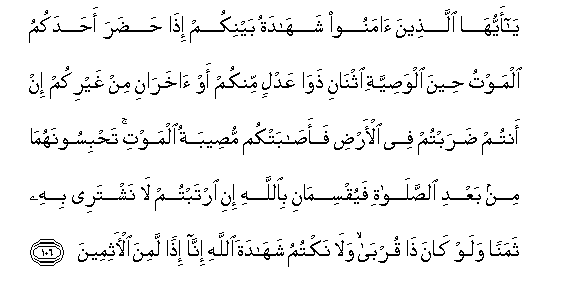

#يَا أَيُّهَا الَّذِينَ آمَنُوا شَهَادَةُ بَيْنِكُمْ إِذَا حَضَرَ أَحَدَكُمُ الْمَوْتُ حِينَ الْوَصِيَّةِ اثْنَانِ ذَوَا عَدْلٍ مِنْكُمْ أَوْ آخَرَانِ مِنْ غَيْرِكُمْ إِنْ أَنْتُمْ ضَرَبْتُمْ فِي الْأَرْضِ فَأَصَابَتْكُمْ مُصِيبَةُ الْمَوْتِ ۚ تَحْبِسُونَهُمَا مِنْ بَعْدِ الصَّلَاةِ فَيُقْسِمَانِ بِاللَّهِ إِنِ ارْتَبْتُمْ لَا نَشْتَرِي بِهِ ثَمَنًا وَلَوْ كَانَ ذَا قُرْبَىٰ ۙ وَلَا نَكْتُمُ شَهَادَةَ اللَّهِ إِنَّا إِذًا لَمِنَ الْآثِمِينَ 

##Ya ayyuha allatheena amanoo shahadatu baynikum itha hadara ahadakumu almawtu heena alwasiyyati ithnani thawa AAadlin minkum aw akharani min ghayrikum in antum darabtum fee alardi faasabatkum museebatu almawti tahbisoonahuma min baAAdi alssalati fayuqsimani biAllahi ini irtabtum la nashtaree bihi thamanan walaw kana tha qurba wala naktumu shahadata Allahi inna ithan lamina alathimeena 

## 翻译(Translation)：

| Translator | 译文(Translation)                                            |
| :--------: | ------------------------------------------------------------ |
|    马坚    | 信道的人们啊! 当你们中有人临终作遗嘱的时候，你们之间的作证，是你们（教胞）中两个公正人的作证，或别的两个外（教）人的作证，倘若你们旅行异乡，而病势垂危。礼拜之后，你们留著这两个证人，如果你们怀疑他们俩的忠实，他们俩就奉真主之名而发誓，说：我们俩不以这个盟誓换取任何代价，即使我们俩所代证的，是我们俩的亲戚，我们俩也不隐讳真主所重视的证据；否则，我们俩必是犯罪的人。 |
|  YUSUFALI  | O ye who believe! when death approaches any of you (take) witnesses among yourselves when making bequests two just men of your own (brotherhood) or others from outside if ye are journeying through the earth and the chance of death befalls you (thus). If ye doubt (their truth) detain them both after prayer and let them both swear by Allah: "We wish not in this for any worldly gain even though the (beneficiary) be our near relation: we shall hide not the evidence before Allah: if we do then behold! the sin be upon us!" |
| PICKTHALL  | O ye who believe! Let there be witnesses between you when death draweth nigh unto one of you, at the time of bequest - two witnesses, just men from among you, or two others from another tribe, in case ye are campaigning in the land and the calamity of death befall you. Ye shall empanel them both after the prayer, and, if ye doubt, they shall be made to swear by Allah (saying): We will not take a bribe, even though it were (on behalf of) a near kinsman nor will we hide the testimony of Allah, for then indeed we should be of the sinful. |
|   SHAKIR   | O you who believe! call to witness between you when death draws nigh to one of you, at the time of making the will, two just persons from among you, or two others from among others than you, if you are travelling in the land and the calamity of death befalls you; the two (witnesses) you should detain after the prayer; then if you doubt (them), they shall both swear by Allah, (saying): We will not take for it a price, though there be a relative, and we will not hide the testimony of Allah for then certainly we should be among the sinners. |

---

## 对位释义(Words Interpretation)：

| No   | العربية | 中文    | English | 曾用词 |
| ---- | ------: | ------- | ------- | ------ |
| 序号 |    阿文 | Chinese | 英文    | Used   |
| 5:106.1  | يَا        | 啊             | Oh                         | 见2:21.1   |
| 5:106.2  | أَيُّهَا      | 语气词         | O                          | 见2:21.2   |
| 5:106.3  | الَّذِينَ     | 谁，那些       | those who                  | 见2:6.2    |
| 5:106.4  | آمَنُوا     | 诚信           | believe                    | 见2:9.4    |
| 5:106.5  | شَهَادَةُ     | 作证           | witness                    |            |
| 5:106.6  | بَيْنِكُمْ     | 你们之间的     | between you                |            |
| 5:106.7  | إِذَا       | 当时           | when                       | 见2:156.2  |
| 5:106.8  | حَضَرَ       | 接近           | came to                    | 见2:133.5  |
| 5:106.9  | أَحَدَكُمُ     | 你们的任一个   | one of you                 | 见2:180.5  |
| 5:106.10 | الْمَوْتُ     | 死亡           | the death                  | 见2:19.16  |
| 5:106.11 | حِينَ       | 当             | when                       | 见5:101.16 |
| 5:106.12 | الْوَصِيَّةِ    | 一个遗嘱的     | the will                   |            |
| 5:106.13 | اثْنَانِ     | 二             | two                        |            |
| 5:106.14 | ذَوَا       | 拥有者（双数） | as two                     | 见5:95.22  |
| 5:106.15 | عَدْلٍ       | 公正的         | for justice                | 见5:95.23  |
| 5:106.16 | مِنْكُمْ      | 从你们         | Of you                     | 见2:65.5   |
| 5:106.17 | أَوْ        | 或             | or                         | 见2:19.1   |
| 5:106.18 | آخَرَانِ     | 另外两人       | two others                 |            |
| 5:106.19 | مِنْ        | 从             | from                       | 见2:4.8    |
| 5:106.20 | غَيْرِكُمْ     | 不是你们       | others than you            |            |
| 5:106.21 | إِنْ        | 如果           | if                         | 见2:23.18  |
| 5:106.22 | أَنْتُمْ      | 你们           | you                        | 见2:85.2   |
| 5:106.23 | ضَرَبْتُمْ     | 你们外出       | you go abroad              | 见4:94.6   |
| 5:106.24 | فِي        | 在             | in                         | 见2:10.1   |
| 5:106.25 | الْأَرْضِ     | 大地           | Earth                      | 见2:22.4   |
| 5:106.26 | فَأَصَابَتْكُمْ  | 然后遭受你们   | then befell you            | 参3:165.2  |
| 5:106.27 | مُصِيبَةُ     | 灾难           | the calamity               |            |
| 5:106.28 | الْمَوْتِ     | 死亡           | the death                  | 见2:19.16  |
| 5:106.29 | تَحْبِسُونَهُمَا | 你们留着他俩   | you detain them both       |            |
| 5:106.30 | مِنْ        | 从             | from                       | 见2:4.8    |
| 5:106.31 | بَعْدِ       | 之后           | after                      | 见2:27.6   |
| 5:106.32 | الصَّلَاةِ    | 拜功           | the prayer                 | 见4:101.11 |
| 5:106.33 | فَيُقْسِمَانِ   | 然后他俩发誓   | then they shall both swear |            |
| 5:106.34 | بِاللَّهِ     | 在真主         | in Allah                   | 见2:8.6    |
| 5:106.35 | إِنِ        | 如果           | if                         | 见2:217.36 |
| 5:106.36 | ارْتَبْتُمْ    | 你们怀疑       | you doubt                  |            |
| 5:106.37 | لَا        | 不，不是，没有 | no                         | 见2:2.3    |
| 5:106.38 | نَشْتَرِي     | 我们换取       | we take                    |            |
| 5:106.39 | بِهِ        | 以它           | with it                    | 见2:22.13  |
| 5:106.40 | ثَمَنًا      | 价钱           | Price                      | 见2:41.15  |
| 5:106.41 | وَلَوْ       | 和如果         | and if                     | 见2:20.14  |
| 5:106.42 | كَانَ       | 他是           | It was                     | 见2:75.6   |
| 5:106.43 | ذَا        | 拥有           | is                         | 见2:245.2  |
| 5:106.44 | قُرْبَىٰ      | 亲戚关系的     | near relation              |            |
| 5:106.45 | وَلَا       | 也不           | and not                    | 见1:7.8    |
| 5:106.46 | نَكْتُمُ      | 我们隐讳       | we hide                    |            |
| 5:106.47 | شَهَادَةَ     | 作证           | witness                    | 参5:106.5  |
| 5:106.48 | اللَّهِ      | 真主的         | of Allah                   | 见2:23.17  |
| 5:106.49 | إِنَّا       | 确实我们       | surely we                  | 见2:14.12  |
| 5:106.50 | إِذًا       | 然后           | then                       | 见2:145.30 |
| 5:106.51 | لَمِنَ       | 必定从         | surly from                 | 见2:130.17 |
| 5:106.52 | الْآثِمِينَ   | 众犯罪者       | the sinners                |            |

---
