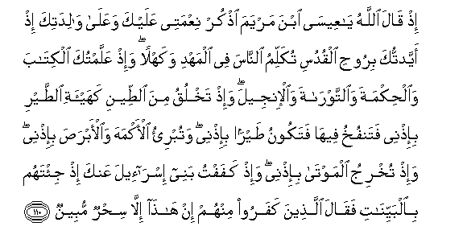

#إِذْ قَالَ اللَّهُ يَا عِيسَى ابْنَ مَرْيَمَ اذْكُرْ نِعْمَتِي عَلَيْكَ وَعَلَىٰ وَالِدَتِكَ إِذْ أَيَّدْتُكَ بِرُوحِ الْقُدُسِ تُكَلِّمُ النَّاسَ فِي الْمَهْدِ وَكَهْلًا ۖ وَإِذْ عَلَّمْتُكَ الْكِتَابَ وَالْحِكْمَةَ وَالتَّوْرَاةَ وَالْإِنْجِيلَ ۖ وَإِذْ تَخْلُقُ مِنَ الطِّينِ كَهَيْئَةِ الطَّيْرِ بِإِذْنِي فَتَنْفُخُ فِيهَا فَتَكُونُ طَيْرًا بِإِذْنِي ۖ وَتُبْرِئُ الْأَكْمَهَ وَالْأَبْرَصَ بِإِذْنِي ۖ وَإِذْ تُخْرِجُ الْمَوْتَىٰ بِإِذْنِي ۖ وَإِذْ كَفَفْتُ بَنِي إِسْرَائِيلَ عَنْكَ إِذْ جِئْتَهُمْ بِالْبَيِّنَاتِ فَقَالَ الَّذِينَ كَفَرُوا مِنْهُمْ إِنْ هَٰذَا إِلَّا سِحْرٌ مُبِينٌ 

##Ith qala Allahu ya AAeesa ibna maryama othkur niAAmatee AAalayka waAAala walidatika ith ayyadtuka biroohi alqudusi tukallimu alnnasa fee almahdi wakahlan waith AAallamtuka alkitaba waalhikmata waalttawrata waalinjeela waith takhluqu mina altteeni kahayati alttayri biithnee fatanfukhu feeha fatakoonu tayran biithnee watubrio alakmaha waalabrasa biithnee waith tukhriju almawta biithnee waith kafaftu banee israeela AAanka ith jitahum bialbayyinati faqala allatheena kafaroo minhum in hatha illa sihrun mubeenun 

## 翻译(Translation)：

| Translator | 译文(Translation)                                            |
| :--------: | ------------------------------------------------------------ |
|    马坚    | 那时，真主将说麦尔彦之子尔撒啊! 你当记忆我所赐你和你母亲的恩典。当时，我曾以玄灵扶助你，你在摇篮里，在壮年时，对人说话。当时，我曾教你书法、智慧、《讨拉特》和《引支勒》。当时，你奉我的命令，用泥捏一只像鸟样的东西，你吹气在里面，它就奉我的命令而飞动。你曾奉我的命令而治疗天然盲和大麻疯。你又奉我的命令而使死人复活。当时，我曾阻止以色列的后裔伤害你。当时，你曾昭示他们许多迹象，他们中不信道的人说：这只是明显的魔术。 |
|  YUSUFALI  | Then will Allah say: "O Jesus the son of Mary! recount my favor to thee and to thy mother. Behold! I strengthened thee with the holy spirit so that thou didst speak to the people in childhood and in maturity. Behold! I taught thee the Book and Wisdom the Law and the Gospel. And behold! thou makest out of clay as it were the figure of a bird by My leave and thou breathest into it and it becometh a bird by My leave and thou healest those born blind and the lepers by My leave. And behold! thou bringest forth the dead by My leave. And behold! I did restrain the Children of Israel from (violence to) thee when thou didst show them the Clear Signs and the unbelievers among them said: `This is nothing but evident magic'. |
| PICKTHALL  | When Allah saith: O Jesus, son of Mary! Remember My favour unto thee and unto thy mother; how I strengthened thee with the holy Spirit, so that thou spakest unto mankind in the cradle as in maturity; and how I taught thee the Scripture and Wisdom and the Torah and the Gospel; and how thou didst shape of clay as it were the likeness of a bird by My permission, and didst blow upon it and it was a bird by My permission, and thou didst heal him who was born blind and the leper by My permission; and how thou didst raise the dead by My permission; and how I restrained the Children of Israel from (harming) thee when thou camest unto them with clear proofs, and those of them who disbelieved exclaimed: This is naught else than mere magic; |
|   SHAKIR   | When Allah will say: O Isa son of Marium! Remember My favor on you and on your mother, when I strengthened you I with the holy Spirit, you spoke to the people in the cradle and I when of old age, and when I taught you the Book and the wisdom and the Taurat and the Injeel; and when you determined out of clay a thing like the form of a bird by My permission, then you breathed into it and it became a bird by My permission, and you healed the blind and the leprous by My permission; and when you brought forth the dead by My permission; and when I withheld the children of Israel from you when you came to them with clear arguments, but those who disbelieved among them said: This is nothing but clear enchantment. |

---

## 对位释义(Words Interpretation)：

| No   | العربية | 中文    | English | 曾用词 |
| ---- | ------: | ------- | ------- | ------ |
| 序号 |    阿文 | Chinese | 英文    | Used   |
| 5:110.1  | إِذْ       | 当时           | when               | 见2:131.1  |
| 5:110.2  | قَالَ      | 他说，         | He said            | 见2:30.2   |
| 5:110.3  | اللَّهُ     | 安拉，真主     | Allah              | 见2:7.2    |
| 5:110.4  | يَا       | 啊             | Oh                 | 见2:21.1   |
| 5:110.5  | عِيسَى     | 尔撒           | Isa                | 见2:87.10  |
| 5:110.6  | ابْنَ      | 儿子           | Son                | 见2:87.11  |
| 5:110.7  | مَرْيَمَ     | 麦尔彦         | Marium             | 见2:87.12  |
| 5:110.8  | اذْكُرْ     | 你应记忆       | Remember           |            |
| 5:110.9  | نِعْمَتِي    | 我的恩典       | my favours         | 见2:150.28 |
| 5:110.10 | عَلَيْكَ     | 在你           | on you             | 见2:252.5  |
| 5:110.11 | وَعَلَىٰ     | 和至           | and on             | 见2:7.5    |
| 5:110.12 | وَالِدَتِكَ   | 你的母亲       | your mother        |            |
| 5:110.13 | إِذْ       | 当时           | when               | 见2:131.1  |
| 5:110.14 | أَيَّدْتُكَ    | 我扶助你       | I strengthened you |            |
| 5:110.15 | بِرُوحِ     | 以灵           | with spirit        | 见2:87.15  |
| 5:110.16 | الْقُدُسِ    | 神圣的         | the Holy           | 见2:87.16  |
| 5:110.17 | تُكَلِّمُ     | 你说话         | you spoke          |            |
| 5:110.18 | النَّاسَ    | 人             | People             | 见2:8.2    |
| 5:110.19 | فِي       | 在             | in                 | 见2:10.1   |
| 5:110.20 | الْمَهْدِ    | 摇篮           | the cradle         | 见3:46.4   |
| 5:110.21 | وَكَهْلًا    | 和成年         | and manhood        | 见3:46.5   |
| 5:110.22 | وَإِذْ      | 和当时         | and when           | 见2:30.1   |
| 5:110.23 | عَلَّمْتُكَ    | 我教你         | I taught you       |            |
| 5:110.24 | الْكِتَابَ   | 这部经，这本书 | the book           | 见2:2.2    |
| 5:110.25 | وَالْحِكْمَةَ  | 和智慧         | and wisdom         | 见2:129.11 |
| 5:110.26 | وَالتَّوْرَاةَ | 和讨拉特       | and the Torah      | 见3:48.4   |
| 5:110.27 | وَالْإِنْجِيلَ | 和引支勒       | and the Injeel     | 见3:3.11   |
| 5:110.28 | وَإِذْ      | 和当时         | and when           | 见2:30.1   |
| 5:110.29 | تَخْلُقُ     | 你捏           | you did shape      |            |
| 5:110.30 | مِنَ       | 从             | from               | 见2:19.3 |
| 5:110.31 | الطِّينِ    | 泥土           | clay               | 见3:49.15  |
| 5:110.32 | كَهَيْئَةِ    | 像东西         | like the form      | 见3:49.16  |
| 5:110.33 | الطَّيْرِ    | 鸟             | the birds          | 见2:260.21 |
| 5:110.34 | بِإِذْنِي    | 在我的命令     | by my permission   | 参2:102.50 |
| 5:110.35 | فَتَنْفُخُ    | 然后你吹气     | then you blow      |            |
| 5:110.36 | فِيهَا     | 在其中         | therein            | 见2:25.29  |
| 5:110.37 | فَتَكُونُ    | 然后它是       | then it was        |            |
| 5:110.38 | طَيْرًا     | 一只鸟         | a bird             | 见3:49.21  |
| 5:110.39 | بِإِذْنِي    | 在我的命令     | by my permission   | 见5:110.34 |
| 5:110.40 | وَتُبْرِئُ    | 和你治疗       | and you healed     |            |
| 5:110.41 | الْأَكْمَهَ   | 天然盲         | those born blind   | 见3:49.25  |
| 5:110.42 | وَالْأَبْرَصَ  | 和大麻疯       | and the lepers     | 见3:49.26  |
| 5:110.43 | بِإِذْنِي    | 在我的命令     | by my permission   | 见5:110.34 |
| 5:110.44 | وَإِذْ      | 和当时         | and when           | 见2:30.1   |
| 5:110.45 | تُخْرِجُ     | 你复活         | you brought forth  |            |
| 5:110.46 | الْمَوْتَىٰ   | 死者           | The dead           | 见2:73.7   |
| 5:110.47 | بِإِذْنِي    | 在我的命令     | by my permission   | 见5:110.34 |
| 5:110.48 | وَإِذْ      | 和当时         | and when           | 见2:30.1   |
| 5:110.49 | كَفَفْتُ     | 我阻止         | I restrained       |            |
| 5:110.50 | بَنِي      | 后裔           | Children           | 见2:40.2   |
| 5:110.51 | إِسْرَائِيلَ  | 以色列         | Israel             | 见2:40.3   |
| 5:110.52 | عَنْكَ      | 在你           | on you             | 见2:120.3  |
| 5:110.53 | إِذْ       | 当时           | when               | 见2:131.1  |
| 5:110.54 | جِئْتَهُمْ    | 你昭示他们     | you show them      |            |
| 5:110.55 | بِالْبَيِّنَاتِ | 以明证         | with Clear Signs   | 见2:92.4   |
| 5:110.56 | فَقَالَ     | 然后他说       | then he said       | 见2:31.9   |
| 5:110.57 | الَّذِينَ    | 谁，那些       | those who          | 见2:6.2    |
| 5:110.58 | كَفَرُوا    | 不信           | disbelieve         | 见2:6.3    |
| 5:110.59 | مِنْهُمْ     | 从他们         | from them          | 见2:75.8   |
| 5:110.60 | إِنْ       | 不             | no                 | 见4:62.12  |
| 5:110.61 | هَٰذَا      | 这个，此       | This               | 见2:25.20  |
| 5:110.62 | إِلَّا      | 除了           | Except             | 见2:9.7    |
| 5:110.63 | سِحْرٌ      | 魔术           | magic              |            |
| 5:110.64 | مُبِينٌ     | 明确的         | open               | 见2:168.17 |

---
