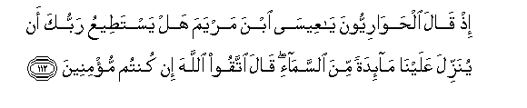

#إِذْ قَالَ الْحَوَارِيُّونَ يَا عِيسَى ابْنَ مَرْيَمَ هَلْ يَسْتَطِيعُ رَبُّكَ أَنْ يُنَزِّلَ عَلَيْنَا مَائِدَةً مِنَ السَّمَاءِ ۖ قَالَ اتَّقُوا اللَّهَ إِنْ كُنْتُمْ مُؤْمِنِينَ 

##Ith qala alhawariyyoona ya AAeesa ibna maryama hal yastateeAAu rabbuka an yunazzila AAalayna maidatan mina alssamai qala ittaqoo Allaha in kuntum mumineena 

## 翻译(Translation)：

| Translator | 译文(Translation)                                            |
| :--------: | ------------------------------------------------------------ |
|    马坚    | 当时，众门徒说：麦尔彦之子尔撒啊，你的主能从天上降筵席给我们吗？他说：你们当敬畏真主，如果你们是信士的话。 |
|  YUSUFALI  | Behold! the disciples said: "O Jesus the son of Mary! can thy Lord send down to us a table set (with viands) from heaven?" Said Jesus: "Fear Allah if ye have faith." |
| PICKTHALL  | When the disciples said: O Jesus, son of Mary! Is thy Lord able to send down for us a table spread with food from heaven ? He said: Observe your duty to Allah, if ye are true believers. |
|   SHAKIR   | When the disciples said: O Isa son of Marium! will your Lord consent to send down to us food from heaven? He said: Be careful of (your duty to) Allah if you are believers. |

---

## 对位释义(Words Interpretation)：

| No   | العربية | 中文    | English | 曾用词 |
| ---- | ------: | ------- | ------- | ------ |
| 序号 |    阿文 | Chinese | 英文    | Used   |
| 5:112.1  | إِذْ        | 当时       | when            | 见2:131.1  |
| 5:112.2  | قَالَ       | 他说，     | He said         | 见2:30.2   |
| 5:112.3  | الْحَوَارِيُّونَ | 众门徒     | the disciples   | 见3:52.12  |
| 5:112.4  | يَا        | 啊         | Oh              | 见2:21.1   |
| 5:112.5  | عِيسَى      | 尔撒       | Isa             | 见2:87.10  |
| 5:112.6  | ابْنَ       | 儿子       | Son             | 见2:87.11  |
| 5:112.7  | مَرْيَمَ      | 麦尔彦     | Marium          | 见2:87.12  |
| 5:112.8  | هَلْ        | 是吗？     | will ?          | 见2:210.1  |
| 5:112.9  | يَسْتَطِيعُ    | 他能够     | able            | 见2:282.46 |
| 5:112.10 | رَبُّكَ       | 您的主     | Your Lord       | 见2:30.3   |
| 5:112.11 | أَنْ        | 该         | that            | 见2:26.5   |
| 5:112.12 | يُنَزِّلَ      | 他降示     | he get down     | 见2:90.12  |
| 5:112.13 | عَلَيْنَا     | 在我们     | to us           | 见2:70.12  |
| 5:112.14 | مَائِدَةً     | 筵席       | a table set     |            |
| 5:112.15 | مِنَ        | 从         | from            | 见2:4.8    |
| 5:112.16 | السَّمَاءِ    | 天空       | The sky, heaven | 见2:19.4   |
| 5:112.17 | قَالَ       | 他说，     | He said         | 见2:30.2   |
| 5:112.18 | اتَّقُوا     | 敬畏       | fear            | 见2:278.5  |
| 5:112.19 | اللَّهَ      | 安拉，真主 | Allah           | 见2:9.2    |
| 5:112.20 | إِنْ        | 如果       | if              | 见2:23.18  |
| 5:112.21 | كُنْتُمْ      | 你们是     | You are         | 见2:23.2   |
| 5:112.22 | مُؤْمِنِينَ    | 信道者     | Believers       | 见2:91.30  |

---
