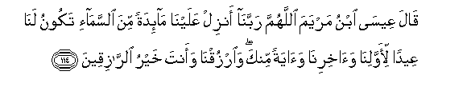

#قَالَ عِيسَى ابْنُ مَرْيَمَ اللَّهُمَّ رَبَّنَا أَنْزِلْ عَلَيْنَا مَائِدَةً مِنَ السَّمَاءِ تَكُونُ لَنَا عِيدًا لِأَوَّلِنَا وَآخِرِنَا وَآيَةً مِنْكَ ۖ وَارْزُقْنَا وَأَنْتَ خَيْرُ الرَّازِقِينَ 

##Qala AAeesa ibnu maryama allahumma rabbana anzil AAalayna maidatan mina alssamai takoonu lana AAeedan liawwalina waakhirina waayatan minka waorzuqna waanta khayru alrraziqeena 

## 翻译(Translation)：

| Translator | 译文(Translation)                                            |
| :--------: | ------------------------------------------------------------ |
|    马坚    | 麦尔彦之子尔撒说：真主啊! 我们的主啊! 求你从天上降筵席给我们，以便我们先辈和后辈都以降筵之日为节日，并以筵席为你所降示的迹象。求你以给养赏赐我们，你是最善于供给的。 |
|  YUSUFALI  | Said Jesus the son of Mary: "O Allah our Lord! send us from heaven a table set (with viands) that there may be for us for the first and the last of us a solemn festival and a sign from Thee; and provide for our sustenance for Thou art the best Sustainer (of our needs). |
| PICKTHALL  | Jesus, son of Mary, said: O Allah, Lord of us! Send down for us a table spread with food from heaven, that it may be a feast for us, for the first of us and for the last of us, and a sign from Thee. Give us sustenance, for Thou art the Best of Sustainers. |
|   SHAKIR   | Isa the son of Marium said: O Allah, our Lord! send i down to us food from heaven which should be to us an ever-recurring happiness, to the first of us and to the last of us, and a sign from Thee, and grant us means of subsistence, and Thou art the best of the Providers. |

---

## 对位释义(Words Interpretation)：

| No   | العربية | 中文    | English | 曾用词 |
| ---- | ------: | ------- | ------- | ------ |
| 序号 |    阿文 | Chinese | 英文    | Used   |
| 5:114.1  | قَالَ      | 他说，         | He said             | 见2:30.2   |
| 5:114.2  | عِيسَى     | 尔撒           | Isa                 | 见2:87.10  |
| 5:114.3  | ابْنُ      | 儿子           | son                 | 见3:45.14  |
| 5:114.4  | مَرْيَمَ     | 麦尔彦         | Marium              | 见2:87.12  |
| 5:114.5  | اللَّهُمَّ    | 真主啊         | O Allah             | 见3:26.2   |
| 5:114.6  | رَبَّنَا     | 我们的主       | Our Lord            | 见2:127.8  |
| 5:114.7  | أَنْزِلْ     | 求你降         | Send down           |            |
| 5:114.8  | عَلَيْنَا    | 在我们         | to us               | 见2:70.12  |
| 5:114.9  | مَائِدَةً    | 筵席           | a table set         | 见5:112.14 |
| 5:114.10 | مِنَ       | 从             | from                | 见2:19.3 |
| 5:114.11 | السَّمَاءِ   | 天空           | The sky, heaven     | 见2:19.4   |
| 5:114.12 | تَكُونُ     | 它是           | it be               |            |
| 5:114.13 | لَنَا      | 为我们         | for us              | 见2:32.5   |
| 5:114.14 | عِيدًا     | 一个节日       | a solemn festival   |            |
| 5:114.15 | لِأَوَّلِنَا   | 为我们的先辈   | for the first of us |            |
| 5:114.16 | وَآخِرِنَا   | 和我们的后辈   | and the last of us  |            |
| 5:114.17 | وَآيَةً     | 和一个迹象     | and a sign          | 参2:259.47 |
| 5:114.18 | مِنْكَ      | 从你           | from Thee           |            |
| 5:114.19 | وَارْزُقْنَا  | 和求你供给我们 | and grant us        |            |
| 5:114.20 | وَأَنْتَ     | 和您           | and thou            | 参2:32.10  |
| 5:114.21 | خَيْرُ      | 最好的         | the best of         | 见3:54.5   |
| 5:114.22 | الرَّازِقِينَ | 众供给者       | the Sustainers      |            |

---
