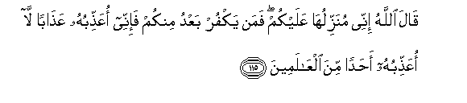

#قَالَ اللَّهُ إِنِّي مُنَزِّلُهَا عَلَيْكُمْ ۖ فَمَنْ يَكْفُرْ بَعْدُ مِنْكُمْ فَإِنِّي أُعَذِّبُهُ عَذَابًا لَا أُعَذِّبُهُ أَحَدًا مِنَ الْعَالَمِينَ 

##Qala Allahu innee munazziluha AAalaykum faman yakfur baAAdu minkum fainnee oAAaththibuhu AAathaban la oAAaththibuhu ahadan mina alAAalameena 

## 翻译(Translation)：

| Translator | 译文(Translation)                                            |
| :--------: | ------------------------------------------------------------ |
|    马坚    | 真主说：我必定把筵席降给你们。此后，你们中谁不信道，我要用一种绝不用于惩治全世界任何人的刑罚来惩治谁。 |
|  YUSUFALI  | Allah said: "I will send it down unto you: but if any of you after that resisteth faith I will punish him with a penalty such as I have not inflicted on anyone among all the peoples. |
| PICKTHALL  | Allah said: Lo! I send it down for you. And whoso disbelieveth of you afterward, him surely will I punish with a punishment wherewith I have not punished any of (My) creatures. |
|   SHAKIR   | Allah said: Surely I will send it down to you, but whoever shall disbelieve afterwards from among you, surely I will chastise him with a chastisement with which I will not chastise, anyone among the nations. |

---

## 对位释义(Words Interpretation)：

| No   | العربية | 中文    | English | 曾用词 |
| ---- | ------: | ------- | ------- | ------ |
| 序号 |    阿文 | Chinese | 英文    | Used   |
| 5:115.1  | قَالَ      | 他说，         | He said           | 见2:30.2   |
| 5:115.2  | اللَّهُ     | 安拉，真主     | Allah             | 见2:7.2    |
| 5:115.3  | إِنِّي      | 确实我         | surely I          | 见2:30.5   |
| 5:115.4  | مُنَزِّلُهَا   | 降下它         | send it down      |            |
| 5:115.5  | عَلَيْكُمْ    | 在你们         | on you            | 见2:40.8   |
| 5:115.6  | فَمَنْ      | 无论谁         | whosoever         | 见2:38.9   |
| 5:115.7  | يَكْفُرْ     | 他不信         | he disbelieve     | 见2:99.7   |
| 5:115.8  | بَعْدُ      | 之后           | after             | 见2:230.7  |
| 5:115.9  | مِنْكُمْ     | 从你们         | Of you            | 见2:65.5   |
| 5:115.10 | فَإِنِّي     | 然后确实我     | then surely I am  | 见2:186.5  |
| 5:115.11 | أُعَذِّبُهُ    | 我惩罚他       | I will punish him |            |
| 5:115.12 | عَذَابًا    | 刑罚           | chastisement      | 见3:56.5   |
| 5:115.13 | لَا       | 不，不是，没有 | no                | 见2:2.3    |
| 5:115.14 | أُعَذِّبُهُ    | 我惩罚他       | I will punish him | 见5:115.11 |
| 5:115.15 | أَحَدًا     | 任何人         | any               | 见5:20.21  |
| 5:115.16 | مِنَ       | 从             | from              | 见2:4.8    |
| 5:115.17 | الْعَالَمِينَ | 世界，众世界的 | worlds            | 见1:2.4    |

---
