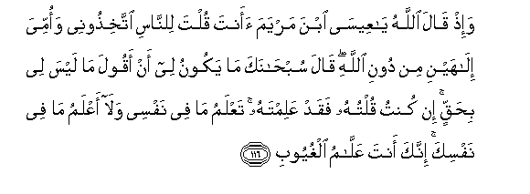

#وَإِذْ قَالَ اللَّهُ يَا عِيسَى ابْنَ مَرْيَمَ أَأَنْتَ قُلْتَ لِلنَّاسِ اتَّخِذُونِي وَأُمِّيَ إِلَٰهَيْنِ مِنْ دُونِ اللَّهِ ۖ قَالَ سُبْحَانَكَ مَا يَكُونُ لِي أَنْ أَقُولَ مَا لَيْسَ لِي بِحَقٍّ ۚ إِنْ كُنْتُ قُلْتُهُ فَقَدْ عَلِمْتَهُ ۚ تَعْلَمُ مَا فِي نَفْسِي وَلَا أَعْلَمُ مَا فِي نَفْسِكَ ۚ إِنَّكَ أَنْتَ عَلَّامُ الْغُيُوبِ 

##Waith qala Allahu ya AAeesa ibna maryama aanta qulta lilnnasi ittakhithoonee waommiya ilahayni min dooni Allahi qala subhanaka ma yakoonu lee an aqoola ma laysa lee bihaqqin in kuntu qultuhu faqad AAalimtahu taAAlamu ma fee nafsee wala aAAlamu ma fee nafsika innaka anta AAallamu alghuyoobi 

## 翻译(Translation)：

| Translator | 译文(Translation)                                            |
| :--------: | ------------------------------------------------------------ |
|    马坚    | 当时，真主将说：麦尔彦之子尔撒啊! 你曾对众人说过这句话吗﹖'你们当舍真主而以我和我母亲为主宰'。他说：我赞颂你超绝万物，我不会说出我不该说的话。如果我说了，那你一定知道。你知道我心里的事，我却不知道你心里的事。你确是深知一切幽玄的。 |
|  YUSUFALI  | And behold! Allah will say "O Jesus the son of Mary! didst thou say unto men `worship me and my mother as gods in derogation of Allah"? He will say: "Glory to Thee! never could I say what I had no right (to say). Had I said such a thing Thou wouldst indeed have known it. Thou knowest what is in my heart though I know not what is in Thine. For Thou knowest in full all that is hidden. |
| PICKTHALL  | And when Allah saith: O Jesus, son of Mary! Didst thou say unto mankind: Take me and my mother for two gods beside Allah ? he saith: Be glorified! It was not mine to utter that to which I had no right. If I used to say it, then Thou knewest it. Thou knowest what is in my mind, and I know not what is in Thy Mind. Lo! Thou, only Thou, art the Knower of Things Hidden ? |
|   SHAKIR   | And when Allah will say: O Isa son of Marium! did you say to men, Take me and my mother for two gods besides Allah he will say: Glory be to Thee, it did not befit me that I should say what I had no right to (say); if I had said it, Thou wouldst indeed have known it; Thou knowest what is in my mind, and I do not know what is in Thy mind, surely Thou art the great Knower of the unseen things. |

---

## 对位释义(Words Interpretation)：

| No   | العربية | 中文    | English | 曾用词 |
| ---- | ------: | ------- | ------- | ------ |
| 序号 |    阿文 | Chinese | 英文    | Used   |
| 5:116.1  | وَإِذْ     | 和当时     | and when             | 见2:30.1   |
| 5:116.2  | قَالَ     | 他说，     | He said              | 见2:30.2   |
| 5:116.3  | اللَّهُ    | 安拉，真主 | Allah                | 见2:7.2    |
| 5:116.4  | يَا      | 啊         | Oh                   | 见2:21.1   |
| 5:116.5  | عِيسَى    | 尔撒       | Isa                  | 见2:87.10  |
| 5:116.6  | ابْنَ     | 儿子       | Son                  | 见2:87.11  |
| 5:116.7  | مَرْيَمَ    | 麦尔彦     | Marium               | 见2:87.12  |
| 5:116.8  | أَأَنْتَ    | 你吗？     | did you              |            |
| 5:116.9  | قُلْتَ     | 你说       | you say              |            |
| 5:116.10 | لِلنَّاسِ   | 对世人     | For people           | 见2:83.17  |
| 5:116.11 | اتَّخِذُونِي | 你们采取我 | Take me              |            |
| 5:116.12 | وَأُمِّيَ    | 和我的母亲 | and my mother        |            |
| 5:116.13 | إِلَٰهَيْنِ   | 两个神     | two gods             |            |
| 5:116.14 | مِنْ      | 从         | from                 | 见2:4.8    |
| 5:116.15 | دُونِ     | 之外       | Without              | 见2:23.16  |
| 5:116.16 | اللَّهِ    | 真主的     | of Allah             | 见2:23.17  |
| 5:116.17 | قَالَ     | 他说，     | He said              | 见2:30.2   |
| 5:116.18 | سُبْحَانَكَ  | 赞你超绝   | Glory be to you      | 见2:32.2   |
| 5:116.19 | مَا      | 不         | not                  | 见2:120.24 |
| 5:116.20 | يَكُونُ    | 他是       | he is                | 见2:247.13 |
| 5:116.21 | لِي      | 至我       | to me                | 见2:152.4  |
| 5:116.22 | أَنْ      | 该         | that                 | 见2:26.5   |
| 5:116.23 | أَقُولَ    | 我说       | I say                |            |
| 5:116.24 | مَا      | 什么       | what/ that which     | 见2:17.8   |
| 5:116.25 | لَيْسَ     | 它不是     | It is not            | 见2:177.1  |
| 5:116.26 | لِي      | 至我       | to me                | 见2:152.4  |
| 5:116.27 | بِحَقٍّ     | 在真理     | with right           | 参2:121.5  |
| 5:116.28 | إِنْ      | 如果       | if                   | 见2:23.18  |
| 5:116.29 | كُنْتُ     | 我是       | I was                | 见4:73.15  |
| 5:116.30 | قُلْتُهُ    | 我说它     | I say it             |            |
| 5:116.31 | فَقَدْ     | 然后当然   | then may             | 见2:108.15 |
| 5:116.32 | عَلِمْتَهُ   | 你知道它   | you know it          |            |
| 5:116.33 | تَعْلَمُ    | 你知道     | you know             | 见4:113.28 |
| 5:116.34 | مَا      | 什么       | what/ that which     | 见2:17.8   |
| 5:116.35 | فِي      | 在         | in                   | 见2:10.1   |
| 5:116.36 | نَفْسِي    | 我自己     | myself               | 见5:25.7   |
| 5:116.37 | وَلَا     | 也不       | and not              | 见1:7.8    |
| 5:116.38 | أَعْلَمُ    | 至知       | best know            | 见2:30.25  |
| 5:116.39 | مَا      | 什么       | what/ that which     | 见2:17.8   |
| 5:116.40 | فِي      | 在         | in                   | 见2:10.1   |
| 5:116.41 | نَفْسِكَ    | 你自己     | yourself             | 见4:79.12  |
| 5:116.42 | إِنَّكَ     | 确实您     | surely you           | 见2:32.9   |
| 5:116.43 | أَنْتَ     | 您         | thou                 | 见2:32.10  |
| 5:116.44 | عَلَّامُ    | 全知       | the great Knower     | 见5:109.14 |
| 5:116.45 | الْغُيُوبِ  | 幽玄的     | of the unseen things | 见5:109.15 |

---
