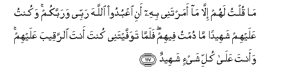

#مَا قُلْتُ لَهُمْ إِلَّا مَا أَمَرْتَنِي بِهِ أَنِ اعْبُدُوا اللَّهَ رَبِّي وَرَبَّكُمْ ۚ وَكُنْتُ عَلَيْهِمْ شَهِيدًا مَا دُمْتُ فِيهِمْ ۖ فَلَمَّا تَوَفَّيْتَنِي كُنْتَ أَنْتَ الرَّقِيبَ عَلَيْهِمْ ۚ وَأَنْتَ عَلَىٰ كُلِّ شَيْءٍ شَهِيدٌ 

##Ma qultu lahum illa ma amartanee bihi ani oAAbudoo Allaha rabbee warabbakum wakuntu AAalayhim shaheedan ma dumtu feehim falamma tawaffaytanee kunta anta alrraqeeba AAalayhim waanta AAala kulli shayin shaheedun 

## 翻译(Translation)：

| Translator | 译文(Translation)                                            |
| :--------: | ------------------------------------------------------------ |
|    马坚    | 我只对他们说过你所命我说的话，即：你们当崇拜真主--我的主，和你们的主。我同他们相处期间，我是他们的见证。你使我死去之后，盟护他们的是你，你是万物的见证。 |
|  YUSUFALI  | "Never said I to them aught except what Thou didst command me to say to wit `Worship Allah my Lord and your Lord'; and I was a witness over them whilst I dwelt amongst them; when Thou didst take me up thou wast the Watcher over them and Thou art a Witness to all things. |
| PICKTHALL  | I spake unto them only that which Thou commandedst me, (saying): Worship Allah, my Lord and your Lord. I was a witness of them while I dwelt among them, and when Thou tookest me Thou wast the Watcher over them. Thou art Witness over all things. |
|   SHAKIR   | I did not say to them aught save what Thou didst enjoin me with: That serve Allah, my Lord and your Lord, and I was a witness of them so long as I was among them, but when Thou didst cause me to die, Thou wert the watcher over them, and Thou art witness of all things. |

---

## 对位释义(Words Interpretation)：

| No   | العربية | 中文    | English | 曾用词 |
| ---- | ------: | ------- | ------- | ------ |
| 序号 |    阿文 | Chinese | 英文    | Used   |
| 5:117.1  | مَا      | 不         | not              | 见2:120.24  |
| 5:117.2  | قُلْتُ     | 我说       | I said           |             |
| 5:117.3  | لَهُمْ     | 对他们     | for them         | 见2:11.3    |
| 5:117.4  | إِلَّا     | 除了       | Except           | 见2:9.7     |
| 5:117.5  | مَا      | 什么       | what/ that which | 见2:17.8    |
| 5:117.6  | أَمَرْتَنِي  | 你命令我   | you commanded me |             |
| 5:117.7  | بِهِ      | 以它       | with it          | 见2:22.13   |
| 5:117.8  | أَنِ      | 那个       | that             | 见4:66.5    |
| 5:117.9  | اعْبُدُوا  | 崇拜       | Worship          | 见2:21.4    |
| 5:117.10 | اللَّهَ    | 安拉，真主 | Allah            | 见2:9.2     |
| 5:117.11 | رَبِّي     | 我的主     | my Lord          | 见3:51.3    |
| 5:117.12 | وَرَبَّكُمْ   | 和你们的主 | and your Lord    | 见5:72.19   |
| 5:117.13 | وَكُنْتُ    | 和我是     | and I was        | 参4:73.15   |
| 5:117.14 | عَلَيْهِمْ   | 在他们     | on they          | 见1:7.4     |
| 5:117.15 | شَهِيدًا   | 作证       | Witness          | 见2:143.12  |
| 5:117.16 | مَا      | 什么       | what/ that which | 见2:17.8    |
| 5:117.17 | دُمْتُ     | 我停留     | I dwelt          |             |
| 5:117.18 | فِيهِمْ    | 在他们     | in them          | 见2:129.3   |
| 5:117.19 | فَلَمَّا    | 但是当     | but when         | 见2:17.6    |
| 5:117.20 | تَوَفَّيْتَنِي | 你召回我   | you take me      |             |
| 5:117.21 | كُنْتَ     | 你是       | You are          | 见2:143.17  |
| 5:117.22 | أَنْتَ     | 您         | thou             | 见2:32.10   |
| 5:117.23 | الرَّقِيبَ  | 监护者     | the Watcher      |             |
| 5:117.24 | عَلَيْهِمْ   | 在他们     | on they          | 见1:7.4     |
| 5:117.25 | وَأَنْتَ    | 和您       | and thou         | 见5:114.20  |
| 5:117.26 | عَلَىٰ     | 至         | On               | 见2:5.2     |
| 5:117.27 | كُلِّ      | 所有       | All              | 见2:20.23   |
| 5:117.28 | شَيْءٍ     | 事物       | Thing            | 见2:20.24   |
| 5:117.29 | شَهِيدٌ    | 作证者     | the witness      | 见2:282.116 |

---
