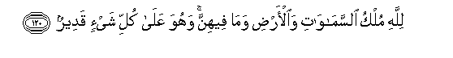

#لِلَّهِ مُلْكُ السَّمَاوَاتِ وَالْأَرْضِ وَمَا فِيهِنَّ ۚ وَهُوَ عَلَىٰ كُلِّ شَيْءٍ قَدِيرٌ 

##Lillahi mulku alssamawati waalardi wama feehinna wahuwa AAala kulli shayin qadeerun 

## 翻译(Translation)：

| Translator | 译文(Translation)                                            |
| :--------: | ------------------------------------------------------------ |
|    马坚    | 天地万物的国权只是真主的，他对于万事是全能的。               |
|  YUSUFALI  | To Allah doth belong the dominion of the heavens and the earth and all that is therein and it is He who hath power over all things. |
| PICKTHALL  | Unto Allah belongeth the Sovereignty of the heavens and the earth and whatsoever is therein, and He is Able to do all things. |
|   SHAKIR   | Allah's is the kingdom of the heavens and the earth and what is in them; and He has power over all things. |

---

## 对位释义(Words Interpretation)：

| No   | العربية | 中文    | English | 曾用词 |
| ---- | ------: | ------- | ------- | ------ |
| 序号 |    阿文 | Chinese | 英文    | Used   |
| 5:120.1  | لِلَّهِ      | 为真主       | for Allah      | 见1:2.2   |
| 5:120.2  | مُلْكُ      | 国权         | the kingdom    | 见2:102.6 |
| 5:120.3  | السَّمَاوَاتِ | 诸天的       | of the heavens | 见2:33.16 |
| 5:120.4  | وَالْأَرْضِ   | 和土地       | and earth      | 见2:33.17 |
| 5:120.5  | وَمَا      | 和什么       | and that       | 见2:4.6   |
| 5:120.6  | فِيهِنَّ     | 其中         | therein        | 见2:197.6 |
| 5:120.7  | وَهُوَ      | 和他         | and he         | 见2:29.16 |
| 5:120.8  | عَلَىٰ      | 至           | On             | 见2:5.2   |
| 5:120.9  | كُلِّ       | 所有         | All            | 见2:20.23 |
| 5:120.10 | شَيْءٍ      | 事物         | Thing          | 见2:20.24 |
| 5:120.11 | قَدِيرٌ     | 全能，大能的 | Mighty         | 见2:20.25 |

---
