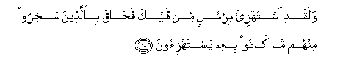

#وَلَقَدِ اسْتُهْزِئَ بِرُسُلٍ مِنْ قَبْلِكَ فَحَاقَ بِالَّذِينَ سَخِرُوا مِنْهُمْ مَا كَانُوا بِهِ يَسْتَهْزِئُونَ 

##Walaqadi istuhzia birusulin min qablika fahaqa biallatheena sakhiroo minhum ma kanoo bihi yastahzioona 

## 翻译(Translation)：

| Translator | 译文(Translation)                                            |
| :--------: | ------------------------------------------------------------ |
|    马坚    | 在你之前，有许多使者，确已被人嘲笑，但嘲笑者所嘲笑的（刑罚），已降临他们了。 |
|  YUSUFALI  | Mocked were (many) Apostles before thee; but the scoffers were hemmed in by the thing that they mocked. |
| PICKTHALL  | Messengers (of Allah) have been derided before thee, but that whereat they scoffed surrounded such of them as did deride. |
|   SHAKIR   | And certainly apostles before you were mocked at, but that which they mocked at encompassed the scoffers among them. |

---

## 对位释义(Words Interpretation)：

| No   | العربية | 中文    | English | 曾用词 |
| ---- | ------: | ------- | ------- | ------ |
| 序号 |    阿文 | Chinese | 英文    | Used   |
| 6:10.1  | وَلَقَدِ     | 和确实     | And certainly    | 见2:65.1  |
| 6:10.2  | اسْتُهْزِئَ   | 他们被嘲笑 | they were mocked |           |
| 6:10.3  | بِرُسُلٍ     | 在众使者   | at Apostles      |           |
| 6:10.4  | مِنْ       | 从         | from             | 见2:4.8   |
| 6:10.5  | قَبْلِكَ     | 在您以前   | before you       | 见2:4.9   |
| 6:10.6  | فَحَاقَ     | 因此它包围 | then surrounded  |           |
| 6:10.7  | بِالَّذِينَ   | 在那些人   | to those         | 见3:170.8 |
| 6:10.8  | سَخِرُوا    | 他们嘲笑   | they mocked      |           |
| 6:10.9  | مِنْهُمْ     | 从他们     | from them        | 见2:75.8  |
| 6:10.10 | مَا       | 什么       | what/ that which | 见2:17.8  |
| 6:10.11 | كَانُوا    | 他们是     | they were        | 见2:10:11 |
| 6:10.12 | بِهِ       | 以它       | with it          | 见2:22.13 |
| 6:10.13 | يَسْتَهْزِئُونَ | 他们嘲笑   | they mocked      | 见6:5.12  |

---
