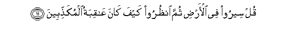

#قُلْ سِيرُوا فِي الْأَرْضِ ثُمَّ انْظُرُوا كَيْفَ كَانَ عَاقِبَةُ الْمُكَذِّبِينَ 

##Qul seeroo fee alardi thumma onthuroo kayfa kana AAaqibatu almukaththibeena 

## 翻译(Translation)：

| Translator | 译文(Translation)                                            |
| :--------: | ------------------------------------------------------------ |
|    马坚    | 你说：你们当在大地上旅行，然后观察否认使者的结局是怎样的。   |
|  YUSUFALI  | Say: "Travel through the earth and see what was the end of those who rejected truth." |
| PICKTHALL  | Say (unto the disbelievers): Travel in the land, and see the nature of the consequence for the rejecters! |
|   SHAKIR   | Say: Travel in the land, then see what was the end of the rejecters. |

---

## 对位释义(Words Interpretation)：

| No   | العربية | 中文    | English | 曾用词 |
| ---- | ------: | ------- | ------- | ------ |
| 序号 |    阿文 | Chinese | 英文    | Used   |
| 6:11.1  | قُلْ       | 你说       | Say              | 见2:80.8   |
| 6:11.2  | سِيرُوا    | 你们应旅行 | Travel           |            |
| 6:11.3  | فِي       | 在         | in               | 见2:10.1   |
| 6:11.4  | الْأَرْضِ    | 大地       | Earth            | 见2:22.4   |
| 6:11.5  | ثُمَّ       | 然后       | Then             | 见2:28.7   |
| 6:11.6  | انْظُرُوا   | 你们看     | see              |            |
| 6:11.7  | كَيْفَ      | 如何       | How              | 见2:28.1   |
| 6:11.8  | كَانَ      | 他是       | It was           | 见2:75.6   |
| 6:11.9  | عَاقِبَةُ    | 结局       | the consequence  | 见3:137.12 |
| 6:11.10 | الْمُكَذِّبِينَ | 众否认者的 | of the rejecters | 见3:137.13 |

---
