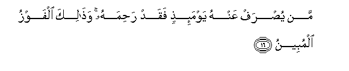

#مَنْ يُصْرَفْ عَنْهُ يَوْمَئِذٍ فَقَدْ رَحِمَهُ ۚ وَذَٰلِكَ الْفَوْزُ الْمُبِينُ 

##Man yusraf AAanhu yawmaithin faqad rahimahu wathalika alfawzu almubeenu 

## 翻译(Translation)：

| Translator | 译文(Translation)                                            |
| :--------: | ------------------------------------------------------------ |
|    马坚    | 在那日，谁得避免刑罚，谁确已蒙主的慈恩了。那是明显的成功。   |
|  YUSUFALI  | "On that day if the penalty is averted from any it is due to Allah's Mercy; and that would be (Salvation) the obvious fulfillment of all desire. |
| PICKTHALL  | He from whom (such retribution) is averted on that day, (Allah) hath in truth had mercy on him. That will be the signal triumph. |
|   SHAKIR   | He from whom it is averted on that day, Allah indeed has shown mercy to him; and this is a manifest achievement. |

---

## 对位释义(Words Interpretation)：

| No   | العربية | 中文    | English | 曾用词 |
| ---- | ------: | ------- | ------- | ------ |
| 序号 |    阿文 | Chinese | 英文    | Used   |
| 6:16.1 | مَنْ     | 谁       | who                 | 见2:97.2   |
| 6:16.2 | يُصْرَفْ   | 他避免   | he averted          |            |
| 6:16.3 | عَنْهُ    | 从它     | on it               | 见4:31.6   |
| 6:16.4 | يَوْمَئِذٍ  | 那日     | that day            | 见3:167.20 |
| 6:16.5 | فَقَدْ    | 然后当然 | then may            | 见2:108.15 |
| 6:16.6 | رَحِمَهُ   | 他慈恩他 | he had mercy on him |            |
| 6:16.7 | وَذَٰلِكَ   | 和这是   | and this is         | 见4:13.16  |
| 6:16.8 | الْفَوْزُ  | 成功     | success             | 见4:13.17  |
| 6:16.9 | الْمُبِينُ | 明白的   | clear               | 见5:92.13  |

---
