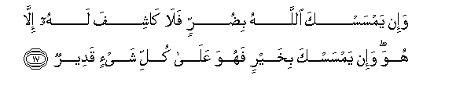

#وَإِنْ يَمْسَسْكَ اللَّهُ بِضُرٍّ فَلَا كَاشِفَ لَهُ إِلَّا هُوَ ۖ وَإِنْ يَمْسَسْكَ بِخَيْرٍ فَهُوَ عَلَىٰ كُلِّ شَيْءٍ قَدِيرٌ 

##Wain yamsaska Allahu bidurrin fala kashifa lahu illa huwa wain yamsaska bikhayrin fahuwa AAala kulli shayin qadeerun 

## 翻译(Translation)：

| Translator | 译文(Translation)                                            |
| :--------: | ------------------------------------------------------------ |
|    马坚    | 如果真主使你遭受灾难，那末，除他外绝无能解除的。如果他使你享受福利，（那末，任何人不能干涉他），因为他对于万事是全能的。 |
|  YUSUFALI  | "If Allah touch thee with affliction none can remove it but He; if He touch thee with happiness He hath power over all things. |
| PICKTHALL  | If Allah touch thee with affliction, there is none that can relieve therefrom save Him, and if He touch thee with good fortune (there is none that can impair it); for He is Able to do all things. |
|   SHAKIR   | And if Allah touch you with affliction, there is none to take it off but He; and if He visit you with good, then He has power over all things. |

---

## 对位释义(Words Interpretation)：

| No   | العربية | 中文    | English | 曾用词 |
| ---- | ------: | ------- | ------- | ------ |
| 序号 |    阿文 | Chinese | 英文    | Used   |
| 6:17.1  | وَإِنْ   | 和如果       | and if          | 见2:23.1 |
| 6:17.2  | يَمْسَسْكَ | 他使你接触   | he touch you    |            |
| 6:17.3  | اللَّهُ  | 安拉，真主   | Allah           | 见2:7.2    |
| 6:17.4  | بِضُرٍّ   | 在灾难       | with affliction |            |
| 6:17.5  | فَلَا   | 因此不       | shall not       | 见2:22.18  |
| 6:17.6  | كَاشِفَ  | 解除         | relieve         |            |
| 6:17.7  | لَهُ    | 对他         | for he          | 见2:102.62 |
| 6:17.8  | إِلَّا   | 除了         | Except          | 见2:9.7    |
| 6:17.9  | هُوَ    | 他是         | He is           | 见2:29.1   |
| 6:17.10 | وَإِنْ   | 和如果       | and if          | 见2:23.1 |
| 6:17.11 | يَمْسَسْكَ | 他使你接触   | he touch you    | 见6:17.2   |
| 6:17.12 | بِخَيْرٍ  | 以更好的     | with better     | 见2:106.8  |
| 6:17.13 | فَهُوَ   | 因此它       | then it is      | 见2:184.23 |
| 6:17.14 | عَلَىٰ   | 至           | On              | 见2:5.2    |
| 6:17.15 | كُلِّ    | 所有         | All             | 见2:20.23  |
| 6:17.16 | شَيْءٍ   | 事物         | Thing           | 见2:20.24  |
| 6:17.17 | قَدِيرٌ  | 全能，大能的 | Mighty          | 见2:20.25  |

---
