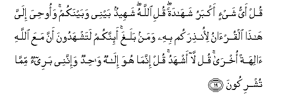

#قُلْ أَيُّ شَيْءٍ أَكْبَرُ شَهَادَةً ۖ قُلِ اللَّهُ ۖ شَهِيدٌ بَيْنِي وَبَيْنَكُمْ ۚ وَأُوحِيَ إِلَيَّ هَٰذَا الْقُرْآنُ لِأُنْذِرَكُمْ بِهِ وَمَنْ بَلَغَ ۚ أَئِنَّكُمْ لَتَشْهَدُونَ أَنَّ مَعَ اللَّهِ آلِهَةً أُخْرَىٰ ۚ قُلْ لَا أَشْهَدُ ۚ قُلْ إِنَّمَا هُوَ إِلَٰهٌ وَاحِدٌ وَإِنَّنِي بَرِيءٌ مِمَّا تُشْرِكُونَ 

##Qul ayyu shayin akbaru shahadatan quli Allahu shaheedun baynee wabaynakum waoohiya ilayya hatha alquranu lionthirakum bihi waman balagha ainnakum latashhadoona anna maAAa Allahi alihatan okhra qul la ashhadu qul innama huwa ilahun wahidun wainnanee bareeon mimma tushrikoona 

## 翻译(Translation)：

| Translator | 译文(Translation)                                            |
| :--------: | ------------------------------------------------------------ |
|    马坚    | 你说：什么事物是最大的见证？你说：真主是我与你们之间的见证。这部《古兰经》，被启示给我，以便我用它来警告你们，和它所达到的各民族。难道你们务必要作证还有别的许多主宰与真主同等吗？你说：我不这样作证。你说：真主是独一的主宰。你们用来配主的（那些偶像），我与他们确是无关系的。 |
|  YUSUFALI  | Say: "What thing is most weighty in evidence?" Say: "Allah is Witness between me and you: this Qur'an hath been revealed to me by inspiration that I may warn you and all whom it reaches. Can ye possibly bear witness that besides Allah there is another god?" Say: "Nay! I cannot bear witness!" Say: "But in truth He is the One Allah and I truly am innocent of (your blasphemy of) joining others with Him. |
| PICKTHALL  | Say (O Muhammad): What thing is of most weight in testimony ? Say: Allah is Witness between me and you. And this Qur'an hath been inspired in me, that I may warn therewith you and whomsoever it may reach. Do ye in sooth bear witness that there are gods beside Allah ? Say: I bear no such witness. Say: He is only One God. Lo! I am innocent of that which ye associate (with Him). |
|   SHAKIR   | Say: What thing is the weightiest in testimony? Say: Allah is witness between you and me; and this Quran has been revealed to me that with it I may warn you and whomsoever it reaches. Do you really bear witness that there are other gods with Allah? Say: I do not bear witness. Say: He is only one God, and surely I am clear of that which you set up (with Him). |

---

## 对位释义(Words Interpretation)：

| No   | العربية | 中文    | English | 曾用词 |
| ---- | ------: | ------- | ------- | ------ |
| 序号 |    阿文 | Chinese | 英文    | Used   |
| 6:19.1  | قُلْ      | 你说           | Say                      | 见2:80.8    |
| 6:19.2  | أَيُّ      | 什么？         | what                     |             |
| 6:19.3  | شَيْءٍ     | 事物           | Thing                    | 见2:20.24   |
| 6:19.4  | أَكْبَرُ    | 更大           | greater                  | 见2:217.22  |
| 6:19.5  | شَهَادَةً   | 证据           | a testimony              | 见2:140.22  |
| 6:19.6  | قُلِ      | 你说           | Say                      | 见2:80.8    |
| 6:19.7  | اللَّهُ    | 安拉，真主     | Allah                    | 见2:7.2     |
| 6:19.8  | شَهِيدٌ    | 作证者         | the witness              | 见2:282.116 |
| 6:19.9  | بَيْنِي    | 我之间         | between me               |             |
| 6:19.10 | وَبَيْنَكُمْ  | 和你们之间     | and between you          | 见3:64.10   |
| 6:19.11 | وَأُوحِيَ   | 和它被启示     | and it has been revealed |             |
| 6:19.12 | إِلَيَّ     | 至我           | to me                    | 见3:55.9    |
| 6:19.13 | هَٰذَا     | 这个，此       | This                     | 见2:25.20   |
| 6:19.14 | الْقُرْآنُ  | 古兰经         | the Quran                | 见2:185.6   |
| 6:19.15 | لِأُنْذِرَكُمْ | 以便我警告你们 | that I may warn you      |             |
| 6:19.16 | بِهِ      | 以它           | with it                  | 见2:22.13   |
| 6:19.17 | وَمَنْ     | 和谁           | and who                  | 见2:108.11  |
| 6:19.18 | بَلَغَ     | 它达到         | it reaches               |             |
| 6:19.19 | أَئِنَّكُمْ   | 你们确实吗？   | Do you really            |             |
| 6:19.20 | لَتَشْهَدُونَ | 必定你们证实   | surely You witness       | 参2:84.15   |
| 6:19.21 | أَنَّ      | 该             | that                     | 见2:26.5    |
| 6:19.22 | مَعَ      | 共同           | With                     | 见2:43.6    |
| 6:19.23 | اللَّهِ    | 真主的         | of Allah                 | 见2:23.17   |
| 6:19.24 | آلِهَةً    | 众神灵         | gods                     |             |
| 6:19.25 | أُخْرَىٰ    | 其他的         | other                    | 见4:102.20  |
| 6:19.26 | قُلْ      | 你说           | Say                      | 见2:80.8    |
| 6:19.27 | لَا      | 不，不是，没有 | no                       | 见2:2.3     |
| 6:19.28 | أَشْهَدُ    | 我见证         | I bear witness           |             |
| 6:19.29 | قُلْ      | 你说           | Say                      | 见2:80.8    |
| 6:19.30 | إِنَّمَا    | 仅仅           | only                     | 见2:11.9    |
| 6:19.31 | هُوَ      | 他是           | He is                    | 见2:29.1    |
| 6:19.32 | إِلَٰهٌ     | 主宰           | Allah                    | 见2:163.2   |
| 6:19.33 | وَاحِدٌ    | 独一的         | One                      | 见2:163.3   |
| 6:19.34 | وَإِنَّنِي   | 和确实我       | and surely I             |             |
| 6:19.35 | بَرِيءٌ    | 无关           | innocent                 |             |
| 6:19.36 | مِمَّا     | 关于什么       | to what                  | 见2:23.5    |
| 6:19.37 | تُشْرِكُونَ  | 你们采配       | you associate            |             |

---
