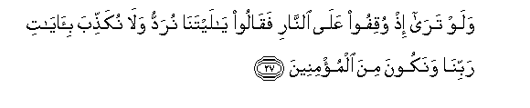

#وَلَوْ تَرَىٰ إِذْ وُقِفُوا عَلَى النَّارِ فَقَالُوا يَا لَيْتَنَا نُرَدُّ وَلَا نُكَذِّبَ بِآيَاتِ رَبِّنَا وَنَكُونَ مِنَ الْمُؤْمِنِينَ 

##Walaw tara ith wuqifoo AAala alnnari faqaloo ya laytana nuraddu wala nukaththiba biayati rabbina wanakoona mina almumineena 

## 翻译(Translation)：

| Translator | 译文(Translation)                                            |
| :--------: | ------------------------------------------------------------ |
|    马坚    | 当他们奉命站在火狱边上的时候，假若你看到他们的情状。于是，他们说：啊！但愿我们得复返人世，我们不再否认我们的主的迹象，而我们要做信士了。 |
|  YUSUFALI  | If thou couldst but see when they are confronted with the fire! They will say: "Would that we were but sent back! then would we not reject the Signs of our Lord but would be amongst those who believe! |
| PICKTHALL  | If thou couldst see when they are set before the Fire and say: Oh, would that we might return! Then would we not deny the revelations of our Lord but we would be of the believers! |
|   SHAKIR   | And could you see when they are made to stand before the fire, then they shall say: Would that we were sent back, and we would not reject the communications of our Lord and we would be of the believers. |

---

## 对位释义(Words Interpretation)：

| No   | العربية | 中文    | English | 曾用词 |
| ---- | ------: | ------- | ------- | ------ |
| 序号 |    阿文 | Chinese | 英文    | Used   |
| 6:27.1  | وَلَوْ      | 和如果     | and if              | 见2:20.14  |
| 6:27.2  | تَرَىٰ      | 你看       | You will see        | 见5:80.1   |
| 6:27.3  | إِذْ       | 当时       | when                | 见2:131.1  |
| 6:27.4  | وُقِفُوا    | 他们面对   | they are confronted |            |
| 6:27.5  | عَلَى      | 至         | On                  | 见2:5.2    |
| 6:27.6  | النَّارِ    | 火狱       | the Fire            | 见2:24.7   |
| 6:27.7  | فَقَالُوا   | 然后他们说 | then they said      | 见4:153.16 |
| 6:27.8  | يَا       | 啊         | Oh                  | 见2:21.1   |
| 6:27.9  | لَيْتَنَا    | 但愿我们   | would that we       |            |
| 6:27.10 | نُرَدُّ      | 我们返回   | we were sent back   |            |
| 6:27.11 | وَلَا      | 也不       | and not             | 见1:7.8    |
| 6:27.12 | نُكَذِّبَ     | 我们否认   | we would not reject |            |
| 6:27.13 | بِآيَاتِ    | 在众迹象   | in the Signs of     | 见2:61.50  |
| 6:27.14 | رَبِّنَا     | 我们的主   | Our Lord            | 见3:7.41 |
| 6:27.15 | وَنَكُونَ    | 和我们是   | and we are          | 见5:113.12 |
| 6:27.16 | مِنَ       | 从         | from                | 见2:19.3 |
| 6:27.17 | الْمُؤْمِنِينَ | 信士们     | the believers       | 见2:223.16 |

---
