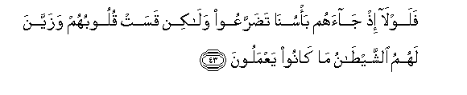

#فَلَوْلَا إِذْ جَاءَهُمْ بَأْسُنَا تَضَرَّعُوا وَلَٰكِنْ قَسَتْ قُلُوبُهُمْ وَزَيَّنَ لَهُمُ الشَّيْطَانُ مَا كَانُوا يَعْمَلُونَ 

##Falawla ith jaahum basuna tadarraAAoo walakin qasat quloobuhum wazayyana lahumu alshshaytanu ma kanoo yaAAmaloona 

## 翻译(Translation)：

| Translator | 译文(Translation)                                            |
| :--------: | ------------------------------------------------------------ |
|    马坚    | 当我的惩罚降临的时候，他们为什么不谦逊呢？但他们的心坚硬，恶魔以他们的行为迷惑他们。 |
|  YUSUFALI  | When the suffering reached them from Us why then did they not learn humility? On the contrary their hearts became hardened and Satan made their (sinful) acts seem alluring to them. |
| PICKTHALL  | If only, when Our disaster came on them, they had been humble! But their hearts were hardened and the devil made all that they used to do seem fair unto them! |
|   SHAKIR   | Yet why did they not, when Our punishment came to them, humble themselves? But their hearts hardened and the Shaitan made what they did fair-seeming to them. |

---

## 对位释义(Words Interpretation)：

| No   | العربية | 中文    | English | 曾用词 |
| ---- | ------: | ------- | ------- | ------ |
| 序号 |    阿文 | Chinese | 英文    | Used   |
| 6:43.1  | فَلَوْلَا   | 然后为何不 | so were it not            | 见2:64.6  |
| 6:43.2  | إِذْ      | 当时       | when                      | 见2:131.1 |
| 6:43.3  | جَاءَهُمْ   | 他来到他们 | there came to them        | 见2:89.2  |
| 6:43.4  | بَأْسُنَا   | 我们的惩罚 | Our punishment            |           |
| 6:43.5  | تَضَرَّعُوا  | 他们谦逊   | they had been humble      | 参6:42.11 |
| 6:43.6  | وَلَٰكِنْ    | 并且但是   | and but                   | 见2:12.5  |
| 6:43.7  | قَسَتْ     | 变硬       | hardened                  | 见2:74.2  |
| 6:43.8  | قُلُوبُهُمْ  | 他们的心   | Their hearts              | 见2:7.4   |
| 6:43.9  | وَزَيَّنَ    | 和他迷惑   | and they did fair-seeming |           |
| 6:43.10 | لَهُمُ     | 对他们     | for them                  | 见2:11.3  |
| 6:43.11 | الشَّيْطَانُ | 恶魔       | Satan                     | 见2:36.2  |
| 6:43.12 | مَا      | 什么       | what/ that which          | 见2:17.8  |
| 6:43.13 | كَانُوا   | 他们是     | they were                 | 见2:10:11 |
| 6:43.14 | يَعْمَلُونَ  | 他们的行为 | they do                   | 见2:96.25 |

---
