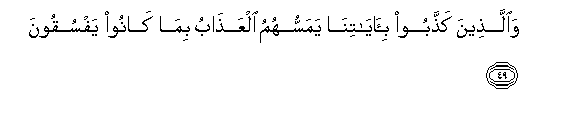

#وَالَّذِينَ كَذَّبُوا بِآيَاتِنَا يَمَسُّهُمُ الْعَذَابُ بِمَا كَانُوا يَفْسُقُونَ 

##Waallatheena kaththaboo biayatina yamassuhumu alAAathabu bima kanoo yafsuqoona 

## 翻译(Translation)：

| Translator | 译文(Translation)                                            |
| :--------: | ------------------------------------------------------------ |
|    马坚    | 否认我的迹象的人，将为犯罪而遭受刑罚。                       |
|  YUSUFALI  | But those who reject Our Signs them shall our punishment touch for that they ceased not from transgressing. |
| PICKTHALL  | But as for those who deny Our revelations, torment will afflict them for that they used to disobey. |
|   SHAKIR   | And (as for) those who reject Our communications, chastisement shall afflict them because they transgressed. |

---

## 对位释义(Words Interpretation)：

| No   | العربية | 中文    | English | 曾用词 |
| ---- | ------: | ------- | ------- | ------ |
| 序号 |    阿文 | Chinese | 英文    | Used   |
| 6:49.1 | وَالَّذِينَ  | 和那些       | and those who   | 见2:21.8  |
| 6:49.2 | كَذَّبُوا   | 他们否认     | they denied     | 见3:11.7  |
| 6:49.3 | بِآيَاتِنَا | 在我们的迹象 | in Our signs    | 见2:39.4  |
| 6:49.4 | يَمَسُّهُمُ   | 它接触他们   | it touches them |           |
| 6:49.5 | الْعَذَابُ  | 刑罚         | Torment         | 见2:49.8  |
| 6:49.6 | بِمَا     | 在什么       | in what         | 见2:4.3   |
| 6:49.7 | كَانُوا   | 他们是       | they were       | 见2:10:11 |
| 6:49.8 | يَفْسُقُونَ  | 犯罪         | transgressed    | 见2:59.18 |

---
