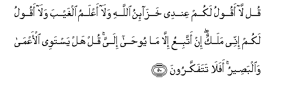

#قُلْ لَا أَقُولُ لَكُمْ عِنْدِي خَزَائِنُ اللَّهِ وَلَا أَعْلَمُ الْغَيْبَ وَلَا أَقُولُ لَكُمْ إِنِّي مَلَكٌ ۖ إِنْ أَتَّبِعُ إِلَّا مَا يُوحَىٰ إِلَيَّ ۚ قُلْ هَلْ يَسْتَوِي الْأَعْمَىٰ وَالْبَصِيرُ ۚ أَفَلَا تَتَفَكَّرُونَ 

##Qul la aqoolu lakum AAindee khazainu Allahi wala aAAlamu alghayba wala aqoolu lakum innee malakun in attabiAAu illa ma yooha ilayya qul hal yastawee alaAAma waalbaseeru afala tatafakkaroona 

## 翻译(Translation)：

| Translator | 译文(Translation)                                            |
| :--------: | ------------------------------------------------------------ |
|    马坚    | 你说：我不对你们说：我有真主的一切宝藏。我也不对你们说：我能知幽玄。我也不对你们说：我是一个天神。我只是遵从我所受的启示。你说：无眼的人与有眼的人是不是相等的？难道你们不该想想吗？ |
|  YUSUFALI  | Say: "I tell you not that with me are the treasures of Allah nor do I know what is hidden nor do I tell you I am an angel. I but follow what is revealed to me." Say: "Can the blind be held equal to the seeing?" Will ye then consider not? |
| PICKTHALL  | Say (O Muhammad, to the disbelievers): I say not unto you (that) I possess the treasures of Allah, nor that I have knowledge of the Unseen; and I say not unto you: Lo! I am an angel. I follow only that which is inspired in me. Say: Are the blind man and the seer equal ? Will ye not then take thought ? |
|   SHAKIR   | Say: I do not say to you, I have with me the treasures of Allah, nor do I know the unseen, nor do I say to you that I am an angel; I do not follow aught save that which is revealed to me. Say: Are the blind and the seeing one alike? Do you not then reflect? |

---

## 对位释义(Words Interpretation)：

| No   | العربية | 中文    | English | 曾用词 |
| ---- | ------: | ------- | ------- | ------ |
| 序号 |    阿文 | Chinese | 英文    | Used   |
| 6:50.1  | قُلْ      | 你说           | Say              | 见2:80.8   |
| 6:50.2  | لَا      | 不，不是，没有 | no               | 见2:2.3    |
| 6:50.3  | أَقُولُ    | 我说           | I say            | 参2:80.8   |
| 6:50.4  | لَكُمْ     | 为你们         | For you          | 见2:22.3   |
| 6:50.5  | عِنْدِي    | 我的那里       | that with me     |            |
| 6:50.6  | خَزَائِنُ   | 宝藏           | the treasures    |            |
| 6:50.7  | اللَّهِ    | 真主的         | of Allah         | 见2:23.17  |
| 6:50.8  | وَلَا     | 也不           | and not          | 见1:7.8    |
| 6:50.9  | أَعْلَمُ    | 至知           | know best        | 见2:30.25  |
| 6:50.10 | الْغَيْبَ   | 幽玄           | the unseen       |            |
| 6:50.11 | وَلَا     | 也不           | and not          | 见1:7.8    |
| 6:50.12 | أَقُولُ    | 我说           | I say            | 见6:50.3   |
| 6:50.13 | لَكُمْ     | 为你们         | For you          | 见2:22.3   |
| 6:50.14 | إِنِّي     | 确实我         | surely I         | 见2:30.5   |
| 6:50.15 | مَلَكٌ     | 一个天神       | an angel         | 见6:8.5    |
| 6:50.16 | إِنْ      | 不             | no               | 见4:62.12  |
| 6:50.17 | أَتَّبِعُ    | 我遵从         | I follow         |            |
| 6:50.18 | إِلَّا     | 除了           | Except           | 见2:9.7    |
| 6:50.19 | مَا      | 什么           | what/ that which | 见2:17.8   |
| 6:50.20 | يُوحَىٰ    | 它被启示       | it is revealed   |            |
| 6:50.21 | إِلَيَّ     | 至我           | to me            | 见3:55.9   |
| 6:50.22 | قُلْ      | 你说           | Say              | 见2:80.8   |
| 6:50.23 | هَلْ      | 是吗？         | will ?           | 见2:210.1  |
| 6:50.24 | يَسْتَوِي   | 他们相等       | equal            | 见4:95.2   |
| 6:50.25 | الْأَعْمَىٰ  | 无眼           | the blind        |            |
| 6:50.26 | وَالْبَصِيرُ | 和有眼         | and the seeing   |            |
| 6:50.27 | أَفَلَا    | 岂不           | will not         | 见2:44.9   |
| 6:50.28 | تَتَفَكَّرُونَ | 思维           | ponder           | 见2:219.38 |

---
