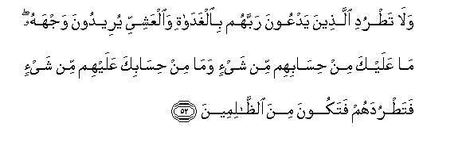

#وَلَا تَطْرُدِ الَّذِينَ يَدْعُونَ رَبَّهُمْ بِالْغَدَاةِ وَالْعَشِيِّ يُرِيدُونَ وَجْهَهُ ۖ مَا عَلَيْكَ مِنْ حِسَابِهِمْ مِنْ شَيْءٍ وَمَا مِنْ حِسَابِكَ عَلَيْهِمْ مِنْ شَيْءٍ فَتَطْرُدَهُمْ فَتَكُونَ مِنَ الظَّالِمِينَ 

##Wala tatrudi allatheena yadAAoona rabbahum bialghadati waalAAashiyyi yureedoona wajhahu ma AAalayka min hisabihim min shayin wama min hisabika AAalayhim min shayin fatatrudahum fatakoona mina alththalimeena 

## 翻译(Translation)：

| Translator | 译文(Translation)                                            |
| :--------: | ------------------------------------------------------------ |
|    马坚    | 早晚祈祷主，欲蒙其喜悦的人，你不要驱逐他们。你对于他们的被清算，毫无责任；他们对于你的被清算，也毫无责任。你何必驱逐他们，以至你变成不义的人。 |
|  YUSUFALI  | Send not away those who call on their Lord morning and evening seeking His Face. Naught have they to gain from thee and naught hast thou to gain from them that thou shouldst turn them away and thus be (one) of the unjust. |
| PICKTHALL  | Repel not those who call upon their Lord at morn and evening, seeking His Countenance. Thou art not accountable for them in aught, nor are they accountable for thee in aught, that thou shouldst repel them and be of the wrong-doers. |
|   SHAKIR   | And do not drive away those who call upon their Lord in the morning and the evening, they desire only His favor; neither are you answerable for any reckoning of theirs, nor are they answerable for any reckoning of yours, so that you should drive them away and thus be of the unjust. |

---

## 对位释义(Words Interpretation)：

| No   | العربية | 中文    | English | 曾用词 |
| ---- | ------: | ------- | ------- | ------ |
| 序号 |    阿文 | Chinese | 英文    | Used   |
| 6:52.1  | وَلَا      | 也不           | and not                            | 见1:7.8    |
| 6:52.2  | تَطْرُدِ     | 你驱逐         | send away                          |            |
| 6:52.3  | الَّذِينَ    | 谁，那些       | those who                          | 见2:6.2    |
| 6:52.4  | يَدْعُونَ    | 他们邀请       | they invite                        | 见2:221.26 |
| 6:52.5  | رَبَّهُمْ     | 他们的主       | their Lord                         | 见3:198.4  |
| 6:52.6  | بِالْغَدَاةِ  | 在早晨         | in the morning                     |            |
| 6:52.7  | وَالْعَشِيِّ   | 和晚上         | and the evening                    |            |
| 6:52.8  | يُرِيدُونَ   | 他们希望       | they wish                          | 见4:60.15  |
| 6:52.9  | وَجْهَهُ     | 全体，其面容   | His face                           | 见2:112.4  |
| 6:52.10 | مَا       | 不             | not                                | 见2:120.24 |
| 6:52.11 | عَلَيْكَ     | 在你           | on you                             | 见2:252.5  |
| 6:52.12 | مِنْ       | 从             | from                               | 见2:4.8    |
| 6:52.13 | حِسَابِهِمْ   | 他们的责任     | their accountable                  |            |
| 6:52.14 | مِنْ       | 从             | from                               | 见2:4.8    |
| 6:52.15 | شَيْءٍ      | 事物           | Thing                              | 见2:20.24  |
| 6:52.16 | وَمَا      | 和不           | And not                            | 见2:9.9    |
| 6:52.17 | مِنْ       | 从             | from                               | 见2:4.8    |
| 6:52.18 | حِسَابِكَ    | 你的责任       | your accountable                   | 参6:52.13  |
| 6:52.19 | عَلَيْهِمْ    | 在他们         | on they                            | 见1:7.4    |
| 6:52.20 | مِنْ       | 从             | from                               | 见2:4.8    |
| 6:52.21 | شَيْءٍ      | 事物           | Thing                              | 见2:20.24  |
| 6:52.22 | فَتَطْرُدَهُمْ  | 因此你驱逐他们 | so that you should drive them away |            |
| 6:52.23 | فَتَكُونَ    | 然后你是       | so you would be                    | 见5:29.7   |
| 6:52.24 | مِنَ       | 从             | from                               | 见2:4.8    |
| 6:52.25 | الظَّالِمِينَ | 不义的人       | unjust                             | 见2:35.19  |

---
