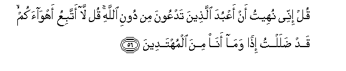

#قُلْ إِنِّي نُهِيتُ أَنْ أَعْبُدَ الَّذِينَ تَدْعُونَ مِنْ دُونِ اللَّهِ ۚ قُلْ لَا أَتَّبِعُ أَهْوَاءَكُمْ ۙ قَدْ ضَلَلْتُ إِذًا وَمَا أَنَا مِنَ الْمُهْتَدِينَ 

##Qul innee nuheetu an aAAbuda allatheena tadAAoona min dooni Allahi qul la attabiAAu ahwaakum qad dalaltu ithan wama ana mina almuhtadeena 

## 翻译(Translation)：

| Translator | 译文(Translation)                                            |
| :--------: | ------------------------------------------------------------ |
|    马坚    | 你说：我确已奉到禁令，不得崇拜你们舍真主而祈祷的。你说：我不顺从你们的私欲；否则，我必迷误，而绝不是遵循正道的人。 |
|  YUSUFALI  | Say. I am forbidden to worship those other than Allah whom ye call upon." Say: "I will not follow your vain desires: if I did I would stray from the path and be not of the company of those who receive guidance." |
| PICKTHALL  | Say: I am forbidden to worship those on whom ye call instead of Allah. Say: I will not follow your desires, for then should I go astray and I should not be of the rightly guided. |
|   SHAKIR   | Say: I am forbidden to serve those whom you call upon besides Allah. Say: I do not follow your low desires. for then indeed I should have gone astray and I should not be of those who go aright. |

---

## 对位释义(Words Interpretation)：

| No   | العربية | 中文    | English | 曾用词 |
| ---- | ------: | ------- | ------- | ------ |
| 序号 |    阿文 | Chinese | 英文    | Used   |
| 6:56.1  | قُلْ       | 你说           | Say                | 见2:80.8   |
| 6:56.2  | إِنِّي      | 确实我         | surely I           | 见2:30.5   |
| 6:56.3  | نُهِيتُ     | 我被禁止       | I am forbidden     |            |
| 6:56.4  | أَنْ       | 该             | that               | 见2:26.5   |
| 6:56.5  | أَعْبُدَ     | 我崇拜         | I worship          |            |
| 6:56.6  | الَّذِينَ    | 谁，那些       | those who          | 见2:6.2    |
| 6:56.7  | تَدْعُونَ    | 你们祈祷       | you call           | 见6:40.12  |
| 6:56.8  | مِنْ       | 从             | from               | 见2:4.8    |
| 6:56.9  | دُونِ      | 之外           | Without            | 见2:23.16  |
| 6:56.10 | اللَّهِ     | 真主的         | of Allah           | 见2:23.17  |
| 6:56.11 | قُلْ       | 你说           | Say                | 见2:80.8   |
| 6:56.12 | لَا       | 不，不是，没有 | no                 | 见2:2.3    |
| 6:56.13 | أَتَّبِعُ     | 我遵从         | I follow           | 见6:50.17  |
| 6:56.14 | أَهْوَاءَكُمْ  | 你们的私欲     | your vain desires  |            |
| 6:56.15 | قَدْ       | 当然           | may                | 见2:60.14  |
| 6:56.16 | ضَلَلْتُ     | 我迷误         | I go astray        |            |
| 6:56.17 | إِذًا      | 然后           | then               | 见2:145.30 |
| 6:56.18 | وَمَا      | 和不           | And not            | 见2:9.9    |
| 6:56.19 | أَنَا      | 我             | I                  | 见2:258.21 |
| 6:56.20 | مِنَ       | 从             | from               | 见2:19.3 |
| 6:56.21 | الْمُهْتَدِينَ | 众被引导者     | the rightly guided |            |

---
