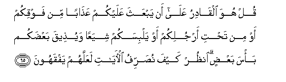

#قُلْ هُوَ الْقَادِرُ عَلَىٰ أَنْ يَبْعَثَ عَلَيْكُمْ عَذَابًا مِنْ فَوْقِكُمْ أَوْ مِنْ تَحْتِ أَرْجُلِكُمْ أَوْ يَلْبِسَكُمْ شِيَعًا وَيُذِيقَ بَعْضَكُمْ بَأْسَ بَعْضٍ ۗ انْظُرْ كَيْفَ نُصَرِّفُ الْآيَاتِ لَعَلَّهُمْ يَفْقَهُونَ 

##Qul huwa alqadiru AAala an yabAAatha AAalaykum AAathaban min fawqikum aw min tahti arjulikum aw yalbisakum shiyaAAan wayutheeqa baAAdakum basa baAAdin onthur kayfa nusarrifu alayati laAAallahum yafqahoona 

## 翻译(Translation)：

| Translator | 译文(Translation)                                            |
| :--------: | ------------------------------------------------------------ |
|    马坚    | 你说：他能使刑罚从你们的头上和脚下袭击你们，或使你们各宗派相混杂，从而使你们这宗派尝试那宗派的战争。你看，我怎样阐述许多迹象，以便他们了解。 |
|  YUSUFALI  | Say: "He hath power to send calamities on you from above and below or to cover you with confusion in party strife giving you a taste of mutual vengeance each from the other." See how We explain the Signs by various (symbols) that they may understand. |
| PICKTHALL  | Say: He is able to send punishment upon you from above you or from beneath your feet, or to bewilder you with dissension and make you taste the tyranny one of another. See how We display the revelations so that they may understand. |
|   SHAKIR   | Say: He has the power that He should send on you a chastisement from above you or from beneath your feet, or that He should throw you into confusion, (making you) of different parties; and make some of you taste the fighting of others. See how We repeat the communications that they may understand. |

---

## 对位释义(Words Interpretation)：

| No   | العربية | 中文    | English | 曾用词 |
| ---- | ------: | ------- | ------- | ------ |
| 序号 |    阿文 | Chinese | 英文    | Used   |
| 6:65.1  | قُلْ     | 你说         | Say                      | 见2:80.8   |
| 6:65.2  | هُوَ     | 他是         | He is                    | 见2:29.1   |
| 6:65.3  | الْقَادِرُ | 能够         | able                     |            |
| 6:65.4  | عَلَىٰ    | 至           | On                       | 见2:5.2    |
| 6:65.5  | أَنْ     | 该           | that                     | 见2:26.5   |
| 6:65.6  | يَبْعَثَ   | 他袭击       | he send                  |            |
| 6:65.7  | عَلَيْكُمْ  | 在你们       | on you                   | 见2:40.8   |
| 6:65.8  | عَذَابًا  | 刑罚         | chastisement             | 见3:56.5   |
| 6:65.9  | مِنْ     | 从           | from                     | 见2:4.8    |
| 6:65.10 | فَوْقِكُمْ  | 你们的上面   | above you                |            |
| 6:65.11 | أَوْ     | 或           | or                       | 见2:19.1   |
| 6:65.12 | مِنْ     | 从           | from                     | 见2:4.8    |
| 6:65.13 | تَحْتِ    | 下面         | beneath                  | 见5:66.15  |
| 6:65.14 | أَرْجُلِكُمْ | 你们的众脚   | your feet                |            |
| 6:65.15 | أَوْ     | 或           | or                       | 见2:19.1   |
| 6:65.16 | يَلْبِسَكُمْ | 他混杂你们   | cover you with confusion |            |
| 6:65.17 | شِيَعًا   | 各宗派       | parties                  |            |
| 6:65.18 | وَيُذِيقَ  | 和使尝试     | and make taste           |            |
| 6:65.19 | بَعْضَكُمْ  | 你们的一部分 | some of you              | 见4:32.7   |
| 6:65.20 | بَأْسَ    | 战争         | the fighting             | 见4:84.15  |
| 6:65.21 | بَعْضٍ    | 一部分       | Some                     | 见2:76.11  |
| 6:65.22 | انْظُرْ   | 你看         | See                      | 见4:50.1   |
| 6:65.23 | كَيْفَ    | 如何         | How                      | 见2:28.1   |
| 6:65.24 | نُصَرِّفُ   | 我们阐述     | We explain               | 见6:46.19  |
| 6:65.25 | الْآيَاتِ | 众迹象       | the signs                | 见2:118.22 |
| 6:65.26 | لَعَلَّهُمْ  | 以便他们     | in order that they       | 见2:186.16 |
| 6:65.27 | يَفْقَهُونَ | 他们了解     | understand               | 见4:78.35  |

---
