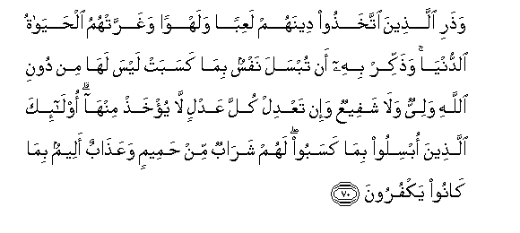

#وَذَرِ الَّذِينَ اتَّخَذُوا دِينَهُمْ لَعِبًا وَلَهْوًا وَغَرَّتْهُمُ الْحَيَاةُ الدُّنْيَا ۚ وَذَكِّرْ بِهِ أَنْ تُبْسَلَ نَفْسٌ بِمَا كَسَبَتْ لَيْسَ لَهَا مِنْ دُونِ اللَّهِ وَلِيٌّ وَلَا شَفِيعٌ وَإِنْ تَعْدِلْ كُلَّ عَدْلٍ لَا يُؤْخَذْ مِنْهَا ۗ أُولَٰئِكَ الَّذِينَ أُبْسِلُوا بِمَا كَسَبُوا ۖ لَهُمْ شَرَابٌ مِنْ حَمِيمٍ وَعَذَابٌ أَلِيمٌ بِمَا كَانُوا يَكْفُرُونَ 

##Wathari allatheena ittakhathoo deenahum laAAiban walahwan wagharrathumu alhayatu alddunya wathakkir bihi an tubsala nafsun bima kasabat laysa laha min dooni Allahi waliyyun wala shafeeAAun wain taAAdil kulla AAadlin la yukhath minha olaika allatheena obsiloo bima kasaboo lahum sharabun min hameemin waAAathabun aleemun bima kanoo yakfuroona 

## 翻译(Translation)：

| Translator | 译文(Translation)                                            |
| :--------: | ------------------------------------------------------------ |
|    马坚    | 把自己的宗教当作嬉戏和娱乐，而且为今世生活所欺骗的人，你可以任他们自便。你应当以《古兰经》劝戒世人，以免任何人因自己的罪行而遭毁灭；他除真主外没有保护者，也没有说情者，他无论怎样赎罪，总无效果。这等人，将为自己的罪行而遭毁灭。他们将为不信道而享受沸腾的饮料，和受痛苦的刑罚。 |
|  YUSUFALI  | Leave alone those who take their religion to be mere play and amusement and are deceived by the life of this world. But proclaim (to them) this (truth): that every soul delivers itself to ruin by its own acts: it will find for itself no protector or intercessor except Allah: if it offered every ransom (or reparation) none will be accepted: such is (the end of) those who deliver themselves to ruin by their own acts: they will have for drink (only) boiling water and for punishment one most grievous: for they persisted in rejecting Allah. |
| PICKTHALL  | And forsake those who take their religion for a pastime and a jest, and whom the life of the world beguileth. Remind (mankind) hereby lest a soul be destroyed by what it earneth. It hath beside Allah no protecting ally nor intercessor, and though it offer every compensation it will not be accepted from it. Those are they who perish by their own deserts. For them is drink of boiling water and a painful doom, because they disbelieved. |
|   SHAKIR   | And leave those who have taken their religion for a play and an idle sport, and whom this world's life has deceived, and remind (them) thereby lest a soul should be given up to destruction for what it has earned; it shall not have besides Allah any guardian nor an intercessor, and if it should seek to give every compensation, it shall not be accepted from it; these are they who shall be given up to destruction for what they earned; they shall have a drink of boiling water and a painful chastisement because they disbelieved. |

---

## 对位释义(Words Interpretation)：

| No   | العربية | 中文    | English | 曾用词 |
| ---- | ------: | ------- | ------- | ------ |
| 序号 |    阿文 | Chinese | 英文    | Used   |
| 6:70.1  | وَذَرِ    | 和你使自便     | and forsake          |            |
| 6:70.2  | الَّذِينَ  | 谁，那些       | those who            | 见2:6.2    |
| 6:70.3  | اتَّخَذُوا | 他们采取       | they took            | 见4:153.24 |
| 6:70.4  | دِينَهُمْ  | 他们的宗教     | their religion       | 见4:146.8  |
| 6:70.5  | لَعِبًا   | 一个嬉戏       | a play               |            |
| 6:70.6  | وَلَهْوًا  | 和一个娱乐     | and amusement        |            |
| 6:70.7  | وَغَرَّتْهُمُ | 和它欺骗他们   | and it deceived them |            |
| 6:70.8  | الْحَيَاةُ | 生活           | the life             | 见2:212.4  |
| 6:70.9  | الدُّنْيَا | 今世           | this world           | 见2:85.38  |
| 6:70.10 | وَذَكِّرْ   | 和你应劝诫     | and remind           |            |
| 6:70.11 | بِهِ     | 以它           | with it              | 见2:22.13  |
| 6:70.12 | أَنْ     | 该             | that                 | 见2:26.5   |
| 6:70.13 | تُبْسَلَ   | 她遭受         | be destroyed         |            |
| 6:70.14 | نَفْسٌ    | 一个人         | one                  | 见2:48.5   |
| 6:70.15 | بِمَا    | 在什么         | in what              | 见2:4.3    |
| 6:70.16 | كَسَبَتْ   | 赚到           | earned               | 见2:134.7  |
| 6:70.17 | لَيْسَ    | 它不是         | It is not            | 见2:177.1  |
| 6:70.18 | لَهَا    | 对她           | for her              | 见2:134.5  |
| 6:70.19 | مِنْ     | 从             | from                 | 见2:4.8    |
| 6:70.20 | دُونِ    | 之外           | Without              | 见2:23.16  |
| 6:70.21 | اللَّهِ   | 真主的         | of Allah             | 见2:23.17  |
| 6:70.22 | وَلِيٌّ    | 一个保护者     | guardian             | 见6:51.13  |
| 6:70.23 | وَلَا    | 也不           | and not              | 见1:7.8    |
| 6:70.24 | شَفِيعٌ   | 一个说情者     | intercessor          | 见6:51.15  |
| 6:70.25 | وَإِنْ    | 和不           | and no               | 见2:78.8 |
| 6:70.26 | تَعْدِلْ   | 她赎罪         | it offered           |            |
| 6:70.27 | كُلَّ     | 所有           | All                  | 见2:20.23  |
| 6:70.28 | عَدْلٍ    | 公正的         | for justice          | 见5:95.23  |
| 6:70.29 | لَا     | 不，不是，没有 | no                   | 见2:2.3    |
| 6:70.30 | يُؤْخَذْ   | 它被接受       | it will be accepted  |            |
| 6:70.31 | مِنْهَا   | 从它           | From it              | 见2:25.15  |
| 6:70.32 | أُولَٰئِكَ  | 这等人         | These are            | 见2:5.1    |
| 6:70.33 | الَّذِينَ  | 谁，那些       | those who            | 见2:6.2    |
| 6:70.34 | أُبْسِلُوا | 他们遭遇       | perish               |            |
| 6:70.35 | بِمَا    | 在什么         | in what              | 见2:4.3    |
| 6:70.36 | كَسَبُوا  | 他们赚到       | they have earned     | 见2:202.5  |
| 6:70.37 | لَهُمْ    | 对他们         | for them             | 见2:11.3   |
| 6:70.38 | شَرَابٌ   | 一个饮料       | a drink              |            |
| 6:70.39 | مِنْ     | 从             | from                 | 见2:4.8    |
| 6:70.40 | حَمِيمٍ   | 沸腾的         | boiling water        |            |
| 6:70.41 | وَعَذَابٌ  | 和刑罚         | and punishment       | 参2:7.11   |
| 6:70.42 | أَلِيمٌ   | 痛苦，疼痛     | A painful            | 见2:10.9   |
| 6:70.43 | بِمَا    | 在什么         | in what              | 见2:4.3    |
| 6:70.44 | كَانُوا  | 他们是         | they were            | 见2:10:11  |
| 6:70.45 | يَكْفُرُونَ | 他们不信       | They disbelieve      | 见2:61.49  |

---
