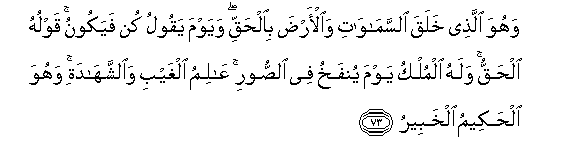

#وَهُوَ الَّذِي خَلَقَ السَّمَاوَاتِ وَالْأَرْضَ بِالْحَقِّ ۖ وَيَوْمَ يَقُولُ كُنْ فَيَكُونُ ۚ قَوْلُهُ الْحَقُّ ۚ وَلَهُ الْمُلْكُ يَوْمَ يُنْفَخُ فِي الصُّورِ ۚ عَالِمُ الْغَيْبِ وَالشَّهَادَةِ ۚ وَهُوَ الْحَكِيمُ الْخَبِيرُ 

##Wahuwa allathee khalaqa alssamawati waalarda bialhaqqi wayawma yaqoolu kun fayakoonu qawluhu alhaqqu walahu almulku yawma yunfakhu fee alssoori AAalimu alghaybi waalshshahadati wahuwa alhakeemu alkhabeeru 

## 翻译(Translation)：

| Translator | 译文(Translation)                                            |
| :--------: | ------------------------------------------------------------ |
|    马坚    | 他就是本真理而创造天地的。在那日，他说'有'，世界就有了。他的话就是真理。吹号角之日，国权只是他的。他知道幽明，他是至睿的，是彻知的。 |
|  YUSUFALI  | It is He Who created the heavens and the earth in true (proportions): the day He saith "Be" Behold! it is. His Word is the truth. His will be the dominion the day the trumpet will be blown. He knoweth the Unseen as well as that which is open. For He is the Wise well acquainted (with all things). |
| PICKTHALL  | He it is Who created the heavens and the earth in truth. In the day when He saith: Be! it is. His Word is the Truth, and His will be the Sovereignty on the day when the trumpet is blown. Knower of the Invisible and the Visible, He is the Wise, the Aware. |
|   SHAKIR   | And He it is Who has created the heavens and the earth with truth, and on the day He says: Be, it is. His word is the truth, and His is the kingdom on the day when the trumpet shall be blown; the Knower of the unseen and the seen; and He is the Wise, the Aware. |

---

## 对位释义(Words Interpretation)：

| No   | العربية | 中文    | English | 曾用词 |
| ---- | ------: | ------- | ------- | ------ |
| 序号 |    阿文 | Chinese | 英文    | Used   |
| 6:73.1  | وَهُوَ      | 和他             | and he               | 见2:29.16  |
| 6:73.2  | الَّذِي     | 谁，那些         | those who            | 见2:6.2    |
| 6:73.3  | خَلَقَ      | 创造             | created              | 见2:29.3   |
| 6:73.4  | السَّمَاوَاتِ | 诸天的           | of the heavens       | 见2:33.16  |
| 6:73.5  | وَالْأَرْضَ   | 和土地           | and earth            | 见2:255.44 |
| 6:73.6  | بِالْحَقِّ    | 以真理           | with truth           | 见2:71.20  |
| 6:73.7  | وَيَوْمَ     | 和日子           | and day              | 见2:85.39  |
| 6:73.8  | يَقُولُ     | 说               | Says                 | 见2:8.4    |
| 6:73.9  | كُنْ       | 是               | Be                   | 见2:117.10 |
| 6:73.10 | فَيَكُونُ    | 然后它是         | So it is             | 见2:117.11 |
| 6:73.11 | قَوْلُهُ     | 他的话语         | his word             | 见2:204.5  |
| 6:73.12 | الْحَقُّ     | 正确的，真理     | Right, truth         | 见2:26.17  |
| 6:73.13 | وَلَهُ      | 和对他           | and for he           | 见2:266.21 |
| 6:73.14 | الْمُلْكُ    | 国权             | the kingdom          | 见2:247.15 |
| 6:73.15 | يَوْمَ      | 日，日子，时候的 | day                  | 见1:4.2    |
| 6:73.16 | يُنْفَخُ     | 它被吹           | it is blown          |            |
| 6:73.17 | فِي       | 在               | in                   | 见2:10.1   |
| 6:73.18 | الصُّورِ    | 号角             | the trumpet          |            |
| 6:73.19 | عَالِمُ     | 全知者           | the Knower           |            |
| 6:73.20 | الْغَيْبِ    | 幽玄的           | of the things unseen | 见3:44.4   |
| 6:73.21 | وَالشَّهَادَةِ | 和可见的         | and the seen         |            |
| 6:73.22 | وَهُوَ      | 和他             | and he               | 见2:29.16  |
| 6:73.23 | الْحَكِيمُ   | 至睿的           | the wise             | 见2:32.12  |
| 6:73.24 | الْخَبِيرُ   | 彻知的           | the Aware            | 见6:18.7   |

---
