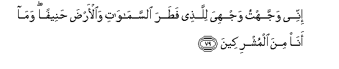

#إِنِّي وَجَّهْتُ وَجْهِيَ لِلَّذِي فَطَرَ السَّمَاوَاتِ وَالْأَرْضَ حَنِيفًا ۖ وَمَا أَنَا مِنَ الْمُشْرِكِينَ 

##Innee wajjahtu wajhiya lillathee fatara alssamawati waalarda haneefan wama ana mina almushrikeena 

## 翻译(Translation)：

| Translator | 译文(Translation)                                            |
| :--------: | ------------------------------------------------------------ |
|    马坚    | 我确已崇正地专向天地的创造者，我不是以物配主的人。           |
|  YUSUFALI  | "For me I have set my face firmly and truly toward Him Who created the heavens and the earth, and never shall I give partners to Allah." |
| PICKTHALL  | Lo! I have turned my face toward Him Who created the heavens and the earth, as one by nature upright, and I am not of the idolaters. |
|   SHAKIR   | Surely I have turned myself, being upright, wholly to Him Who originated the heavens and the earth, and I am not of the polytheists. |

---

## 对位释义(Words Interpretation)：

| No   | العربية | 中文    | English | 曾用词 |
| ---- | ------: | ------- | ------- | ------ |
| 序号 |    阿文 | Chinese | 英文    | Used   |
| 6:79.1  | إِنِّي      | 确实我     | surely I        | 见2:30.5   |
| 6:79.2  | وَجَّهْتُ     | 我转向     | I have turned   |            |
| 6:79.3  | وَجْهِيَ     | 我的脸     | my face         | 见3:20.5   |
| 6:79.4  | لِلَّذِي     | 至那个     | to those        |            |
| 6:79.5  | فَطَرَ      | 他创造     | he created      |            |
| 6:79.6  | السَّمَاوَاتِ | 诸天的     | of the heavens  | 见2:33.16  |
| 6:79.7  | وَالْأَرْضَ   | 和土地     | and earth       | 见2:255.44 |
| 6:79.8  | حَنِيفًا    | 崇正地     | the upright     | 见2:135.11 |
| 6:79.9  | وَمَا      | 和不       | And not         | 见2:9.9    |
| 6:79.10 | أَنَا      | 我         | I               | 见2:258.21 |
| 6:79.11 | مِنَ       | 从         | from            | 见2:19.3 |
| 6:79.12 | الْمُشْرِكِينَ | 以物配主者 | The polytheists | 见2:105.9  |

---
