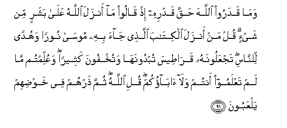

#وَمَا قَدَرُوا اللَّهَ حَقَّ قَدْرِهِ إِذْ قَالُوا مَا أَنْزَلَ اللَّهُ عَلَىٰ بَشَرٍ مِنْ شَيْءٍ ۗ قُلْ مَنْ أَنْزَلَ الْكِتَابَ الَّذِي جَاءَ بِهِ مُوسَىٰ نُورًا وَهُدًى لِلنَّاسِ ۖ تَجْعَلُونَهُ قَرَاطِيسَ تُبْدُونَهَا وَتُخْفُونَ كَثِيرًا ۖ وَعُلِّمْتُمْ مَا لَمْ تَعْلَمُوا أَنْتُمْ وَلَا آبَاؤُكُمْ ۖ قُلِ اللَّهُ ۖ ثُمَّ ذَرْهُمْ فِي خَوْضِهِمْ يَلْعَبُونَ 

##Wama qadaroo Allaha haqqa qadrihi ith qaloo ma anzala Allahu AAala basharin min shayin qul man anzala alkitaba allathee jaa bihi moosa nooran wahudan lilnnasi tajAAaloonahu qarateesa tubdoonaha watukhfoona katheeran waAAullimtum ma lam taAAlamoo antum wala abaokum quli Allahu thumma tharhum fee khawdihim yalAAaboona 

## 翻译(Translation)：

| Translator | 译文(Translation)                                            |
| :--------: | ------------------------------------------------------------ |
|    马坚    | 他们对于真主没有真正的认识，当时，他们说：真主没有把任何物降示给任何人。你说：谁降示了穆萨所传授的、可以做世人的光明和向导的天经呢？你们把那部天经抄录在一些散纸上，你们发表一部分，隐藏大部分。你们曾受过自己和祖先所未认识的教训。你说：是真主。然后，任随他们在妄言中游戏。 |
|  YUSUFALI  | No just estimate of Allah do they make when they say: "Nothing doth Allah send down to man (by way of revelation)": Say: "Who then sent down the Book which Moses brought? a light and guidance to man: but ye make it into (separate) sheets for show while ye conceal much (of its contents): therein were ye taught that which ye knew not neither ye nor your fathers." Say: "Allah (sent it down)": then leave them to plunge in vain discourse and trifling. |
| PICKTHALL  | And they measure not the power of Allah its true measure when they say: Allah hath naught revealed unto a human being. Say (unto the Jews who speak thus): Who revealed the Book which Moses brought, a light and guidance for mankind, which ye have put on parchments which ye show, but ye hide much (thereof), and (by which) ye were taught that which ye knew not yourselves nor (did) your fathers (know it) ? Say: Allah. Then leave them to their play of cavilling. |
|   SHAKIR   | And they do not assign to Allah the attributes due to Him when they say: Allah has not revealed anything to a mortal. Say: Who revealed the Book which Musa brought, a light and a guidance to men, which you make into scattered writings which you show while you conceal much? And you were taught what you did not know, (neither) you nor your fathers. Say: Allah then leave them sporting in their vain discourses. |

---

## 对位释义(Words Interpretation)：

| No   | العربية | 中文    | English | 曾用词 |
| ---- | ------: | ------- | ------- | ------ |
| 序号 |    阿文 | Chinese | 英文    | Used   |
| 6:91.1  | وَمَا     | 和不                   | And not               | 见2:9.9    |
| 6:91.2  | قَدَرُوا   | 他们认识               | they estimate         |            |
| 6:91.3  | اللَّهَ    | 安拉，真主             | Allah                 | 见2:9.2    |
| 6:91.4  | حَقَّ      | 正确的，真理           | Right, truth          | 见2:121.5  |
| 6:91.5  | قَدْرِهِ    | 他的认识               | its estimate          |            |
| 6:91.6  | إِذْ      | 当时                   | when                  | 见2:131.1  |
| 6:91.7  | قَالُوا   | 他们说，               | They said             | 见2:11.8   |
| 6:91.8  | مَا      | 不                     | not                   | 见2:120.24 |
| 6:91.9  | أَنْزَلَ    | 下降，颁降，降示，揭秘 | get down              | 见2:4.4    |
| 6:91.10 | اللَّهُ    | 安拉，真主             | Allah                 | 见2:7.2    |
| 6:91.11 | عَلَىٰ     | 至                     | On                    | 见2:5.2    |
| 6:91.12 | بَشَرٍ     | 任何人                 | a human being         |            |
| 6:91.13 | مِنْ      | 从                     | from                  | 见2:4.8    |
| 6:91.14 | شَيْءٍ     | 事物                   | Thing                 | 见2:20.24  |
| 6:91.15 | قُلْ      | 你说                   | Say                   | 见2:80.8   |
| 6:91.16 | مَنْ      | 谁                     | who                   | 见2:97.2   |
| 6:91.17 | أَنْزَلَ    | 下降，颁降，降示，揭秘 | get down              | 见2:4.4    |
| 6:91.18 | الْكِتَابَ  | 这部经，这本书         | the book              | 见2:2.2    |
| 6:91.19 | الَّذِي    | 谁，那些               | those who             | 见2:6.2    |
| 6:91.20 | جَاءَ     | 他来                   | come                  | 见4:43.28  |
| 6:91.21 | بِهِ      | 以它                   | with it               | 见2:22.13  |
| 6:91.22 | مُوسَىٰ    | 穆萨                   | Moses                 | 见2:51.3   |
| 6:91.23 | نُورًا    | 光明                   | light                 | 见4:174.11 |
| 6:91.24 | وَهُدًى    | 和引导                 | and guidance          | 见2:97.16  |
| 6:91.25 | لِلنَّاسِ   | 对世人                 | For people            | 见2:83.17  |
| 6:91.26 | تَجْعَلُونَهُ | 你们抄录它             | you make it           |            |
| 6:91.27 | قَرَاطِيسَ  | 众纸                   | sheets                |            |
| 6:91.28 | تُبْدُونَهَا | 你们发表它             | you show it           |            |
| 6:91.29 | وَتُخْفُونَ  | 和你们隐藏             | and you concealed     | 参4:114.4  |
| 6:91.30 | كَثِيرًا   | 多                     | Much                  | 见2:26.31  |
| 6:91.31 | وَعُلِّمْتُمْ  | 和你们被教导           | and you were taught   |            |
| 6:91.32 | مَا      | 什么                   | what/ that which      | 见2:17.8   |
| 6:91.33 | لَمْ      | 不，没有               | did not               | 见2:6.8    |
| 6:91.34 | تَعْلَمُوا  | 你们知道               | you know              | 见4:43.11  |
| 6:91.35 | أَنْتُمْ    | 你们                   | you                   | 见2:85.2   |
| 6:91.36 | وَلَا     | 也不                   | and not               | 见1:7.8    |
| 6:91.37 | آبَاؤُكُمْ  | 你的父母亲             | your parents          | 见4:11.56  |
| 6:91.38 | قُلِ      | 你说                   | Say                   | 见2:219.30 |
| 6:91.39 | اللَّهُ    | 安拉，真主             | Allah                 | 见2:7.2    |
| 6:91.40 | ثُمَّ      | 然后                   | Then                  | 见2:28.7   |
| 6:91.41 | ذَرْهُمْ    | 你使他们               | you leave them        |            |
| 6:91.42 | فِي      | 在                     | in                    | 见2:10.1   |
| 6:91.43 | خَوْضِهِمْ   | 他们的妄言             | their vain discourses |            |
| 6:91.44 | يَلْعَبُونَ  | 他们游戏               | their play            |            |

---
