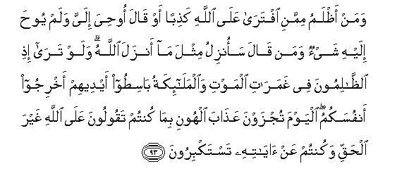

#وَمَنْ أَظْلَمُ مِمَّنِ افْتَرَىٰ عَلَى اللَّهِ كَذِبًا أَوْ قَالَ أُوحِيَ إِلَيَّ وَلَمْ يُوحَ إِلَيْهِ شَيْءٌ وَمَنْ قَالَ سَأُنْزِلُ مِثْلَ مَا أَنْزَلَ اللَّهُ ۗ وَلَوْ تَرَىٰ إِذِ الظَّالِمُونَ فِي غَمَرَاتِ الْمَوْتِ وَالْمَلَائِكَةُ بَاسِطُو أَيْدِيهِمْ أَخْرِجُوا أَنْفُسَكُمُ ۖ الْيَوْمَ تُجْزَوْنَ عَذَابَ الْهُونِ بِمَا كُنْتُمْ تَقُولُونَ عَلَى اللَّهِ غَيْرَ الْحَقِّ وَكُنْتُمْ عَنْ آيَاتِهِ تَسْتَكْبِرُونَ 

##Waman athlamu mimmani iftara AAala Allahi kathiban aw qala oohiya ilayya walam yooha ilayhi shayon waman qala saonzilu mithla ma anzala Allahu walaw tara ithi alththalimoona fee ghamarati almawti waalmalaikatu basitoo aydeehim akhrijoo anfusakumu alyawma tujzawna AAathaba alhooni bima kuntum taqooloona AAala Allahi ghayra alhaqqi wakuntum AAan ayatihi tastakbiroona 

## 翻译(Translation)：

| Translator | 译文(Translation)                                            |
| :--------: | ------------------------------------------------------------ |
|    马坚    | 假借真主的名义而造谣的，自称奉到启示，其实，没有奉到任何启示的人，或妄言要像真主那样降示天经的人，这等人谁比他们还不义呢？不义的人正在临死的苦痛中，众天神伸著手说：你们拿出你们的灵魂吧！今天你们要受辱刑的报酬，因为你们假借真主的名义而造谣，并藐视他的迹象。那时，假若你看见他们的情状， |
|  YUSUFALI  | Who can be more wicked than one who inventeth a lie against Allah or saith "I have received inspiration" when he hath received none or (again) who saith "I can reveal the like of what Allah hath revealed?" If thou couldst but see how the wicked (do fare) in the flood of confusion at death! the angels stretch forth their hands (saying) "Yield up your souls. This day shall ye receive your reward a penalty of shame for that ye used to tell lies against Allah and scornfully to reject of His Signs!" |
| PICKTHALL  | Who is guilty of more wrong than he who forgeth a lie against Allah, or saith: I am inspired, when he is not inspired in aught; and who saith: I will reveal the like of that which Allah hath revealed ? If thou couldst see, when the wrong-doers reach the pangs of death and the angels stretch their hands out (saying): Deliver up your souls. This day ye are awarded doom of degradation for that ye spake concerning Allah other than the truth, and used to scorn His portents. |
|   SHAKIR   | And who is more unjust than he who forges a lie against Allah, or says: It has been revealed to me; while nothing has been revealed to him, and he who says: I can reveal the like of what Allah has revealed? and if you had seen when the unjust shall be in the agonies of death and the angels shall spread forth their hands: Give up your souls; today shall you be recompensed with an ignominious chastisement because you spoke against Allah other than the truth and (because) you showed pride against His communications. |

---

## 对位释义(Words Interpretation)：

| No   | العربية | 中文    | English | 曾用词 |
| ---- | ------: | ------- | ------- | ------ |
| 序号 |    阿文 | Chinese | 英文    | Used   |
| 6:93.1  | وَمَنْ       | 和谁                     | and who                  | 见2:108.11 |
| 6:93.2  | أَظْلَمُ      | 更不义                   | more unjust              | 见2:114.2  |
| 6:93.3  | مِمَّنِ       | 比谁                     | than who                 | 见6:21.3   |
| 6:93.4  | افْتَرَىٰ     | 他假借                   | he invents               | 见3:94.2   |
| 6:93.5  | عَلَى       | 至                       | On                       | 见2:5.2    |
| 6:93.6  | اللَّهِ      | 真主的                   | of Allah                 | 见2:23.17  |
| 6:93.7  | كَذِبًا      | 一个谎言                 | a lie                    | 见6:21.7   |
| 6:93.8  | أَوْ        | 或                       | or                       | 见2:19.1   |
| 6:93.9  | قَالَ       | 他说，                   | He said                  | 见2:30.2   |
| 6:93.10 | أُوحِيَ      | 它启示                   | It has been revealed     |            |
| 6:93.11 | إِلَيَّ       | 至我                     | to me                    | 见3:55.9   |
| 6:93.12 | وَلَمْ       | 和不                     | and did not              | 见2:247.21 |
| 6:93.13 | يُوحَ       | 它被启示                 | it has been revealed     |            |
| 6:93.14 | إِلَيْهِ      | 至他                     | to him                   | 见2:28.12  |
| 6:93.15 | شَيْءٌ       | 事物                     | Thing                    | 见2:20.24  |
| 6:93.16 | وَمَنْ       | 和谁                     | and who                  | 见2:108.11 |
| 6:93.17 | قَالَ       | 他说，                   | He said                  | 见2:30.2   |
| 6:93.18 | سَأُنْزِلُ     | 我将降示                 | I will reveal            |            |
| 6:93.19 | مِثْلَ       | 类似                     | Like                     | 见2:113.21 |
| 6:93.20 | مَا        | 什么                     | what/ that which         | 见2:17.8   |
| 6:93.21 | أَنْزَلَ      | 下降，颁降，降示，揭秘   | get down                 | 见2:4.4    |
| 6:93.22 | اللَّهُ      | 安拉，真主               | Allah                    | 见2:7.2    |
| 6:93.23 | وَلَوْ       | 和如果                   | and if                   | 见2:20.14  |
| 6:93.24 | تَرَىٰ       | 你看                     | You will see             | 见5:80.1   |
| 6:93.25 | إِذِ        | 当时                     | when                     | 参2:131.1  |
| 6:93.26 | الظَّالِمُونَ  | 不义者                   | the unjust               | 见2:229.46 |
| 6:93.27 | فِي        | 在                       | in                       | 见2:10.1   |
| 6:93.28 | غَمَرَاتِ     | 痛苦                     | the agonies              |            |
| 6:93.29 | الْمَوْتِ     | 死亡                     | the death                | 见2:19.16  |
| 6:93.30 | وَالْمَلَائِكَةُ | 和众天使                 | and the angels           | 见2:210.11 |
| 6:93.31 | بَاسِطُو     | 伸出                     | stretch                  |            |
| 6:93.32 | أَيْدِيهِمْ    | 他们的手                 | Their hands              | 见2:79.20  |
| 6:93.33 | أَخْرِجُوا    | 你们拿出                 | Deliver up               |            |
| 6:93.34 | أَنْفُسَكُمُ    | 你们的灵魂               | your souls               |            |
| 6:93.35 | الْيَوْمَ     | 今日                     | today                    | 见2:249.40 |
| 6:93.36 | تُجْزَوْنَ     | 你们被报酬               | you are awarded          |            |
| 6:93.37 | عَذَابَ      | 刑罚                     | the chastisement         | 见2:201.13 |
| 6:93.38 | الْهُونِ     | 羞辱的                   | of shame                 |            |
| 6:93.39 | بِمَا       | 在什么                   | in what                  | 见2:4.3    |
| 6:93.40 | كُنْتُمْ      | 你们是                   | You are                  | 见2:23.2   |
| 6:93.41 | تَقُولُونَ    | 你们说                   | You say                  | 见2:80.18  |
| 6:93.42 | عَلَى       | 至                       | On                       | 见2:5.2    |
| 6:93.43 | اللَّهِ      | 真主的                   | of Allah                 | 见2:23.17  |
| 6:93.44 | غَيْرَ       | 非，除了，除开，不是，但 | non, but                 | 见1:7.5    |
| 6:93.45 | الْحَقِّ      | 正确的，真理             | Right, truth             | 见2:26.17  |
| 6:93.46 | وَكُنْتُمْ     | 和你们是                 | And you are              | 见2:28.4   |
| 6:93.47 | عَنْ        | 从                       | on                       | 见2:48.6   |
| 6:93.48 | آيَاتِهِ     | 他的迹象                 | His Signs                | 见2:73.9   |
| 6:93.49 | تَسْتَكْبِرُونَ  | 你们藐视                 | you scornfully to reject |            |

---
