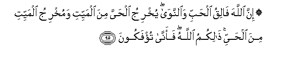

#۞ إِنَّ اللَّهَ فَالِقُ الْحَبِّ وَالنَّوَىٰ ۖ يُخْرِجُ الْحَيَّ مِنَ الْمَيِّتِ وَمُخْرِجُ الْمَيِّتِ مِنَ الْحَيِّ ۚ ذَٰلِكُمُ اللَّهُ ۖ فَأَنَّىٰ تُؤْفَكُونَ 

##Inna Allaha faliqu alhabbi waalnnawa yukhriju alhayya mina almayyiti wamukhriju almayyiti mina alhayyi thalikumu Allahu faanna tufakoona 

## 翻译(Translation)：

| Translator | 译文(Translation)                                            |
| :--------: | ------------------------------------------------------------ |
|    马坚    | 真主确是使谷粒和果核绽开的，他从无生物中造出生物，从生物中造出无生物。这是真主，你们怎么能悖谬呢？ |
|  YUSUFALI  | It is Allah Who causeth the seed-grain and the date-stone to split and sprout. He causeth the living to issue from the dead and He is the one to cause the dead to issue from the living. That is Allah; then how are ye deluded away from the truth? |
| PICKTHALL  | Lo! Allah (it is) Who splitteth the grain of corn and the date-stone (for sprouting). He bringeth forth the living from the dead, and is the bringer-forth of the dead from the living. Such is Allah. How then are ye perverted ? |
|   SHAKIR   | Surely Allah causes the grain and the stone to germinate; He brings forth the living from the dead and He is the bringer forth of the dead from the living; that is Allah! how are you then turned away. |

---

## 对位释义(Words Interpretation)：

| No   | العربية | 中文    | English | 曾用词 |
| ---- | ------: | ------- | ------- | ------ |
| 序号 |    阿文 | Chinese | 英文    | Used   |
| 6:95.1  | إِنَّ     | 的确       | surely                      | 见2:6.1   |
| 6:95.2  | اللَّهَ   | 安拉，真主 | Allah                       | 见2:9.2   |
| 6:95.3  | فَالِقُ   | 绽开       | cause to split              |           |
| 6:95.4  | الْحَبِّ   | 谷粒的     | the grain                   |           |
| 6:95.5  | وَالنَّوَىٰ | 和果核的   | and the date-stone          |           |
| 6:95.6  | يُخْرِجُ   | 他使生出   | He brings forth             |           |
| 6:95.7  | الْحَيَّ   | 生物       | the living                  | 见3:27.10 |
| 6:95.8  | مِنَ     | 从         | from                        | 见2:4.8   |
| 6:95.9  | الْمَيِّتِ  | 无生物     | the dead                    | 见3:27.12 |
| 6:95.10 | وَمُخْرِجُ  | 和他被生出 | and He is the bringer forth |           |
| 6:95.11 | الْمَيِّتِ  | 无生物     | the dead                    | 见3:27.12 |
| 6:95.12 | مِنَ     | 从         | from                        | 见2:4.8   |
| 6:95.13 | الْحَيِّ   | 生物       | the living                  | 见3:27.16 |
| 6:95.14 | ذَٰلِكُمُ   | 那个你们   | that is you                 | 见3:175.2 |
| 6:95.15 | اللَّهُ   | 安拉，真主 | Allah                       | 见2:7.2   |
| 6:95.16 | فَأَنَّىٰ   | 因此如何   | then how                    | 参2:223.6 |
| 6:95.17 | تُؤْفَكُونَ | 你们悖谬   | you turned away             |           |

---
