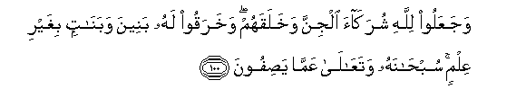

#وَجَعَلُوا لِلَّهِ شُرَكَاءَ الْجِنَّ وَخَلَقَهُمْ ۖ وَخَرَقُوا لَهُ بَنِينَ وَبَنَاتٍ بِغَيْرِ عِلْمٍ ۚ سُبْحَانَهُ وَتَعَالَىٰ عَمَّا يَصِفُونَ 

##WajaAAaloo lillahi shurakaa aljinna wakhalaqahum wakharaqoo lahu baneena wabanatin bighayri AAilmin subhanahu wataAAala AAamma yasifoona 

## 翻译(Translation)：

| Translator | 译文(Translation)                                            |
| :--------: | ------------------------------------------------------------ |
|    马坚    | 真主创造精灵，而他们以精灵为真主的伙伴，并且无知地替他捏造许多儿女。赞颂真主，超绝万物，他是超乎他们的叙述的！ |
|  YUSUFALI  | Yet they make the Jinns equals with Allah though Allah did create the Jinns; and they falsely having no knowledge attribute to Him sons and daughters. Praise and glory be to Him! (for He is) above what they attribute to Him! |
| PICKTHALL  | Yet they ascribe as partners unto Him the jinn, although He did create them, and impute falsely, without knowledge, sons and daughters unto Him. Glorified be He and High Exalted above (all) that they ascribe (unto Him). |
|   SHAKIR   | And they make the jinn associates with Allah, while He created them, and they falsely attribute to Him sons and daughters without knowledge; glory be to Him, and highly exalted is He above what they ascribe (to Him). |

---

## 对位释义(Words Interpretation)：

| No   | العربية | 中文    | English | 曾用词 |
| ---- | ------: | ------- | ------- | ------ |
| 序号 |    阿文 | Chinese | 英文    | Used   |
| 6:100.1  | وَجَعَلُوا | 和他们使     | and they make                  |            |
| 6:100.2  | لِلَّهِ    | 为真主       | for Allah                      | 见1:2.2    |
| 6:100.3  | شُرَكَاءَ  | 众伙伴       | partners                       |            |
| 6:100.4  | الْجِنَّ   | 精灵         | the Jinn                       |            |
| 6:100.5  | وَخَلَقَهُمْ | 和他创造他们 | and He created them            |            |
| 6:100.6  | وَخَرَقُوا | 和他们捏造   | and they falsely attribute     |            |
| 6:100.7  | لَهُ     | 对他         | for he                         | 见2:102.62 |
| 6:100.8  | بَنِينَ   | 众儿子       | sons                           |            |
| 6:100.9  | وَبَنَاتٍ  | 和众女儿     | and daughters                  |            |
| 6:100.10 | بِغَيْرِ   | 没有         | without                        | 见2:61.54  |
| 6:100.11 | عِلْمٍ    | 知识         | knowledge                      | 见4:157.28 |
| 6:100.12 | سُبْحَانَهُ | 赞颂他超绝   | Glory be to Him                | 见2:116.5  |
| 6:100.13 | وَتَعَالَىٰ | 和他超乎     | and highly exalted is He above |            |
| 6:100.14 | عَمَّا    | 在什么       | of what                        | 见2:74.36  |
| 6:100.15 | يَصِفُونَ  | 他们叙述     | they ascribe                   |            |

---
