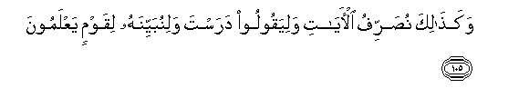

#وَكَذَٰلِكَ نُصَرِّفُ الْآيَاتِ وَلِيَقُولُوا دَرَسْتَ وَلِنُبَيِّنَهُ لِقَوْمٍ يَعْلَمُونَ 

##Wakathalika nusarrifu alayati waliyaqooloo darasta walinubayyinahu liqawmin yaAAlamoona 

## 翻译(Translation)：

| Translator | 译文(Translation)                                            |
| :--------: | ------------------------------------------------------------ |
|    马坚    | 我这样阐述一切迹象，以便他们说你曾研究过经典，以便我为有知识的民众阐明理。 |
|  YUSUFALI  | Thus do We explain the Signs by various (symbols): that they may say "Thou hast taught us diligently" and that We may make the matter clear to those who know. |
| PICKTHALL  | Thus do We display Our revelations that they may say (unto thee, Muhammad): "Thou hast studied," and that We may make (it) clear for people who have knowledge. |
|   SHAKIR   | And thus do We repeat the communications and that they may say: You have read; and that We may make it clear to a people who know. |

---

## 对位释义(Words Interpretation)：

| No   | العربية | 中文    | English | 曾用词 |
| ---- | ------: | ------- | ------- | ------ |
| 序号 |    阿文 | Chinese | 英文    | Used   |
| 6:105.1 | وَكَذَٰلِكَ    | 和像如此         | and Thus                      | 见2:143.1  |
| 6:105.2 | نُصَرِّفُ     | 我们阐述         | We explain                    | 见6:46.19  |
| 6:105.3 | الْآيَاتِ   | 众迹象           | the signs                     | 见2:118.22 |
| 6:105.4 | وَلِيَقُولُوا | 和以便他们说     | and so that they say          | 参6:53.5   |
| 6:105.5 | دَرَسْتَ     | 你研究           | you have studied              |            |
| 6:105.6 | وَلِنُبَيِّنَهُ  | 和以便我们阐明它 | and that We may make it clear |            |
| 6:105.7 | لِقَوْمٍ     | 对人们           | For the people                | 见2:118.23 |
| 6:105.8 | يَعْلَمُونَ   | 知道             | Know                          | 见2:13.19  |

---
