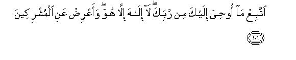

#اتَّبِعْ مَا أُوحِيَ إِلَيْكَ مِنْ رَبِّكَ ۖ لَا إِلَٰهَ إِلَّا هُوَ ۖ وَأَعْرِضْ عَنِ الْمُشْرِكِينَ 

##IttabiAA ma oohiya ilayka min rabbika la ilaha illa huwa waaAArid AAani almushrikeena 

## 翻译(Translation)：

| Translator | 译文(Translation)                                            |
| :--------: | ------------------------------------------------------------ |
|    马坚    | 你当遵守你的主所启示你的经典；除他外，绝无应受崇拜的；你当避开以物配主的人。 |
|  YUSUFALI  | Follow what thou art taught by inspiration from thy Lord: there is no god but He: and turn aside from those who join gods with Allah. |
| PICKTHALL  | Follow that which is inspired in thee from thy Lord; there is no God save Him; and turn away from the idolaters. |
|   SHAKIR   | Follow what is revealed to you from your Lord; there is no god but He; and withdraw from the polytheists. |

---

## 对位释义(Words Interpretation)：

| No   | العربية | 中文    | English | 曾用词 |
| ---- | ------: | ------- | ------- | ------ |
| 序号 |    阿文 | Chinese | 英文    | Used   |
| 6:106.1  | اتَّبِعْ     | 你应遵从       | Follow               |           |
| 6:106.2  | مَا       | 什么           | what/ that which     | 见2:17.8  |
| 6:106.3  | أُوحِيَ     | 它启示         | It has been revealed | 见6:93.10 |
| 6:106.4  | إِلَيْكَ     | 至你           | to you               | 见2:4.5   |
| 6:106.5  | مِنْ       | 从             | from                 | 见2:4.8   |
| 6:106.6  | رَبِّكَ      | 您的主         | Your Lord            | 见2:30.3  |
| 6:106.7  | لَا       | 不，不是，没有 | no                   | 见2:2.3   |
| 6:106.8  | إِلَٰهَ      | 主宰           | Allah                | 见2:163.3 |
| 6:106.9  | إِلَّا      | 除了           | Except               | 见2:9.7   |
| 6:106.10 | هُوَ       | 他是           | He is                | 见2:29.1  |
| 6:106.11 | وَأَعْرِضْ    | 和你应拒绝     | and decline          | 参5:42.10 |
| 6:106.12 | عَنِ       | 关于           | about                | 见2:189.2 |
| 6:106.13 | الْمُشْرِكِينَ | 以物配主者     | The polytheists      | 见2:105.9 |

---
