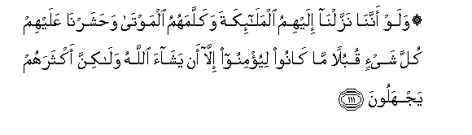

#۞ وَلَوْ أَنَّنَا نَزَّلْنَا إِلَيْهِمُ الْمَلَائِكَةَ وَكَلَّمَهُمُ الْمَوْتَىٰ وَحَشَرْنَا عَلَيْهِمْ كُلَّ شَيْءٍ قُبُلًا مَا كَانُوا لِيُؤْمِنُوا إِلَّا أَنْ يَشَاءَ اللَّهُ وَلَٰكِنَّ أَكْثَرَهُمْ يَجْهَلُونَ 

##Walaw annana nazzalna ilayhimu almalaikata wakallamahumu almawta wahasharna AAalayhim kulla shayin qubulan ma kanoo liyuminoo illa an yashaa Allahu walakinna aktharahum yajhaloona 

## 翻译(Translation)：

| Translator | 译文(Translation)                                            |
| :--------: | ------------------------------------------------------------ |
|    马坚    | 即使我命众天神降临他们，即使死人能对他们说话，即使我把万物集合在他们的面前，除非真主意欲，否则，他们不会信道；但他们大半是无知的。 |
|  YUSUFALI  | Even if We did send unto them angels and the dead did speak unto them and We gathered together all things before their very eyes they are not the ones to believe unless it is in Allah's Plan: but most of them ignore (the truth). |
| PICKTHALL  | And though We should send down the angels unto them, and the dead should speak unto them, and We should gather against them all things in array, they would not believe unless Allah so willed. Howbeit, most of them are ignorant. |
|   SHAKIR   | And even if We had sent down to them the angels and the dead had spoken to them and We had brought together all things before them, they would not believe unless Allah pleases, but most of them are ignorant. |

---

## 对位释义(Words Interpretation)：

| No   | العربية | 中文    | English | 曾用词 |
| ---- | ------: | ------- | ------- | ------ |
| 序号 |    阿文 | Chinese | 英文    | Used   |
| 6:111.1  | وَلَوْ      | 和如果         | and if                    | 见2:20.14  |
| 6:111.2  | أَنَّنَا     | 那个我们       | that We                   |            |
| 6:111.3  | نَزَّلْنَا    | 我所降示       | We sent down              | 见2:23.6   |
| 6:111.4  | إِلَيْهِمُ    | 至他们         | to them                   |            |
| 6:111.5  | الْمَلَائِكَةَ | 和天神         | and Angels                | 见2:161.11 |
| 6:111.6  | وَكَلَّمَهُمُ   | 和他和他们说话 | and he had spoken to them |            |
| 6:111.7  | الْمَوْتَىٰ   | 死者           | The dead                  | 见2:73.7   |
| 6:111.8  | وَحَشَرْنَا   | 和我们集合     | and We gathered           |            |
| 6:111.9  | عَلَيْهِمْ    | 在他们         | on they                   | 见1:7.4    |
| 6:111.10 | كُلَّ       | 所有           | All                       | 见2:20.23  |
| 6:111.11 | شَيْءٍ      | 事物           | Thing                     | 见2:20.24  |
| 6:111.12 | قُبُلًا     | 之前           | before                    |            |
| 6:111.13 | مَا       | 不             | not                       | 见2:120.24 |
| 6:111.14 | كَانُوا    | 他们是         | they were                 | 见2:10:11  |
| 6:111.15 | لِيُؤْمِنُوا  | 至他们归信     | to they believe           | 见2:75.3   |
| 6:111.16 | إِلَّا      | 除了           | Except                    | 见2:9.7    |
| 6:111.17 | أَنْ       | 该             | that                      | 见2:26.5   |
| 6:111.18 | يَشَاءَ     | 他意欲         | he will                   | 见6:80.16  |
| 6:111.19 | اللَّهُ     | 安拉，真主     | Allah                     | 见2:7.2    |
| 6:111.20 | وَلَٰكِنَّ     | 并且但是       | and but                   | 见2:12.5   |
| 6:111.21 | أَكْثَرَهُمْ   | 他们大多数     | most of them              | 见6:37.17  |
| 6:111.22 | يَجْهَلُونَ   | 他们无知       | they are ignorant         |            |

---
